# 心理学笔记

张皓

https://haomood.github.io/homepage/

zhangh0214@gmail.com

2020 年 5 月 16 日起

2020 年 6 月 9 日 1.0 版

[TOC]

# 第一部分 心理学与生活

你是否发现，有人的地方，就有心理学！你是否发现，似乎每个人都是大众心理学家，谁都可以说点“心理学”！但是，你知道吗？我们天天挂在嘴边的“心理学”绝大部分是错的，剩下的一小部分也是不全面的。但凡有人知道你是学心理学的，一定会问一个问题：“你知道我在想什么吗？”其实，心理学不是读心术，人的想法是瞬息万变的，学再多的心理学，也未必可以知道对方在想什么。

**这一部分将通过一些生活中的关键情景，讲述你的关键想法，让你可以理解自己或者他人行为背后的原因。**真正懂得心理学，你就会知道应该挑哪个颜色的衣服，知道如何让人第一眼就喜欢上你，还会知道怎么样用潜意识来保护你自己，更会明白如何让你的梦境更加美丽。所以，心理学其实是让你生活得更加精彩，让你真正懂得你的生活。

## 第一章 感知与记忆

你看世界仅仅通过你的眼睛吗？其实你感知到的世界不仅仅是眼睛看到，还包含着你各种各样的经验，以及你自己主观的加工，即使是你引以为傲的记忆也常常会欺骗和戏弄你哦！“耳听为虚，眼见也未必实”，掌握这些感知与记忆的知识，将会帮助你了解你自己究竟是如何“看”这个世界的。这其中也包括那个在你熟睡之后，绮丽奇幻的梦中世界！

### 1.1 颜色：超越视觉

#### 1.1.1 颜色的生理学基础

不同颜色的光，其实就是不同波长的光波作用于我们的视网膜。当光波照射于视网膜上的**视锥细胞**的时候，它的分子结构就会发生变化，从而产生一种神经冲动，而这个冲动传递到我们的大脑中枢就构成了我们的颜色知觉。

视锥细胞要在中等的，或者比较强的光线条件下才能起到作用，因此颜色知觉对于光照条件有非常大的需求。因此在夜晚我们看不太清颜色，因为那个时候光照是不足的。

*图：色觉正常和红绿色盲对比*

**色弱**患者对光强的感受性要明显低于正常人。**全色盲**患者视网膜上缺乏视锥细胞，他们看不出颜色。另外还有一种叫**局部色盲**，比如说红绿色盲，根本看不到红色和绿色，他们只能看到黄色或蓝色。

语言在颜色的感知中起了非常大的作用。我们大脑中的**颞叶**区域控制颜色辨别和言语。当你对颜色进行辨别，或者对它进行命名的时候，这个地方就会兴奋起来，产生相互地影响。实验表明，对能命名颜色，分辨准确性上更高、而时间上也更快。

#### 1.1.2 颜色的含义

颜色不仅是我们对光波的感知，更是一种视觉经验，渗透着我们文化。我们在看颜色的时候，看到更多的是颜色背后的意义。归根到底就是因为，我们看到颜色之后会展开丰富的联想。

*图：红裙效应*

**红裙效应**（Red Dress Infection）：男性通常认为穿红色衣服的女性，性开放程度更高，魅力更大。在古代，也有很多女性喜欢用桃色的腮红，和艳丽的口红来妆点自己，表现得更加娇媚，提高自己的魅力。进化心理学家研究之后发现，灵长类的雌性动物在准备好繁殖下一代之后，会向雄性发出信号，一个最典型的特征是脸部变得更加红润。

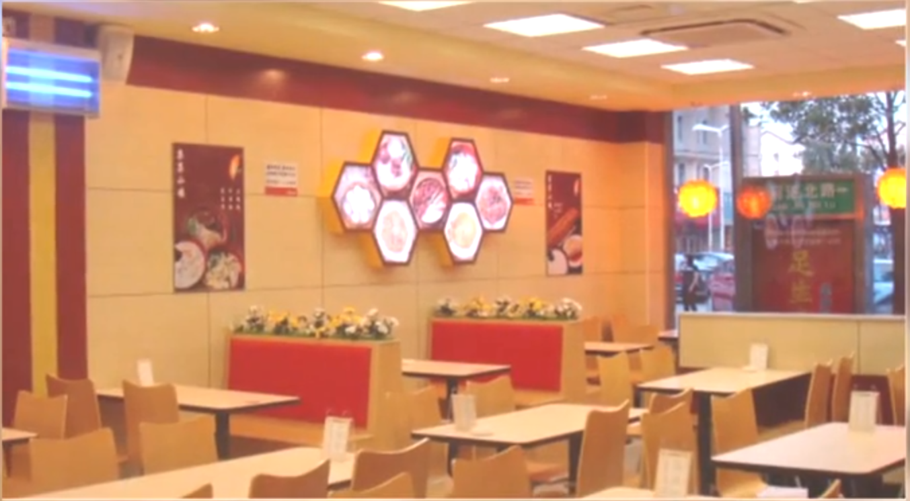

*图：快餐店喜欢用暖色调*

大多数快餐店都会喜欢用暖色调，比如说橘黄色。因为这种颜色会让你心情愉快、食欲大增。但是如果你长时间注视这种颜色，它会让你有一种混乱和嘈杂的感觉，会让你很不耐烦， 又会让你吃得比较快，在店里面不会待很久。

*图：候车室喜欢用冷色调*

而候车室大多数使用冷色调。因为在冷色的环境下，我们会变得更加冷静，而且会削弱我们对时间的感知，比如说明明过了一个小时，你觉得只过了半小时而已，这样就可以降低我们在等待时的焦虑感。

   

   #### 1.1.3 联觉

**联觉**指的是感官之间的相互融合，比如说嗅觉到听觉、视觉到嗅觉。例如，朱自清的《河塘月色》：微风过处，送来缕缕清香，仿佛远处高楼上渺茫的歌声。周杰伦的《迷迭香》：你随风飘扬的笑，有迷迭香的味道。

人群中大概有 0.5% 的人具有联觉能力。我们现在发现的大概有 19 种联觉，比如说在字母中看到颜色、在声音中听到颜色。认知神经科学的研究表明，联觉的产生是跟神经系统发育时，将不同感觉通道的神经系统“混搭”在了一起。

一个著名的联觉能力者丹尼尔，他精通 11 国语言，能把圆周率背到小数点后面 22,513 位。而他记忆的秘诀就是联觉，他可以把数字和字母知觉为不同的颜色和质感，有一些数字是凹凸不平的，有一些数字却是平滑的。 《最强大脑》中的一些超凡记忆的人物或许也有这样的能力。

另一方面，我们听到“幸福”这个词，会想到甜味；看到紫色的时候，会想到神秘。这和神经上的联觉并不是一回事，但是有更广泛的受众和应用。

### 1.2 知觉与错觉：超越理解

#### 1.2.1 知觉的过程

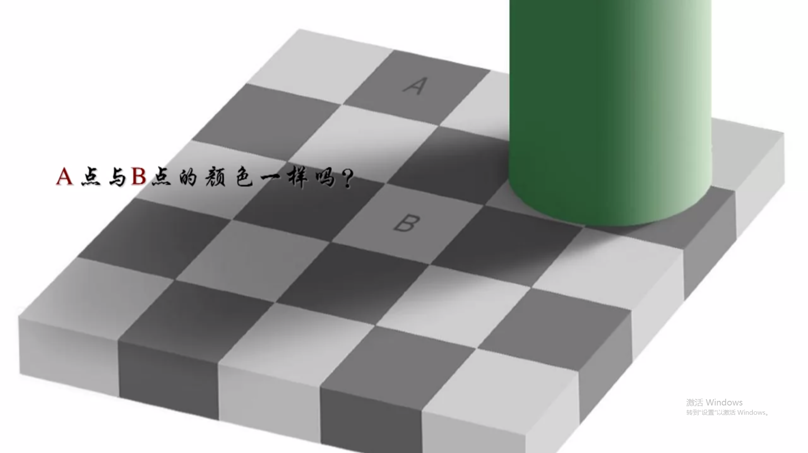

*图：错觉*

知觉包括三个过程：

- 觉察（Detect）：发现一个东西，但是暂时不做任何的判断；

- 分辨（Distinguish）：把 A 色块和 B 色块进行区分有没有差异；

- 确认（Confirm）：利用已有的知识经验和当前获得的信息，最终确定知觉的对象。确认是需要时间最长，也是加工最多的一个过程。

知觉的加工不仅综合了其他感官输入的各种刺激，而且还受到主观因素的影响，比如期待、经验、动机等。例如桂林山水那一块块奇形怪状的石头，在你看来不过就是石头，但在导游的形容和提示下就变成了一个个惟妙惟肖的形象。

#### 1.2.2 知觉的特性

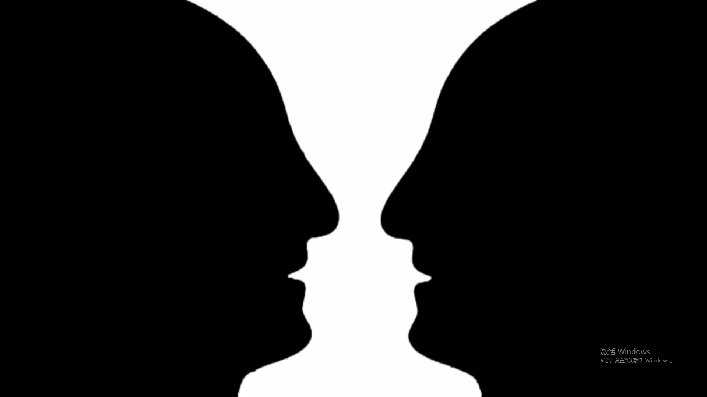

*图：知觉的选择性*

知觉具有四个特性：

- 选择性：知觉是由对象和背景之间的关系来决定的；
- 理解性：在知觉过程中不是被动的认识知觉对象，而是凭借过去的经验和知识力求对知觉对象进行解释，例如我们经常可以从日常用品中看出一张脸来；
- 整体性：知觉系统会不由自主地把个别东西综合在一起成为一个整体，而知觉的理解性有助于把各个部分组合成一个整体。对自己熟悉和理解的东西，更容易当成一个整体。例如我们每天都看那么多次脸，自然对于人脸有非常的敏感性，从而把很多很多的东西，整合在一起，变成一张脸，作为整体来知觉。毕竟我们宁愿认错一张脸，也不愿意错过认出别人脸的机会，因为这对我们的社交有非常大的作用；
- 恒常性：当知觉的对象发生变化时，对其的知觉保持稳定性。有时候我们使用恒常性，反而会造成错觉。例如我们之所以会认为 B 点的颜色要比 A 点的浅，是因为我们将 B 自动的脑补，看成了是阴影下的白色地面，而 A 则是正常光照下的灰色地面，我们并不是直接，把颜色进行比较，而是我们进行了知觉加工之后，再进行比较，这就构成了，我们的知觉错觉。

### 1.2.3 错觉

*图：3D 图像*

错觉：我们的知觉不能正确表达外界事物的特性，而出现种种歪曲的情况。

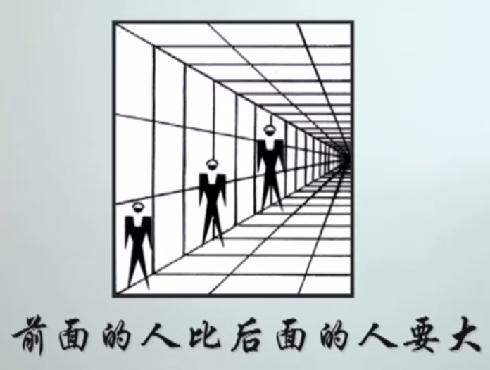

*图：将 2 维图片知觉为立体图形*

我们对于立体物体的知觉，完全依赖于我们视网膜上对这些物体的线条、阴影等信息进行快速整合和解释。当信息不完全或有很多可能性时，只能觉察到一种。而我们对于阴影和线条等的快速整合，就依赖于我们过去的经验。把三维世界的知觉经验用于二维世界，把阴影和线条进行归类，立体化。

*图：3D 图像的构图*

在 3D 画展现场，你什么效果都看不到。这是因为这些 3D 画是用两维的画面让你产生三维的错觉，真正在画这些画的时候，其实构图都是不正常的。只有这样，用照相机把它拍下来，通过照片这样的两维方式呈现，才能产生3D的效果。

#### 1.2.4 盲人复明

盲人复明，是一件好事，也有可能是一件大麻烦事。特别是先天失明或或者早期失明的人而言，他们都在视觉发育的关键期（婴幼儿时期）丧失了视力，由于缺少足够的光线刺激。他们大脑当中，参与视觉加工的神经元之间的联系非常地少。这些人即使恢复视力，也没有办法识别复杂的物体。也就是说，在关键时期的经验缺失让他们无法建立起基本的视觉系统。

盲人复明，首先是时机问题，青少年应尽快让他恢复视力，而对于一位已经失明了数十年的老人而言，还是让他在黑暗中安详沉静地生活比较好；其次是经验对知觉的重要性，我们生活在当下的世界中，光拥有一套正常的视觉系统是不够的，更要拥有一套适合于我们生活的视觉系统。

### 1.3 记忆

#### 1.3.1 记忆的分类

分类维度一：

- 内隐记忆（Implicit Memory）：不需要意识控制，也不需要意志努力就能实现的记忆，例如恒源祥：羊羊羊；
- 外显记忆（Explicit Memory）需要意识控制和意志努力才能实现的记忆，例如背单词。

分类维度二：

- 程序性记忆（Procedural Memory）是一种关于怎么做事情的过程、步骤等具体操作的记忆，例如把大象放进冰箱需要几步；
- 陈述性记忆（Declarative Memory）是一种依靠语言描述来进行的记忆，例如背单词时记忆单词的概念。

分类维度三：

- 情景记忆（Episodic Memory）：对于过去经验中时间、地点、过程等的记忆，例如周日你和家人度假的整个过程；
- 语义记忆（Semantic Memory）：一种对抽象符号的记忆，例如记忆什么是心理学。

分类维度四（时间）：

- 感觉记忆（Sensory Memory）：0.5 - 4 秒；
- 短时记忆（Short-term Memory）：5 秒 - 1 分钟，很容易被干扰，例如数钱或者记电话号码时很容易被打扰；
- 长时记忆（Long-term Memory）：1 分钟以上。

最容易遗忘的记忆是外显记忆、陈述性记忆、和语义记忆。而与情感有关的内隐记忆、程序性记忆、和情景记忆是难以遗忘的。即使失忆的人也能顺利的说话甚至是上班，这已经成为内隐记忆的一部分。

注射可以阻断体内去甲肾上腺素分泌的药物普萘诺尔，可以降低与创伤事件有关的情景记忆。

#### 1.3.2 重构：那些不真实的回忆

记忆重构（Memory Reconstruction）：记忆的储存过程是一个动态过程，在这个过程中一些已经有的经验会发生变化。人们会利用概况、归类等方式来重构信息。在被重构的过程中信息变得更加简单，有些记忆会被简化，不重要的细节完全被忽略，突出和强调那些重要的细节，还有一些记忆会被你按照更加符合常识的方式进行加工然后再记住。

外界的干扰也很容易让我们重构一些错误的记忆，例如言语信息的诱导、社会压力和主观情绪。

质疑目击者实验（劳夫塔斯）：她给150个学生看了一段车祸的录像，然后让他们回答10个问题。A 组学生要回答一个问题是“那辆白色的跑车在乡间公路上开的时速有多快”，B 组学生要回答的一个问题是“那辆白色的跑车在乡间公路上，开过那个谷仓的时速有多快”。一个星期后，她把这些学生都找过来分别要回答另外十个问题，其中有一个问题是“你有没有看见一个谷仓”，A 组说看见这个谷仓的概率只有 2.7%，而 B 组说看见这个谷仓的概率却高达17.3%，事实上那个谷仓根本就不存在。

想象膨胀（Imagination Inflation）：自己想象过的事件也可能成为记忆中的一部分。也就是说，想多了的事情，不论是期望还是担忧，人们常常在记忆中当成发生过的事情。

想象膨胀是因为，在区分实际经历和想象的线索由于某些原因而“丢失”或“混淆”的时候，人们倾向于将记忆中流畅的事件当做经历过的事件。因此难免就会把一些想象过的事当做经历过的事情。例如，成功人士的自传中那些闪闪发光、异于常人的种种经历，也许只是普通事件再造之后的结果，或者想象膨胀的产物。

人记忆的可靠性和准确性并没有想象中的高。

记忆回涨（Reminiscence）：在测验结束的一段时间后记忆量会有所提高。例如，上课时你感觉自己并没有记住什么，但是几天后你却可以在无意中运用课上学的知识来解决实际的问题。在儿童时期更为普遍，成年人基本消失了。

#### 1.3.3 记忆的生理学基础

- 海马：记忆分区；
- 小脑：主要负责程序性记忆；
- 纹状体：习惯形成和刺激反应之间的联系基础；
- 大脑皮层：负责感觉记忆的部分；
- 杏仁核。

脑科学告诉我们，记忆的本质，其实是不断加强的特定的神经元之间的联系。如果某一个信号在神经元之间不断的被重复，这两个神经元之间就会形成一个被长期增强的交流节点，而这个节点的长期性加强，就形成了长时记忆。

小阿尔伯特实验（华生）：每当小阿尔伯特伸手去够老鼠的时候，华生就会在他身后用重锤敲响一块悬挂起来的铁块，不出所料巨大的响声把小阿尔伯特吓得哇哇大哭。重复数次之后，小阿尔伯特就彻底地害怕老鼠，以至于只要一看到小白鼠，他就会又哭又闹，并试图远离老鼠。这就是反复刺激下形成的恐惧记忆。科学家们随后发现，如果简单反复的向实验对象展示一个无害的刺激，比如说兔子，而并不提供危险信号，比如说巨响，那么恐惧的记忆就会逐渐消退。恐惧消退理论是心理学家在治疗恐惧症常用的行为疗法中的暴露疗法。

把大脑处理记忆的过程与电脑进行类比，我们可以称之为编码和提取。编码是指对记忆的材料进行加工，以便于对其进行记忆。提取是指对被存储的信息进行恢复。记忆通过再认和回忆来提取信息，再认比回忆更加容易（再认有线索），线索是我们能否提取记忆的重要因素。

#### 1.3.4 如何提高记忆？

记忆的编码过程具有特异性反应，特异性是说当提取的背景和编码的背景完全相同时，回忆起来就容易的多。因此，背书时不要听音乐，因为考试时不会有音乐，同时专注很重要。

记忆编码的第二个特征是系列位置效应，位置的不同会影响记忆效果。在比赛中，我们印象最深的通常是最先出场的选手、以及最后出场的选手，而中间那些人我们常常毫无印象。因此，复习时为了能记住更多内容，应该不断变换记忆顺序。

对编码进行精细加工也可以提高记忆效果。因此，对要记忆的内容进行编故事、顺口溜等。

### 1.4 时间都去哪儿了

时间知觉：是一种对客观事物或者事件的连续性和顺序性的知觉。其包括四种形式：

- 时序知觉：事件发生的先后顺序；
- 时距知觉：已经进行 30 分钟；
- 时间点知觉：现在几点几分；
- 时间预测知觉：再过 20 分钟下课。

时间知觉不是某个特定感官的功能，人们借助视觉、听觉、皮肤觉、嗅觉等都能感知到时间。

时间的参照物也有很多，没有表的时候可以通过人体的节律活动比如心跳、脉搏等生物反应感受时间，也可以通过自热周期现象比如四季更替、日升日落来感受时间。

对时间的知觉并不一定准确，很多因素会影响对时间的知觉：

- 一定时间内事件发生的数量和性质。数量越少性质越简单，时间估计就会越长。度日如年就是因为一天之内发生的事情实在太少了，让时间知觉被拉长了。某段时间内时间性质的不同也会对时间的估计产生影响。当回忆往事的时候就恰恰相反了，经历事件越多，性质越复杂，估计的时间就越长。因为回顾往事时只是记忆的密度而已，同一时间内经历越丰富事件越复杂我们就觉得时间越长；
- 人的兴趣和情绪也是重要的影响因素。和喜欢的姑娘在一起一个小时仿佛只有一秒，如果坐在火炉上一秒好像一小时；
- 颜色通过作用于情绪，也对对时间知觉产生影响。红色让人感觉时间漫长，因为红色会导致生理的唤醒，是我们感到亢奋、焦虑上升，体验到不适、不安；蓝色会使人感到安全、宁静。因此快餐店用红色、黄色使人进餐速度加快；像咖啡厅或者卧室这样需要静休的地方，则偏向于选择蓝色；
- 时间参照物可能也是影响时间知觉的因素。例如法国著名探险家迈克在没有任何时间参照的山洞里待了两个月，出来之后以为只过去了25天。

### 1.5 梦：你有第六感吗

#### 1.5.1 梦的生理学基础

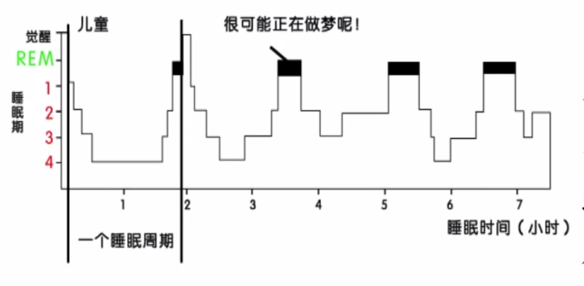

*图：人的睡眠周期*

人类的睡眠是由快速眼动睡眠（REM）和非快速眼动睡眠（NREM）共同组成的，而非快速眼动睡眠还包含4个不同的睡眠周期。所以一个完整的睡眠周期就是由快速眼动睡眠和非快速眼动睡眠交替出现的，一夜要经历 4、5 次循环。在快速眼动睡眠周期，脑电图和眼电图都显示了与清醒时完全一致的活动状态。梦主要在快速眼动时期产生。

即使在恰当的时候进入别人的梦境，你也会发现大多数的梦，都是缺乏逻辑和关系的，光怪陆离的梦境，和现实世界差异非常巨大。

#### 1.5.2 释梦

弗洛伊德认为梦分为显性梦和隐性梦两种，梦的解释就是从可以接受的显性梦境回述到不可以接受的隐性梦境。弗洛伊德在著名的《梦的解析》当中提到了一个案例：一个女孩儿梦到自己的姐姐死了，通过与这个女孩的沟通，弗洛伊德认为，她是在第一次参加葬礼时遇到她的心上人，所以她就希望姐姐死掉，她可以再次参加葬礼，于是可以再次遇到那个人。弗洛伊德将梦境中的大部分符号和人的性本能对应起来，比如说洞穴、房子都代表女性的子宫，而柱子、手枪之类的东西就代表男性的生殖器官。

在中国文化当中《周礼》也有很多关于梦的说法，后来民间还演变出一个著名的释梦的典籍，叫做《周公解梦》。

《盗梦空间》通过梦境盗取机密需要一个假设：即使我们的梦没有预测功能，也不见得和潜意识的直接关系，但是梦是有意义的，并且是我们的经历的投射。现代心理学的研究确实从一定程度上支持了这个假设。美国麻省理工学院的研究发现老鼠做梦时脑活跃的区域，和白天它们学习奔跑时活跃的区域完全相同，这样一来我们就有理由相信记忆和梦境有着非常密切的关系。

如果梦是随机出现的，那么为什么我们总会反复梦到同样的事情？

- 好比我们每一个人都有一种特殊的习惯，而梦也是有习惯的，它习惯于把熟悉的、或者印象深刻的东西，比如你的情绪、过去的某个经验，反复地用来作为梦境的材料；
- 你错误的高估了某些梦出现的频率。因为你每天都在做梦，而梦总是会有重复的，但是只有当记忆深刻的梦被重复时你才会有惊奇的感觉。

梦能预测未来？

- 梦中似乎见过：梦中的地方是曾去过的地方，和第一次去的地方有相似之处。由于梦境是模糊的、跳跃的，你忽略了其他信息，只记住了这个相似的地方；
- 梦到熟人去世：这是概率问题，如果我们给定每天死亡的人数，而我们又假定每一个人一生当中都有一次梦到熟人死亡的机会，那么这样的巧合在英国每两周就会发生一次。梦能预测未来可能就是一个巧合，而这样的巧合具有感知的显著性，所以才会印象深刻，并不断反复传播，并最终深信不疑。

#### 1.5.3 造梦

马来西亚的森诺伊人认为，梦既不回顾过去、也不展望未来，而是生活的另一个方面。假如我在梦中攻击了你，到了白天我要主动向你道歉。虽然我意识层面并不知道为什么我要揍你，但是至少说明我的潜意识里对你怀有敌意。那么公开的沟通是最有利于处理这种潜在矛盾的。

不仅如此，森诺伊人还会教导孩子们去做一些具有积极性和创造性的梦。如果你在梦中梦见从悬崖掉落，大人们会告诉你，如果你下一次再做这样的梦，你可以展开双臂自由地飞翔，并且告诉你，你可以试着让自己降落到一个好玩的地方，这样第二天你就可以告诉我们一个愉快的旅程。如果在梦中遇到陌生人，不用害怕，可以在梦中让这个陌生人教你唱歌跳舞，这样就会降低你的焦虑和恐惧。

这些其实都是在告诉我们，梦不仅仅是生活的简单反映，你完全可以努力对它进行加工，以此对你真实的生活有所帮助。可见梦虽然没有办法简单的被制造出来，但或许我们可以对它做的事情，比你想象的要多得多。

## 第二章 发展与教育

你会不会常常觉得自己的自制力不够？或许这恰恰是因为你的延迟满足能力不强。无论是延迟满足，还是性别意识，许多能力和特质都是你从小慢慢培训起来的。因此，你将会看到婴儿的依恋与成人的恋爱、儿童的游戏与成人的道德之间的联系，也将会了解人类最基本的三种学习模式，并借此学会有效地塑造良好的行为。因为，这个部分就是希望让你更多了解你的过去，或者说更多懂得你未来的孩子。

在人生的不同阶段，从婴幼儿到儿童，从青年到成年，从中年到老年，都有着不同的心理品质，不同的阶段发展的任务也是不一样的。发展心理学的一个重要研究核心就是人的一生如何成长变化。发展心理学就是考察个体在生命历程中行为的发展和变化的过程。发展心理学家认为，从生命孕育到终止，发展的过程是持续贯穿人类每一个部分的。人的行为又保持着相对的稳定。

心理学家养育孩子并没有固定的模式，在养育过程中也会充满矛盾、冲突、问题。只是心理学家会更加灵活，去运用我们所学的知识。所以本章有关发展与教育的知识并不是绝对真理，我们希望在你实际生活中遇到问题的时候，不要照搬这些理论，而是积极地结合你的实际来调整和修正这些理论，从而让你的教育更加有效，而你的孩子的发展更加的健康。

### 2.1 延迟满足

延迟满足实验（米歇尔）：实验员会先给儿童一颗棉花糖，然后告诉他如果你能忍住在我离开的一段时间里面不吃这颗棉花糖，等实验员再次回来的时候，会给你另外一颗棉花糖，当然你也可以直接把它吃掉，不用等待我回来。实验之后的近20年之后，他发现，当年马上把棉花糖吃掉的孩子呢，无论在家里、还是在学校里都更容易出现行为上的问题，学习成绩呢也比较低，他们通常难以面对压力，注意力也不能集中，而且很难维持友谊；而那些可以等上15分钟再吃棉花糖的孩子呢，在这些方面都优于那些立刻吃掉棉花糖的孩子。可见，延迟满足能力对于一个儿童的人格形成以及获得的成就是非常重要的。

什么决定了孩子自我控制的能力呢？秘诀在于转移注意力。如果孩子们意识到学会转移注意力和思想就能实现自我控制，那么他们就成功了一大步。有些孩子会把棉花糖看成一幅画，慢慢地欣赏；有些孩子呢，会对着棉花糖唱歌或者跳舞。

米歇尔用冷系统和热系统来说明注意力策略性分配对延迟满足能力的作用机制。

- 冷系统（理性）：是认知的和策略性的注意调配，主要表现为儿童的各种注意分心活动，它可以延长延迟满足时间；
- 热系统（感性）：是情绪的基础，是由先天性的、受刺激即被激活的注意调配，主要表现为儿童持续将注意力固定在奖励物（强化物）上。

热系统发展要比冷系统早，在人生最早几年中，热系统发挥主要功能性作用，因此儿童会表现的十分冲动。但是随着年龄的增长，冷系统开始发展起来，开始在延迟满足中具有优势作用。

### 2.2 婴儿气质

#### 2.2.1 婴儿发展

刚出生的婴儿头部占整个身体长度的四分之一，到两岁时只有五分之一，成年以后只有八分之一。

四项基本原则：

- 头尾原则：发展是从头部开始向身体的下半部分进行（从上至下）；
- 近远原则：发展是从身体的中央部分开始向外侧慢慢延伸（身体到手指）；
- 等级整合原则：首先会有一些简单的技能慢慢发展，然后才会有一些复杂的技能；
- 系统独立原则：身体的不同系统之间发展速度是不一样的。神经系统发育先快后慢，性别特征系统先慢后快。

新生儿一出生就有一些习惯性的身体活动，而这些活动很多都是我们说的反射过程：

- 吸吮和吞咽反射：摄入乳汁和食物；
- 定向反射：找到嘴边的食物来源，比如说母亲的乳头；
- 咳嗽、打喷嚏、眨眼反射：回避潜在的危险；
- 游泳反射：把孩子放到水里面，当然他不能呼吸，可是他的身体动作却表现出在水里面脸朝下，而以类似的游泳动作来划水或者蹬水。当然，这不是真正的会游泳，只是一种游泳反射，很快就会随着成长而消失；
- 抓握反射：有助于婴儿和他人之间的社会关系发展，从而增加他人对婴儿的兴趣和喜爱；
- 强直性颈反射（击剑反射）。

婴儿出生的时候已经具备的脑神经元数量就已经是人脑总神经元数量的 80% 了。而在出生后的头两年间，基本会把剩余的 20% 长全。因此两岁之前非常重要，两岁之后的脑神经，只能死亡不会再生了。不过虽然神经元的数量很早就基本确定了，而且会不断减少，但是我们整个人大脑中的神经元之间会不断地建立几十亿甚至上百亿个新的连接，使得神经网络变得极为复杂，这一数目远多于肌体所需要的连接数量。于是随着婴儿的成长，那些没有与其他神经元连接的多余神经元会逐渐消失，同时已经形成的但不常使用的神经元也会通过突触修剪这个过程清除，以提高运作效率。

#### 2.2.2 婴儿气质

婴儿气质：个体的唤醒模式和情绪特点，在不同的年龄阶段具有一定的稳定性。气质具有不同的维度，比如活动水平、易激怒水平等。

婴儿有三种气质类型：
- 易养型婴儿：具有积极倾向，身体运作有规律，适应性强，有好奇心，情绪处于中低强度的状态；
- 难养型婴儿：心境偏向消极，适应性弱，面对新情境时倾向于退缩；
- 发动缓慢型婴儿：不太活跃、对环境的反应相对平静，适应缓慢。

气质型没有好或坏，只能说哪一种气质类型更能适应所生长的环境。文化差异对特定气质的后果有很大影响，如文化习俗导致婴儿哭闹时才喂养，这样难养型婴儿更容易存活。

双生子（双胞胎）研究表明，个体的特征会受到一定遗传作用的影响，社会技能、领导力、敏感度、幸福感等因素受到遗传影响的程度可能会有 50% 甚至更高。遗传因素反过来又会决定环境，也就是说孩子可能会自己挑选有利于自己的环境，如活泼的孩子被体育吸引，而一个安静的孩子就更有可能对画画感兴趣。这个时候你就要注意这些偏好，并决定提供一些相关的培养和鼓励。

由于神经的作用，婴儿有着各自的气质类型，而各种气质类型并没有好坏之分，又同时受到遗传、环境和文化种种因素的影响。不要完全按照婴儿出生时的气质类型养育，可以适当给她/他多一点体验其他气质类型的活动方式，这样才能更加多元，增强婴儿的灵活性。

### 2.3 情感依恋

#### 2.3.1 依恋

依恋：寻求与某人的亲密，并且当其在场的时候感觉到安全的心理倾向。从另一个角度来说，依恋就是动物的一种习性，是动物幼崽适应生存的一种特定反应。

恒河猴实验（哈洛）：幼猴出生的时候让它与代理母亲生活在一起 6 个月，其中一个代理母亲是由铁丝做成的，它胸前有一个可以提供奶水的装置；另一个代理母亲是由柔软舒适的绒布做成的，但是这只代理母亲并不能提供奶水。观察之后就发现，幼猴只有在饿的时候才跑到铁丝母亲那儿喝几口，然后又回到绒布母亲那儿紧紧地抱住它。显然幼猴在绒布母亲身上投注了更多的依恋。实验揭示，在依恋过程中有一个非常关键的因素就是身体的接触，即接触性安慰。

弗洛伊德认为，婴儿对人的依恋是由获得物质上的满足而形成的。对于大多数婴儿来说，喂养人是母亲，所以他们对母亲产生强烈的依恋。而哈洛实验证实，事实不是这样，婴儿对母体的依恋不仅仅是为了食物，与母亲温暖而舒适的身体接触才是它安全感的源泉。如果想和婴儿建立起亲密的关系，要给她足够的安全感的话，就要多拥抱。

婴幼儿发展有个敏感期，即最佳时期，在这个时期一项技能会得到最大的发展和成熟。洛伦兹发现，如果幼鸟在敏感期没有看到母鸟，就会在其他目标上产生印刻，并对其形成依恋，形影不离。对婴幼儿来说，现在研究指出，依恋形成的敏感期从六个月大的时候就开始了，但结束时期尚不明确。

#### 2.3.2 婴儿依恋类型

根据婴儿与父母分离和重聚时的不同表现，将婴儿分成四种不同类型的依恋：

- 安全依恋型：当养育者离开的时候，会轻微表示抗议。当养育者回来时，会主动寻找父母，并且很容易在父母安抚下平静下来；
- 回避型依恋：不安全的依恋模式。在养育者离开时并不会表现十分痛苦。当回来时也不会主动回复接触，有时还会把注意力转移到其他地方，比如说玩具，而不看自己的母亲；
- 抗拒型依恋：不安全依恋模式。在陌生环境中通常很焦虑，而不去探索周围世界。养育者离开时大声哭泣，而养育者回来时拒绝接触；
- 混乱型依恋：不安全依恋模式。陌生情境中可能困惑、恐惧，或几种掺杂在一起。

依恋模式之间的差异，其实与婴儿和养育者之间的互动有非常大的关联：

- 安全型依恋模式的婴儿父母对婴儿发出的信号比较敏感，会及时对其需要作出反应；
- 回避型的父母倾向于不回应，很少有身体接触；
- 抗拒型的父母互动是不连续不稳定的，有时回应有时不回应。

总之，不安全型依恋模式的儿童，他们的养育者都在一定程度上忽略了儿童的需要，没有很好的与儿童进行互动。

无论是婴儿的依恋关系，还是成人的依恋关系，情感安全都是非常重要的。如何让婴儿和父母之间形成安全的依恋关系：

- 多抱抱孩子；
- 信守承诺；
- 当孩子不愿意分离时，尽量跟他讲清楚离开的原因，并告知他什么时候回来，而不用恐吓或打骂的方法；
- 多抽出时间陪伴孩子。

#### 2.3.2 成人依恋类型

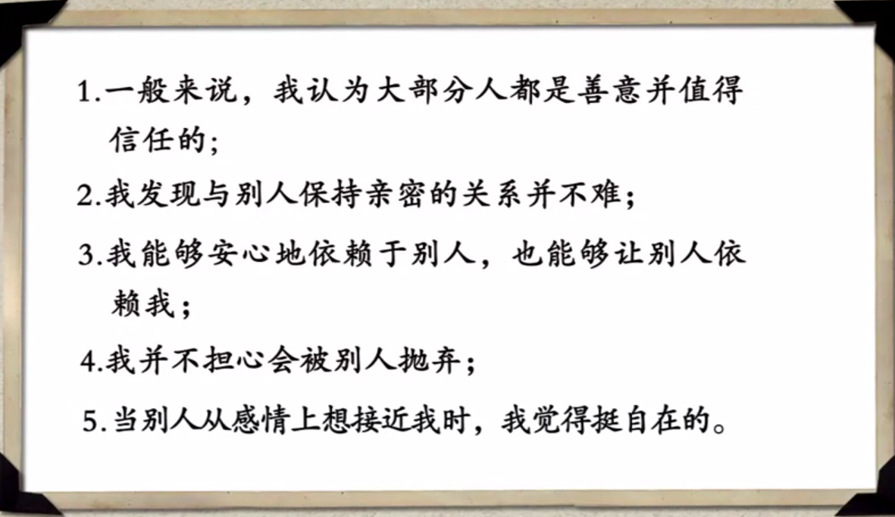

*图：安全型依恋*

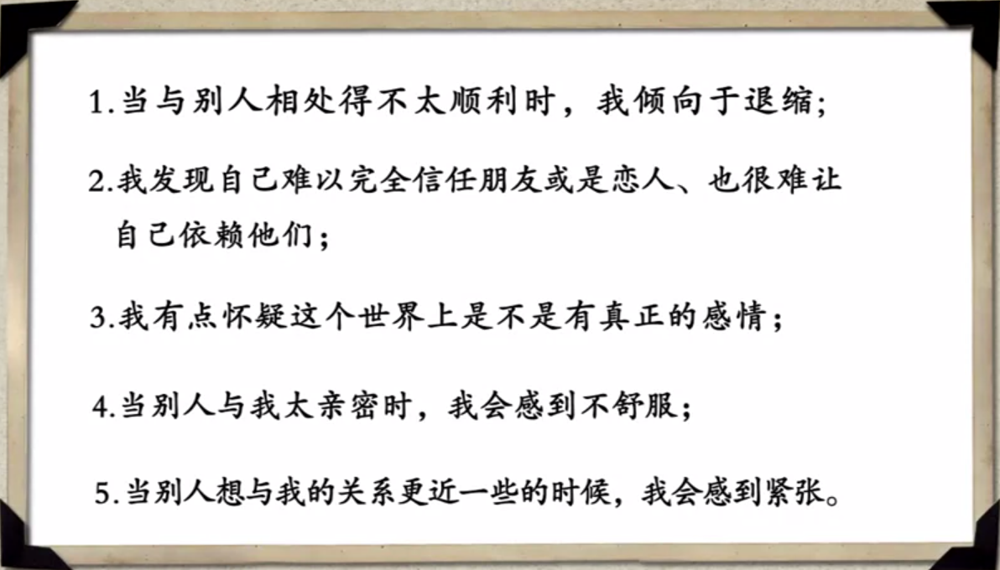

*图：回避型依恋*

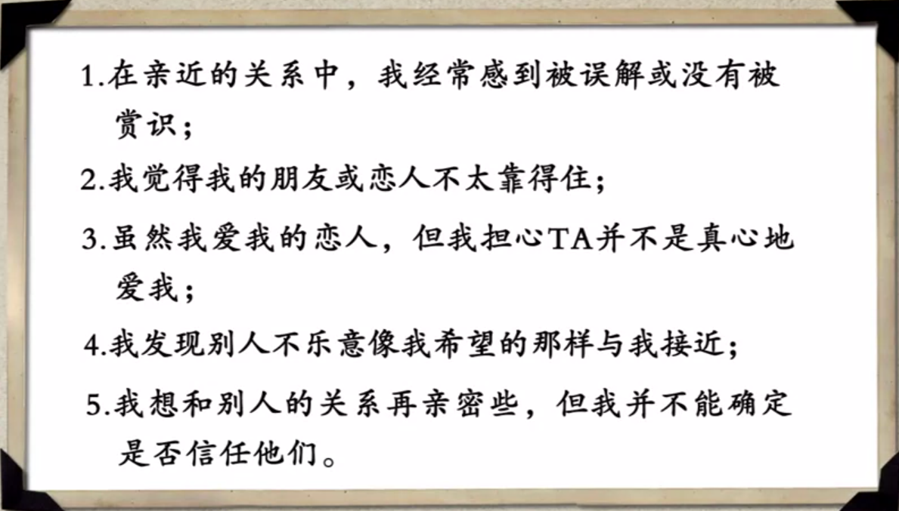

*图：抗拒或混乱型依恋*

成人依恋中 60% 安全型、20% 回避型、20% 抗拒型。幼年依恋的质量与其成年之后的恋爱关系有非常大的关联。不过依恋关系并不是一次确定就不能改变的，一些个体在经历成年期的一些人际关系之后会改变他们的依恋模式。

### 2.4 咿呀学语

#### 2.4.1 条件反射

条件反射：个体学习是以特定的方式，对一个中性刺激进行反应，而这个刺激原本并不会带来这种反应方式。

通过**经典条件反射**，婴儿其实很早就具备了学习的能力。比如说你一边和他说“宝宝吃饭”，这个时候你端出一碗米饭，反复多次之后呢，他就学会了把饭和那个食物米饭对应起来。当你说饭的时候，他就知道应该吃饭了。

另外，婴儿为了想要的结果故意做出某种行为，如发现哭泣后父母立刻来身边，于是最终学会了为了达到目的而哭泣。在**操作性条件反射**中，自发反应会根据结果的正性或负性而得到增强或减弱。

**习惯化**：指在某个刺激重复多次呈现后让我们对它的反应会降低。

**模仿**是一种非常重要的技能，使得个体与他人在相处的时候能够做出恰当的反应。模仿不见得会照搬原来的刺激，可能会自我创造。儿童模仿能力在语言学习中起着非常重要的作用

#### 2.4.2 语言的发展

早期的声音、面部的表情、和肢体的动作等非言语的方式，我们可以称之为前语言交流，其中最明显的表现就是咿呀学语。这个现象存在于不同的文化当中，婴儿有一个特殊的时期，会自动生成每种语言中都存在的声音，比如 a、ma、ba。这或许就是为什么，大多数语言当中妈妈的发音都几乎是一样的，因为婴儿会自动地发一个 ma 的音。一开始这个ma 并没有意思，只是恰巧妈妈就在身边，于是无比兴奋的表情和拥抱亲吻之类后期动作，让婴儿知道这个 ma 是有意义的，于是呢他就学会了叫 mama（妈妈）。

6 个月以后不同语言和文化之间的差异就慢慢显现出来。婴儿从此之后就很难分辨出某些其他语言中的某些发音，也就是说他开始在自己的母语环境中被稳定下来。父母和婴儿之间对简单字词进行重复，比如说婴儿发一个 a，爸爸妈妈也会发一个 a，类似于对话交流，使婴儿明白：交流使需要双方共同参与的，这个就对于将来的学习起到了非常大的铺垫作用。

**符号语言**：手势产生时所激活的脑区与言语生成时所激活的区域几乎是相似，这就表明口语可能是从手语进化而来。

婴儿期语言是如何产生的至今仍然是迷：

- 先天论。早期认为语言发展是学习的结果，是不断强化后形成的，但无法解释婴儿在早期就能迅速掌握的语言能力如语音、语法、句法等。先天论认为语言的发展是遗传的结果，它受到了与生俱来的机制所引导；
- 乔姆斯基认为，人生来就有学习语言的能力，所有语言都有类似的内部结构，即普遍语法结构。人的大脑中有语言习得机制的神经系统，使得婴幼儿能够学习周围语言当中特定的一些特征和特定结构。

目前没有一个观点对语言的获得做出完美解释，也许不同因素在不同时间发挥着不同作用。但在父母和幼儿对话的时候，如果刻意使用他们的腔调，比如语音变高、语调变丰富性、重复词语增加等，这种婴儿指向的言语风格在幼儿学习语言的过程中有极其重要的作用，幼儿也容易接受这样的语言。

### 2.5 性别认同

#### 2.5.1 婴儿情绪

婴儿真的能体验到情绪吗？体验情绪的方式和成人一样吗？

伊扎德认为，婴儿天生就有一套情绪表情，用来反映基本的情绪状态，比如高兴、悲伤。随着婴儿的成长，主导情绪反映的大脑前额叶与边缘系统开始发展成熟，不断扩展和修正基本表情，也不断体验到更为广泛的情绪，越来越熟练的操纵所有情绪的非言语表达方式。

1 - 2 岁时婴儿学会选择性的对他人微笑，即社会性微笑，如果没有回应会变少。表明婴儿会有目的地通过微笑来表达积极情绪，同时也对他人的情绪表达慢慢敏感起来。

当我们在不确定的环境中会留意周围的反应再决定自己如何反应。社会性参照指有意识地搜寻他人的情感信息，以帮助理解不确定情境的含义。8、9 个月大的时候，婴儿凭借面部表情等理解他人情绪的含义。再大一些时，收到相互矛盾的信息时会不安或矛盾，即，如果想教育婴幼儿，养育者的态度应该是一致的。

能够意识到别人的情绪状态是婴儿社会性发展的重要过程。什么时候开始有自我意识？照镜子。12 个月大时，自我意识才慢慢开始发展。

点红实验：你在婴儿的鼻子上偷偷点上一个红色的点，然后让他坐在镜子前面。如果婴儿试图触碰自己的鼻子，或者抹掉这个红点，那么就表明他已经有了一部分的自我意识；相反他如果去摸，镜子当中那个人鼻子上的点，显然他还不知道镜中的那个人就是他自己，当然他也还没有所谓的自我意识。

#### 2.5.2 性别意识

男、女的概念不是自然形成的，而是社会教化形成的。

Sex 和 Gender 的区别：

- Sex 强调生理学和解剖学上的性别特征，包括性器官和性行为的特征；
- Gender 指两性的社会知觉、社会角色以及受到文化影响成分比较大的那些东西。

父母会用不同方式与儿子或者女儿进行互动，也会透过性别这个透镜来看待儿童的行为。很多父母会希望男孩子要活泼好动、希望女孩子要文静可爱，男孩子通常玩玩汽车、玩玩手枪，而女孩子呢抱抱布娃娃和毛绒玩具。研究发现即便存在生理上的不同，女婴和男婴之间差异其实是很小的。男孩子拿到手枪大炮的时候一定会说冲啊、杀啊、哒哒哒，同样，女孩子拿到布娃娃一定会说，你生病了，我给你看病好不好啊，然后拿着听诊器听一听，或者我给你换一件衣服好不好啊。

其实，他们不过是借助手枪大炮，或者布娃娃，来进行一个角色扮演的游戏，而这种角色扮演游戏，其实这就是他的一种行为上的模仿。就本质而言，手枪大炮和布娃娃之间是没有什么大的区别的，只是我们人为的做了一个定义。所以你会看到这些性别差异，其实是父母或者环境强化的结果，而且这种差异会随着年龄的增长，也会不断地增加。比如男孩子如果玩女孩子玩的玩具，比如说刺刺绣啦、打打毛衣啦、玩玩布娃娃了，他所受到的阻力远远要比女孩子玩男孩子的玩具受到的阻力要大得多。男孩儿通常受到更多的鼓励去发现和探索这个世界，女孩子呢则得到更多的拥抱，和父母保持着比较近的距离。

性别的意识在学前期就已经开始建立起来，幼儿会给自己和周围人贴上性别的标签。不仅如此，性别意识也会在游戏中表现出来，小男孩通常喜欢打打闹闹，小女孩则喜欢参与有组织的游戏，比如说过家家。当然，我这里还是要说，这种差异还有可能是后天形成的。因为当小男孩去过家家的时候，可能会被父母所拒绝，或者对他进行其他的引导，比如说让他去爬树、让他去翻墙，就是所谓的打打闹闹；同样当小女孩去翻墙、去爬树的时候父母一定会把她阻止下来，告诉她：你是一个女孩子，应该要文静一点。另一方面，小男孩和小女孩在这个时期也开始选择同性伙伴一起玩耍，表现出一定的同性偏好。当然也有可能是由于我们过分强调了男孩和女孩的差异，导致他们选择相同的伙伴，因为人总是希望跟相似的人在一起玩。

有了性别意识之后，幼儿对于性别示意性行为的期望会变得非常高，甚至会比成年人更加刻板。比如说在幼儿园里，如果一个小男孩儿穿着粉色的衬衫或者鞋子，他可能就会面临所有小朋友集体的嘲笑。再长大一些这种信念反而会有所松动。从生理学上来看，小男孩与小女孩行为的差异可能与性激素有关。但是激素理论并不能完全解释这类行为还需要结合其他来解释。所以就有第二种叫社会学习理论，它是得到普遍支持的一种解释。社会学习理论认为，幼儿通过观察父母、老师、兄弟姐妹和各种玩伴，来学习不同的性别示意行为，在这一过程当中，幼儿得到的肯定和鼓励，会强化这种学习行为，书籍和媒体也通过各种方式，对这一过程起到引导的作用。但是如果在这个过程中，儿童缺少同性的模仿，或者没有和异性之间建立恰当的联系，那么就很有可能出现一些性别的认同障碍，例如我们常常说的易性癖、变性人之类的都有可能与此有关。所以呢性别其实并不只是 Sex 这个简单的由生理特征决定的，它其实更多的会受到社会教化的影响，或者说是我们社会、或者至少是我们的父母想把你变成男孩儿或者女孩儿。而你呢，就按照这个期望变成了男孩儿或者女孩儿。

最后要让各位分享一下，最新的教育理念认为我们其实应该弱化性别教育，也就是说不需要再去强调男或者女，我们希望男性和女性都是独立的个体，并且我们试图将男性和女性的优势结合起来。所以刚柔并济的男人和女人是未来最重要的性别趋势。

### 2.6 游戏人间

#### 2.6.1 幻想游戏

很多小孩子喜欢和自己说话，而且别人未必听得懂，他们自己却说得不亦乐乎。自言自语对于儿童的成长有着非常重要的作用。维果斯基认为这些语言将会被用于指导儿童的行为和思维，产生新的想法，最终起着非常重要的社会功能。比如说通过这些语言，儿童会学到与人交谈时所必须的实践技能、思考或者解决所遇到的难题的方式。例如，遇到困难思考解决方法时会有自我推理的过程，就是内部对话，就是以自言自语为先兆的。儿童与自身的交流有助于学习控制自己的行为。

另外一种自言自语有可能是儿童沉浸在自己的幻想世界。儿童会有强烈的情绪又无法有合适的语言来表达，就有了幻想游戏。幻想游戏就是以想象能力为基础，使物体和人物表现出新的身份或具有新的意义。过家家就是典型的幻想游戏。在幻想中，儿童所想出的人物或情景完全具有个人意义，甚至根本没有必要与他人分享。例如对着洋娃娃啦、本子、笔啦情不自禁的自言自语，这些都是一种幻想游戏的雏形。

儿童的游戏经常是由简单重复的动作组成的，这是感觉运动游戏。比如儿童看到父母的行为进行模仿，大一点通过回忆来再现父母的行为，这就是符号化的游戏。一旦符号思维能力出现，儿童的思维就会变得更加灵活，将一种物体假象为许多别的物体。当要进行游戏而没有必要的物体时，儿童能假想、发明一些物体或者赋予常见物体新的用途，以此来进行游戏。

教育学家认为应该给儿童灵活的、限制少的游戏材料。我们给他的玩具他一个都不喜欢，他喜欢家里所有的日常用品：垃圾桶、扫把、桌子、椅子等一切我们日常用品，他都当成自己的玩具，这就是一种幻想游戏。幻想游戏不单是为了好玩，儿童可以利用幻想来实现对社会和现实环境的理解，从而开拓自己的思维、提高抽象能力。在游戏中，儿童可以超越自己的角色，而到其他领域扮演不同的角色。

#### 2.6.2 道德意识

随着儿童年龄的增长，游戏中的互动性增加，游戏中的冲突、以及冲突的解决，都为他道德意识与行为提供了重要的条件。所以弗洛伊德认为，游戏是儿童形成道德最好的方式之一。儿童的心智在不断成熟，而通过与他人游戏，道德意识也在不断形成。

经典两难故事：很久以前，有一个叫海因茨的男人。他的妻子得了癌症，只有一种十分昂贵的药可以救她，但他无法赚到足够多的钱来买药。而药店的老板说，自己就是为了赚钱，不肯把药降价出售。于是，海因茨半夜闯进店里偷了药给妻子治病。问：海因茨的做法合适吗？如果你是法官，你会判他的罪吗？

科尔伯格将人的道德发展分成三个水平：

- 前习俗水平：“海因茨的做法是合适的，否则他的妻子会病死”或“海因茨不该偷药，因为他会被抓去坐牢”。说明处于以惩罚和服从为导向的阶段，只是通过一件事情的结果来判断好坏：惩罚是坏，表扬是好。“不赞成海因茨的行为，因为药店老板发明药就是为了赚钱”。说明处于以行为的功用和相互满足需要为导向的阶段，你认为人和人之间的关系就是“你帮我、我也帮你”的关系，而不是依靠忠义、感恩、或者公平来建立人与人之间的关系；

- 习俗水平：“海因茨偷药的动机虽然不坏，但却违法，不该做”。说明处于以人际和谐为导向的阶段，总是考虑到他人和社会对好孩子的期望与要求，看这种行为是否被允许来决定这个行为的好坏。“海因茨偷药救妻子合乎情理，但偷药行为是违法的，应该被禁止”。说明判断的依据是规则和法律，但由于情、法、理三者有时候难以兼顾，善恶判断常会出现矛盾；

- 后习俗水平：“对海因茨表示同情，愿意为其出庭辩护请求减刑”或“法律允许老板不顾别人的死活赚钱是不对的”。说明你意识到法律或者习俗仅仅是一种社会契约，是由大家商定决定的，也是可以由大多数的人要求而改变的。如果动机是好的就可以减轻对错误行为的责难，社会上的每一个成员，同样都负有道义上的责任；

- ”对偷药行为表示赞赏“或”要反抗老板牟取暴利的行为“。说明你认为生命更高贵，为了救人危难，你会甘愿遭受惩罚，因为你认为行为是高尚的。很少有人达到这个阶段，即超越个人得失，而将这样的一个水平上升到人类的普遍伦理之上。

这只是道德意识，一个真正的道德体系同时还要包括道德情感、道德行为这另外两个非常重要的方面。只有多让孩子与他人一起参与到游戏当中，才能让他在实际的人际互动当中甚至人际冲突中体验到丰富的内在情绪，逐渐形成协调和化解冲突的有效行为，最终形成稳定和恰当的道德情感和道德行为。

### 2.7 学习方式

人类学习有三种方式。无论是哪一种学习方式，行为的后果对于行为都是非常重要的，其实这就是平常我们说的奖励与惩罚。

#### 2.7.1 经典条件反射

巴普洛夫的狗：狗原先看见肉就会流口水，但由于铃声和肉总是同时出现，于是最终狗听到铃声也会流口水了。

经典条件反射是先有刺激再有反应。

#### 2.7.2 操作条件反射

斯金纳的老鼠：天性活跃的老鼠被放进一只铁笼子里，它在到处触碰和玩耍当中无意识触碰到了一个开关，结果就会得到食物。如此这般多次的反复之后，它再也不会漫无目的地闲逛了，一切从简、直奔主题，一进笼子就不停地触碰那个可以为它带来食物的开关 。

操作条件反射是先有反应再有刺激，即行为的结果增加了行为产生的频率。

#### 2.7.3观察学习

学习者不必直接作出反应，也不需要亲身体验强化，只需要观察他人在一定环境中的行为，以及这种行为背后带来的强化，便可完成学习，例如我们学习如何谈恋爱。榜样行为的结果对儿童是否会表现出类似行为有着巨大作用。随着时间的推移，结果的限制和促进作用就慢慢地减弱了，行为会慢慢表现出来。

班杜拉的实验：给儿童观看录影，内容是一个成年人对一个人形玩偶使用暴力，再将影片中的人形玩偶拿给儿童：

- 如果成人的暴力行为受到了惩罚，则儿童很少出现暴力行为；
- 如果成人的暴力行为受到了奖赏，则儿童会更多地出现暴力行为；
- 如果成人没有受到惩罚或奖赏，则儿童的暴力行为会介于二者之间；
- 相隔一段较长的时间后，三组儿童的暴力水平都会趋于中间，即随着时间的推移，暴力行为的结果的限制和促进作用慢慢地减弱了。

### 2.8 行为塑造

奖励或者惩罚其实有很多不同的形式。当你已经习惯拥有了某种东西，突然它被取消了，你便会有一种负向的情绪。例如从小孩子手上拿走一个玩具会十分痛苦。

奖励也不是只有物质奖赏和表扬。心理学家 Dweck 区分出了鼓励和表扬两种形式：

|                                | A 组               | B 组               |
| ------------------------------ | ------------------ | ------------------ |
| 第一轮测试                     | 表扬：你一定很聪明 | 鼓励：你一定很努力 |
| 第二轮测试（自由选择）         | 选择同等难度       | 选择更高难度       |
| 第三轮测试（增加难度）         | 相当痛苦           | 乐在其中           |
| 第四轮测试（与第一轮测试一样） | 成绩下降 20%       | 成绩上升 30%       |

*表：Dweck 鼓励与表扬实验*

鼓励（B组）让孩子发现自己可以控制成功与否，而简单的表扬（A组）剥夺了这种可控性。

外界的物质奖励，有时候会替换我们的内在动机。

意大利移民萨尔瓦多来到美国，其邻居是一些非洲移民。萨尔瓦多喜欢每天下午在院子里用留声机放歌剧，且声音放得很大，非洲兄弟们不喜欢歌剧，前来警告萨尔瓦多。然而萨尔瓦多忍不住继续放。非洲兄弟忍无可忍，将他打了一顿。日复一日，萨尔瓦多每天坚持放音乐，每天都会被非洲兄弟群殴。一天，被群殴后的萨尔瓦多颤颤巍巍地给每个非洲兄弟发了 10 美元。非洲兄弟感到很奇怪，一边笑话萨尔瓦多傻，一边嘻嘻哈哈地离开了。就这样重复了一个星期，每次他们把萨尔瓦多打一顿后，每人都会得到 10 美元。一周后的一天，非洲兄弟例行惯例开心地结伴前往欧打萨尔瓦多。而这一次，萨尔瓦多被打后，称自己实在没钱了，只给了每人 1 美元。非洲邻居非常失望，骂骂咧咧地接过钱离开了。次日，当歌剧再次响起，非洲兄弟面面相觑，认为 1 美元太少了，什么也做不了，便没有再去了。从此，萨尔瓦多和他的留声机过上了幸福的生活。

非洲兄弟把欧打萨尔瓦多的目的从为了“不许他放歌剧”变成了“为了赚取萨尔瓦多的 10 美元”，所以当钱变少时，他们就不再有动力了。同理，老板给员工加薪，有可能会让员工失去自发的热情。

## 第三章 情绪与情感

为什么你会有那么多爱恨情愁？看似绝对主观的情绪与情感，却可能往往只是由环境中的一杯水、一朵花这样很细小的事物激发的。这个部分将探索情绪与情感，人类最为复杂的内心世界，让你看看它们神经生物的本质特性，让你了解如何与他人发生情感的联接，也让你知道怎样变得更有魅力。当然，还要让你了解更多关于压力和应激的知识，让你可以更好地应对人生的危机与挑战。

### 3.1 需要：情绪和情感的催化剂

情绪和情感：

- 情绪和情感是指人对客观事物的态度体验及相应的行为反应；
- 情绪和情感虽然是由客观事物引起的，但必须在需要的中介作用下，才能真正产生。例如看到蓝天，你一定会心情舒畅，因为这不仅意味着空气的洁净，还满足了你视觉对美的需要；
- 虽然情绪和情感是由客观事物激发产生的，但情绪和情感的性质，则是由你对刺激情境的认知来决定的。例如看见老虎不一定都是害怕，在动物园的老虎笼子外面，你看见老虎睡觉反而不高兴，你非要想办法把它弄醒，最好再叫两声你才会高兴。

### 3.2 具身认知：谁说情绪是主观的

具身认知：人们的生理体验与心理状态之间存在着强烈的联系。例如用牙齿咬住笔杆时的情绪更加积极，因为这个动作与微笑的表情非常接近；相反当我们用嘴巴叼住笔杆的时候就会不由自主地皱眉。比如当你直立的时候，抬头挺胸的人总比那些驼背的人感到更多的自信。

物理温度影响心理温度，也会改变对世界的看法。世界需要热咖啡实验发现，手持一杯热咖啡的人更容易取得与陌生人的信任，而冷咖啡就会有相反的作用。体温升高对待他人时更加友善，也更热情。生理和心理上的温度信号都在大脑的同一个区域加工，这个区域也是社会情感信息加工的重要区域。

温度高低是相对的。环境温度在 20 度的时候，对你来说是最适宜的；温度达到 35 度或者 40 度的时候，你会觉得烦燥不安、心烦意乱；温度降到 10 度以下的时候，你就会觉得沉闷、低落、萎靡不振，甚至会觉得思维效率大大降低。

虽然看上去你的情绪很容易受到影响，但其实这也可以告诉你，如果愿意，可以调节自己的情绪。改变生理状态，改变心理状态。比如说如果你希望在面试中展现出自己最自信的一面，那就可以在面试之前，像这样面带微笑、昂首挺胸坐在一个地方并且维持几分钟，这样就能够通过改变自身的生理状态使得你自己的内心感到自信。也可以在无限感慨与悲凉时，给自己一杯暖暖的热茶。反过来，在烦燥与闷热的时候，给自己一杯冷饮，这些都能让自己，慢慢地恢复平静。

### 3.3 微反应：你会察言观色吗

微反应（Micro Reaction）：在不同的情绪状态下，身体也会随着变化，从而传递出各种非言语的信号。微反应包括姿态、姿势、表情、声音、语调等，持续 1/25 ~ 1/5 秒。微表情可能是人类统一的反应，有着跨越种族的一致性。

情绪的发生和发展与大脑新皮质的进化是平行的；同时，新皮质的发展与面部肌肉系统的分化和发展也是平行的。即，在一个情绪过程中，面部肌肉运动是非常敏感的一环。你在从小到大的社会化过程中，已经慢慢学会了要时时控制和隐藏自己的表情，这样才能减少人际冲突，更好地与他人交往。这样一来，你的内在体验就更有可能通过那些离你的神经中枢系统比较远的身体表现出来，这就是身体动作、姿态之类的微反应。

真笑和假笑：

- 真笑：眼角皱纹、脸颊鼓起、眼睛周围肌肉运动；
- 假笑：仅有嘴周肌肉的活动。

当不知道某个动作什么含义时，可以做一个相同的动作，唤醒自己的情绪记忆，从而识别这个动作背后所代表的情绪状态。

### 3.4 所谓爱情：认知神经的视角

#### 3.4.1 爱情的生理学基础

爱情从本质上来说，也是由生化反应造成的，是大脑中无数脑细胞电活动的结果。当你看到怦然心动的他/她时，你脑中的神经细胞回路开始活跃，从而引起体内一系列的腺体的分泌，使你心跳加快、血流加速、口干舌燥，而这些反应呢又作为线索重新送回到你这大脑，综合其他的线索进行评价，最终产生爱的感觉。其实当你面对梦中情人时身体的反应和面对凶猛野兽时是一样的，但不同的情绪线索使大脑做出不同的评价。

爱情是成瘾反应。爱情使大脑分泌更多的内啡肽和多巴胺，内啡肽使人愉悦，多巴胺传递兴奋、开心等信息。这些反应都最终促使大脑的奖赏回路开始兴奋，其实这些反应与吸烟或者吸食某些毒品之后的脑内反应非常类似。神经科学家们发现，对于一夫一妻制的动物而言夫妻大脑的奖赏回路通常是一致的。某种程度上这也可以解释为什么长期的爱情关系很难被破坏，因为失去爱人就好比失去依赖的药物一样。

#### 3.4.2 失恋

被拒绝后首先体会到的是更加强烈的爱意，随后是痛和悔恨。失恋带来的压力和焦虑会使脑中的多巴胺的浓度和活跃度上升，这样会让失恋者感到前所未有的激情，同时因为失恋使我们无法得到预期的爱的回报，与恋爱相关的大脑奖赏回路回报期望不断地持续上升，于是这些化学反应和电活动就会让失恋的人产生一种感觉，会无比痛苦的高喊“我比以往任何时候都更加爱你”。

当呼声没有回应后，失恋者就进入了第二个阶段：由爱生恨，从痛苦转向愤怒。其实恨不是爱的对立面，冷漠才是。爱与恨拥有如此相似的生理状态，而我们之所以体验到迥异的感觉，只是因为我们的大脑给了它们完全不同的解释。挫折-攻击原则：当我们的期望或目的无法被满足，就会产生某种程度的愤怒心理，而攻击就是这种愤怒的表现形式。

最终，当失恋的人意识到无法挽回时，多巴胺会减少活跃性，于是变得消沉和抑郁。

### 3.5 互补：你们是因为这个相爱的吗

尽管在生活中许多人从直觉的经验相信互补性是人际相互吸引的重要因素，并可以建立亲密的关系。但是从社会心理学的研究来看，没有任何证据表明互补性是一个人际吸引的促进因素，之所以你会产生这样的感觉：

- 高估了互相吸引的两个个体之间的差异；
- 或者错误地将促进两个人互相吸引的因素归因为这种差异；
- 世界某些规律的过度泛化，比如异性相吸。

相似性是促进两个人互相吸引的最大推手，相似性广泛地反映在人际关系的多种特质维度上，例如年龄、兴趣、价值观、生活方式、受教育程度等。

社会心理学的研究还证实了促进人际吸引的其他因素，比如说接近性或者熟悉性。首先就是物理距离上的接近，因为只有这样，相互见面的机会才会多起来，而相互认识和熟悉的机会也会多起来，从而更有可能因为某些相似点而产生情感上的联结或者接近，或者发现某些人格的相同之处，比如说都是热情的、都是真诚的、都很有才华等等。但例外的是，如果本来双方都不喜欢，越接近的结果就是越不喜欢。因为接近或者熟悉、交往的频率增加都会导致彼此的一种负面的情感的增加。

其实我们真正的最喜欢的人，是那些对我们的好感在不断增加的人，而不是一开始就非常喜欢我们的人。

其实随着互联网的普及，人类社会的人际互动模式已经发生了深刻的变化。世界上最遥远的距离，已经不是天涯海角，而是你坐在我的对面，我却在玩手机。换句话说，如果两个人不存在接近性，即使他/她就坐在你身边，但你和他/她的网络距离，可能比你们存在的距离要遥远得多得多。

### 3.6 共情：学会与他人联接！

#### 3.6.1 共情

共情（Empathy）：又称同感、同理性、移情等，指理解和分享他人感受并对他人的处境做出适当反应的能力。

认知神经科学的研究发现，女性在感知他人的时候，会比男性更多地利用镜像神经系统。镜像神经系统的工作原理就是知觉行动机制，也就是说无论我们是亲自体验，还是观察他人的情绪体验，都会激活相似的脑区。有研究发现，当看见他人处于痛苦状态的时候，女性的镜像神经系统有更大的激活，也就是说，女性相对于男性而言，更容易产生共情。另外利用功能性核磁共振的研究当中发现，当面对他人情绪的时候，女性的右外侧前额叶皮层有更加强烈的激活，而男性的左侧颞顶叶皮层，激活程度更强，这就表明男性能够更好的区分自我和他人，阻止他人的情绪对自己产生影响。

共情是人类最美好的情感。如果一个人没有了共情能力，那么他/她可能不仅仅是缺乏同理心的冷漠的人，还可能有暴力的攻击行为。

共情的四个重要特征：

- 接受他人观点的能力，也就是至少你要能站在他人的立场上认同他人的观点；

- 不要对他人进行评价；

* 识别他人的情绪，并且尝试着与他/她进行交流；
* 与他人一起感受。

#### 3.6.2 共情与同情

共情与同情是完全不同的。你说：“我该怎么办，我快要崩溃了”时，同情会回应“哇！太糟糕了，那你要不要休息一下”；共情会回应说“我知道这件事很难解决，但是你并不孤单，我也在这里”。

共情是可以使人之间建立联结的，同情却让人们失去联结。当我们仅仅对他人怀有同情的时候，我们常常喜欢给人一种一丝希望的感觉。例如你说“我失业了”，同情会说：“哦，至少你还有过工作”；你说：”我觉得我的恋爱关系非常地糟糕“，同情会说：”至少你还有一段恋爱可以谈“。虽然出于同情我们想让事情变得更好一些，但这却并不能真正地帮到你，也不能让你更多地去表达你内心的感受。回应是很难让情况好转的，而真正能让事情变好的转机是彼此的联结。

如何理解他人的情绪：

- 学会尊重，尊重他人才能让我们想去了解他人的情绪情感，也能让我们不要去评价、甚至是批评他们；
- 学会倾听、学会换位思考；
- 增加生活阅历，丰富生活经验，这样我们才可能去设身处地，理解他们为什么会有那些情绪情感；
- 学会接纳，接纳对方和对方的事情作为自己内心感受的一个部分。

### 3.7 吃喝玩睡：与压力同行

#### 3.7.1 压力

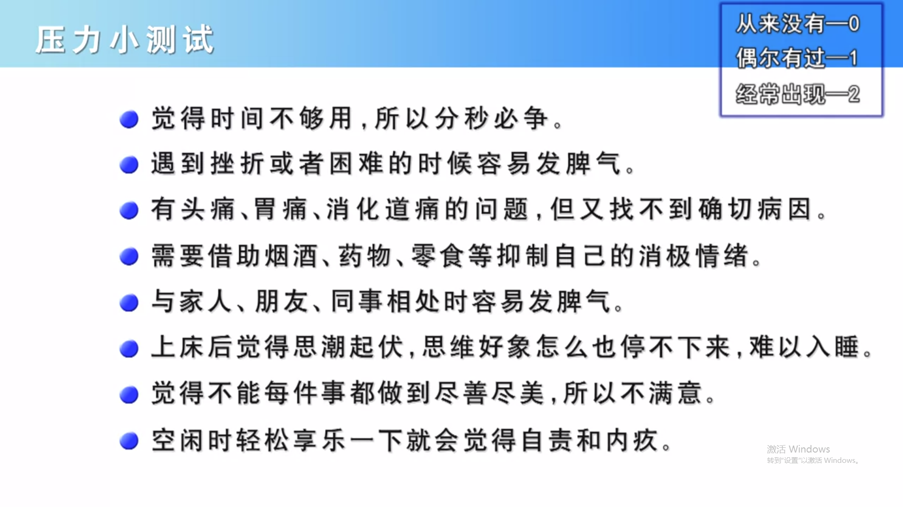

*图：压力测试*

压力测试：

- 得分在 0 - 4 分之间：精神压力比较低，但是生活就有可能变得简单沉闷缺乏动力了；

- 得分在 5 - 9 分之间：压力适中，虽然有时候觉得压力比较大，但还是可以应付自如的；
- 得分在 10 分以上：精神压力可能偏高了，应该反省一下在生活中有没有压力的来源，寻找解决的方法。

应激源：造成压力的来源。

应激源分类一：

- 外在的：学习、工作的目标；
- 内在的：对自身的要求。内在的价值是一个重要的应激源。

应激源分类二：

- 具体可见的：可以见的指标等；
- 隐而不见的。

应激源分类三：

- 急性应激：短暂的唤醒状态，伴随着典型的进攻或者退缩行为，当你逃跑或者反抗之后，成功地摆脱了这个困扰恢复正常；
- 慢性应激：长期的唤醒状态，使人感觉到即便把内在资源和外在资源加在一起，也不能满足压力事件的要求。慢性应激所带来的影响远远超过急性应激

具体的引起压力的事情：

- 生活事件：离婚、家里有人故去、搬家等；
- 学习或工作；
- 钱；
- 好事情：升职（责任越大）、有钱之后等；
- 生活方式：倒班是极其痛苦的，就要不停地变换你的生物钟。再比如你在周一到周五中某天休息，当你休息的时候，你的朋友都在工作；而当你工作时候呢，你的朋友却在休息；
- 信息压力：休息时间远程隐形加班。另外就算你无聊的刷着手机，你也会发现那么多的状态，你要看过来也是无比痛苦，你大量的时间被刷掉之后又会觉得内疚和后悔。

#### 3.7.2 面对压力的不同阶段

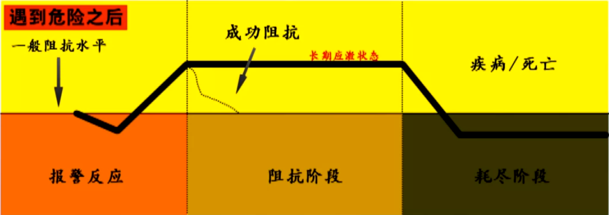

*图：应对压力的三个阶段*

压力来后不同的阶段：

- 进化心理学说面临危险的时候第一反应是呆住，我们的祖先在面临猛兽的时候发现跑也跑不掉，于是躺下来装死。这就是老人家或者小孩子在过马路的时候，当有一辆车向他/她迎面而来，他/她会呆在那儿不动；
- 第二个阶段阻抗阶段：想尽办法减少压力阻抗压力。成功阻抗身体活性下降，不成功进入长期应激状态；
- 长期处于长期应激状态进入第三阶段耗尽阶段，身体分泌应激物质，这些物质短时间存在会提高你的身体活性，但如果它们长时间在你体内存在的话，会破坏你的脏器，造成你的身体衰竭，甚至最终的死亡。所以如果长期处在应激或者压力状态，你又找不到方法解决的话，你就有可能带来身体的疾病。

通过行为方式减少压力带来的影响：

- 吃：香蕉菠萝之类的水果、巧克力；
- 喝：浓茶、咖啡无益于减缓压力，它短时间内可以提神，但它其实会让你的血管收缩，反而造成你更加紧张。据说喝一些花茶，可以起到减缓压力，放松心情的作用；
- 玩：不要从第一天到放假的最后一天全部在外面玩，因为这样你会身体无比的疲惫。有张有驰，有休息也有玩。过度娱乐，恰恰是你压力的表现；
- 充足睡眠：现在睡前可能花很多时间上网，或者刷手机结果，把时间都刷完了，真正的睡眠时间反而减少了，所以放下手机，让自己可以美美地睡一觉；
- 寻求专业心理咨询或辅导。

### 3.8 上网：痛并快乐着

支持网络：朋友可以帮助减轻压力。互联网让人越来越近，也越来越远。

人是社会性的动物，与他人保持稳定的联系是我们生活必不可少的一个部分，正如我们需要一个群体的归属感。我们害怕孤独和寂寞，希望在群体中得到关注和认可。

社交应用是为孤独而生的，但社交网络让人更孤独。研究者还发现，孤独的人倾向于花更多时间在 Facebook 上。不仅仅是 Facebook，人们在使用这些社交软件时，会长期的有规律地联络的也只有那么几个人，而这些一般都是自己的亲人，或者十分要好的朋友。

社交网络确确实实让人们更方便地与外界进行交流和沟通，社交网络上人们添加了大量的好友，可是这样做的代价就是我们要花大量的时间去和那些无关紧要的人交流、查看那些无关紧要的新鲜事，却忽略了那些身边真正关心我们的、或者值得我们关心的人，我们与当下现实情景中的他人交流的时间和沟通时间也大量地减少。这种通信联系增加，和人际接触减少的对立现象，我们也把它称作互联网悖论。

社交网络中人际互动最常用的形式就是文字，文字本身缺少情绪化和人性化成分，缺乏社交性和社会情绪的内容使得我们与他人的亲密感随之降低，从而增加与被人的社会隔离感，造成个人孤独感急剧上升。人们真正面对面时脑中的垂体会分泌一种物质，类似于催产素，是荷尔蒙物质，帮助人们减缓压力，提升信任感，甚至激发爱的感觉。网络交流难以刺激大脑产生这种感觉。所以异地恋更辛苦。

网络社交的联系：弱联系。面对面的联系：强联系。只有当面对面的交流中，对方给你一句宽慰的同时再配上一个动作、一个表情，才能真正让你感受到彼此真实的情感与联接，才能让你体会到那种在网络上感受不到的温暖与关怀。当你开心的时候，需要的是一起欢笑、而不是一句回复；当你哭泣的时候，需要的是一个怀抱、而不是一条信息。

## 第四章 人格与动机

你可能莫名其妙地喜欢上一个人，也可能无缘无故地冲某个人发脾气，这些似乎都不受你自己意识的控制。这就是潜意识，一种蕴藏在你内心深处的神秘力量，它在真正激活你的动机、左右你的行为。而潜意识又是精神分析的核心概念之一。除此之外，行为主义、人本主义和特质理论也都是重要的人格理论流派，你将从不同的角度学习这些理论，让你更加明确心理正常与否的标准，同时也能更好地解释人类的行为。

### 4.1 你未必知道的人格

人格，来源于日语，人和格两个字组合一起，来源于英文 Personality。词根 Persona 指面具，中国的脸谱。Personality 运用了面具这个词根，来慢慢形容在人们内心总所具有的不同的特征与表现。

人格是人人都有的，存在巨大差异。几个特征：

- 整体性：人格的各个成分和特质之间，应该密切联系成为一个整体。人格的完整性是心理健康的重要表现，一旦失去完整性，人格会分裂；
- 稳定性：在不同的时间、不同的情境中稳定的内在特征，我们才能把它定义成人格。人格测量成为可能。跨越时间、跨越空间稳定，但并不是一成不变的；
- 独特性：人与人之间个体差异；
- 社会性：人格是必须立足于社会的，我们是在与他人的交往中不断的学习到行为准则和社会规范，而最终慢慢形成一个独立的人格；
- 动力性：行为受情境控制，行为也会受人格控制。出于人格做出某些行为。

性格：是人的一种内在思维方式，它更多的是涉及到社会评价的部分。有正面与负面，比如勇敢-懦弱，真诚-虚伪。性格是在社会化过程中逐渐形成的，反应社会文化。

### 4.2 你不知道的东西潜意识知道

弗洛伊德在 1900 年出版的《梦的解析》这本书，标志着精神分析理论登上了历史舞台。弗洛伊德用冰山理论提出意识和潜意识：

- 意识：能觉察到的、能意识到的、能进行反省和思考的；
- 潜意识：是你觉察不到的，藏在意识之下，但时刻会影响你的行为。

我们能看到的冰山，只是漂浮在海平面上非常小的一段，那是意识；但是真正这个冰山向哪个方向移动跟海平面以下，那个非常大的一块冰有非常大的关系，那个就是潜意识。决定这个冰山走向的是潜意识，而不是意识。

如何知觉到潜意识？

- 梦；
- 自由联想；
- 催眠状态。

弗洛伊德的另一个重要的基础理论，是人格的结构：

- 本我：我们最原始的冲动和欲望，没有规章制度，按照快乐原则行事；
- 自我：人格当中相对理性的一面，协调着本我和外界之间的关系，按照外界的规则行事。它使得我们的最原始的冲动，转化成一个现实可以接受的行为或者模式表现出来，即现实原则；
- 超我：所有价值观的源泉，是我们后天慢慢习得的一种社会规范和道德，即被内化的道德，超我按道德原则行事。

强大的自我可以协调本我和超我，不强大会人格分裂。

所有的本我都是潜意识，蕴含着丰富的原始冲动和欲望，虽然它极大影响我们的生活而且确实存在，但是感觉不到。自我和超我既有意识的成分也有潜意识的成分。

假期综合征（Post-holiday Syndrome）：可能是潜意识的表达。假期结束后，我们将消极情绪压抑进入潜意识中，造成失眠、疲惫、精神不济，通过身体表现出来，从而避免不必要的心理冲突。本我：清闲；超我：奋斗；自我：协调二者，让身体出现症状，让本我得以消极怠工，让超我得以容忍本我。自我通过部分地压抑本我的冲动，从而避免了和超我之间产生冲突，即自我防御机制（Ego-defence mechanism）。

不是所有人都有假期综合症，尤其是那些工作比较清闲的人，根本不会出现这种症状。不过反过来也告诉我们，当你真的出现假期综合症的时候，是不是说明你的工作已经超出你的承受范围，这或许又是一个必要的信号。

### 4.3 你运用自如的自我防御机制

自我防御机制：人为了避免精神上的痛苦、烦躁、焦虑等一系列负面情绪，从而进行了自我的心理调节，达到保护自己的一种作用。自我防御机制是潜意识层面的，通常来说是个人无法知觉到的。

几种自我防御机制：

- 压抑：把负面情绪埋藏进心底，例如如对老板不满而不说、喜欢女生而不表白。最常见的自我防御机制；
- 否认：例如做错事抵赖，心情不好却说“我没事”。用否认的方式避免尴尬，防止不愿示人的东西被别人发现；
- 投射：把自己内心的一种情感加到别人身上，例如喜欢一个人，会觉得那个人的任何行为都和自己有关，例如女神即使看了你一眼，你也会觉得那一眼是充满了柔情的；
- 合理化：将得不到的东西合理化，免受得不到的痛苦，例如吃不到葡萄说葡萄酸，失恋的时候你一定会认为那个人是多么的不好，你离开他/她是多么的明智；
- 退行：成年人用儿童的方式保护自己，例如吵架的时候男朋友对女朋友说你听我解释，女朋友说“我不听”；
- 抵消：当你有一个不可接受的行为的时候，我们会有一种象征的手法来平衡这种心理上的焦虑，例如过年的时候听到不吉利的话说童言无忌，打碎碗说岁岁平安；
- 反向形成：例如喜欢一个人却又说不出口，只能用相反的行为来表现，例如一个男孩子喜欢一个女孩子却反而欺负她；
- 升华：将不为社会接受的冲动和能量转换一种社会能接受的形式来释放，例如歌德表白被拒写成《少年维特的烦恼》；
- 转移：当我们不能把一种正常的情绪像一个人表现出来的时候，我们只能找一些替代的，可以接受的人去发泄我们的负面情绪，例如将公司的怨气发泄给家人。

自我防御机制类似于自我麻痹。虽然它平时可以帮助我们维护自己的形象，避免冲突和矛盾，但是不能放弃自我思考，自我防御相信得太久了，你自己真的会相信，从而失去思考能力，也失去前进和进步的动力。

不要企图揭穿别人的自我防御机制，因为自我防御机制就像一块伤疤，你非要把别人的伤疤揭开，别人是不答应的。因此，对别人的自我防御机制应该宽容一点，留给他/她足够的时间和空间，耐心陪伴和等待，有时候比追问更有用。

### 4.4 为什么广告会有用：人本主义的解释

精神分析理论认为人的行为是受到原始欲望所驱使的，所以行为归根到底是本能，这未免有些悲观主义的色彩。

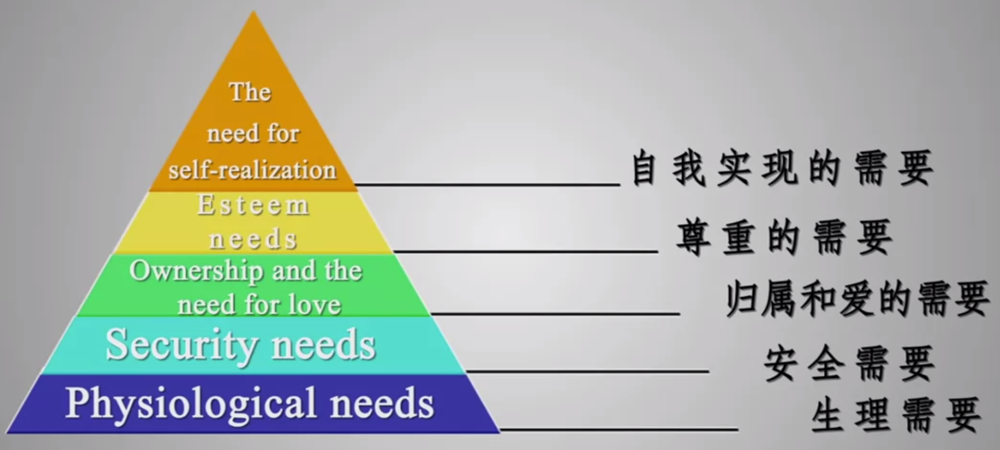

*图：需要层次理论*

以马斯洛为代表的人本主义认为，人的内在特质是异常美好的，人格发展的重要动力来源于我们慢慢形成的不同层次的需要，即需要层次理论。人的需要不是先天就有的，也不是随意可以满足的。人的需要是有结构的、分层次的，下一层需要只有得到满足，或者部分满足的时候，才会有更高层次的需要：

- 生理需要：包含了所有的吃喝拉撒睡的需要；
- 安全需要：们避免身体伤害，对秩序稳定的一种追求；
- 归属和爱的需要：我们企图与他人建立关系，被自己所在的团体所认可的一种需要，例如你希望同事、同学都有良好的人际关系。酒广告里反映了归属和爱的需要：“喝杯清酒，交个朋友”、“岁月流金，爱我所爱”、“孔府家酒，叫人想家”；
- 尊重需要：包含两部分，一个是别人对我们的尊重，包括社会地位、名誉声望等；另一个是自尊，是我们自己对名誉地位的一种追求。汽车广告反映了尊重需要：“领导时代，驾驭未来”、“享非凡声誉，令世界赞叹”、“坐红旗车，走中国路”；
- 自我实现的需要。所谓自我实现就是一个人想成为什么，他必须成为什么。也就是说，一个人要全面发挥他的潜能，让他成为他可能成为的一切。人本主义最大的特点是他相信所有人都有成长潜能。凡自我实现者必有高峰体验。高峰体验是一种发自内心深处的颤栗、欣快、满足、超然的情绪体验。运动品牌广告反映了自我实现的需要：“一切皆有可能”、“我能，无限可能”。

生理需要 + 安全需要 = 缺失需要（Deficiency Need），涉及生死的需要。归属和爱的需要 + 尊重需要 + 自我实现的需要 = 发展需要（Growth Need），不涉及生死，而是让人更幸福的需要。

归属和爱的需要要比尊重需要更低。例如在暧昧阶段，男生会在女生宿舍楼下等很久，等女生下去跟他说：“抱歉，我来晚了”，他会跟你说：“没事，我刚到”。一个是被追求者，一个是追求者，两者关系是不平衡的。可是追求者为了得到的爱，他当然愿意接受这份不平衡，哪怕牺牲一点尊严或者自尊。可是当你们确立关系之后，当女生刚刚迟到5分钟，他就会冲你大喊：“你就不能快一点”，此时两者就应该慢慢地平衡起来，即使是追求者也希望跟你保持相同的地位，因为只有平等的爱情才是最稳定的。

### 4.5 你的心理正常吗？

心理正常包括：

- 一般心理问题；
- 严重心理问题，例如心情低落、抑郁等。

心理异常：

- 人格障碍；
- 确诊的精神障碍。

甄别心理正常和异常最基本的两条标准：令自己感到痛苦不适和统计上的极端性。不过也不可以反过来说，只要痛苦不适、只要符合统计上的极端性，就代表你有心理疾病。例如如果你去动物园被一只老虎咬了一口，你一定会痛苦不适，这件事情也符合统计上的极端性，但不能说明你有心理问题。

每一个人至少有一种以上的人格倾向，偏执性就是其中的一种。人格中的偏执性倾向恰恰说明你做事比较认真坚持而且执着，它能帮助你取得事业的成功，所以这是一种正常的人格状态。而偏执性人格障碍是一种变态人格，你不但会影响你正常的生活，而且会让你饱受痛苦。所以千万不要把正常的人格倾向和异常的人格障碍混为一谈。

很多人一出现情绪不佳，或者心情低落的时候，就会对这些症状对号入座，无缘无故给自己打上了抑郁症的标签。抑郁症是一种极端的病理性行为，而抑郁倾向是普遍的、时常存在的。即使你频繁地陷入到抑郁情绪当中，也不要先着急判断自己有没有抑郁症，因为这样可能会让你更加抑郁。可以先处理自己的情绪，你可以找一些书读一读，或者找你的家人、朋友聊一聊，甚至可以寻求专业的心理帮助。研究表明，即使是慢跑或者慢走这样的低强度的运动，都可以让你的情绪得到调节。

手机依赖是心理疾病吗？很多人其实都依赖于手机进行工作、学习、生活，所以并不存在统计上的极端性；当你使用手机的时候，如果你是正常的，没有特别的不适感和痛苦感，那么手机依赖不应该是一种心理疾病。

### 4.6 挨千刀的心灵鸡汤：行为主义的视角

人格心理学中有很多理论，这些理论没有对错之分，它们只是从不同的视角去看待人。精神分析和人本主义虽然它们在人格发展动力的理解上有非常大的不同，但是都强调人的内在本能或者动力。

行为主义强调外在行为的影响，就是斯金纳为代表的操作行为反射。传统行为主义三个观点：

- 行为和人格基本上是由外在环境塑造的；
- 人格其实就是人所有外显与内隐行为的总和，而这些反应又都是被强化出来的；
- 人之所以有个体差异，是因为我们有着不同的外界强化路径，因此我们的发展模式也是不一样的。

传统行为主义基本上否认了人的能动性和自主性，有失偏颇的。班杜拉在传统行为主义基础上以学习理论为基础补充了人自身的能动作用，强调人与社会环境之间的相互作用，提出了新的人格研究方法，形成了新的行为主义流派：社会学习理论。

精神分析和人本主义都认为人由本能驱动，而传统行为主义者否定了内在驱力，认为人是环境塑造的。社会学习理论认为人既不是光由本能驱动，也不是完全受环境摆布，而是由自己独立的认知过程，而这个过程它参与到行为的获得并最终让你养成了人格。

你不用自己去杀人放火，通过学习你就知道这是一种犯罪的行为，是被禁止的。你能够去思考这样做是多么的不理性，因为你完全可以预见杀人放火之后的可能结果。这种学习叫作替代学习，或观察学习。你的认知过程能作用于你的行为和环境，同样环境也能改变你的行为和认知。个人、行为、环境之间有着非常复杂的交互作用。

心灵鸡汤提高了我们的自我效能感，似乎一切全由我们自己去掌握。班杜拉之处，自我效能感是一种信念，是指我们相信自己能在特定的环境中恰当而有效地作出行为表现。这种信念不同于一般的自信，是对能力的特殊评价，是一种非常复杂的自我认知。例如你参加马拉松比赛，自我效能感就是你对自己能否在马拉松比赛中取得好成绩，或者能跑完马拉松与否的一个重要评价。

自我效能感的重要影响因素：

- 言语劝说。如微信朋友圈的鸡汤，让你觉得“我能”；
- 直接的成败体验更能刺激你，成功提高自我效能感，反复失败会越降越低。不过成功的定义其实有很多种，学会根据实际情况确定恰当的成功，才能保证你拥有坚强而自信的心；
- 替代经验。例如”别人家的孩子“，替代经验要有作用的因素是，要与榜样有一致性，两者应该非常相似；

“心灵鸡汤”和“别人家孩子”都忽略了环境或者其他因素，并不能真正理解你的生活，特别是由于种种原因，付出没有得到期许的回报，努力没有获得想要的结果的时候反而会降低自我效能感。

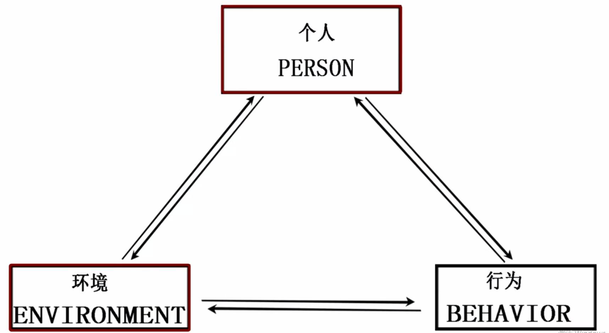

*图：社会学习理论中，个体、环境和人格之间有着非常复杂的交互作用*

只有学会从恰当的实际出发，定义恰当的成功，选择恰当的方式才能拥有恰当的坚强和自信。

### 4.7 人心，可测吗

人格特质指人拥有的能够影响行为的品质和特性，例如成熟稳重、冲动鲁莽。人格特质理论（Theory of Personality Trait）是另一个人格理论，认为人格由不同的特质构成，这是大部分人格测试的理论基础，将人格划分为不同的特质或几个不同的维度，而测试的结果就反应了你在这些特质或维度上的强弱程度。不同的人格测试，都是通过你在不同维度上的表现进行逐个的分析，最终，大致勾勒出你的人格的面貌。

艾森克人格测试（EPQ）：

- 神经质（Neuroticism）：情绪稳定性；

- 外倾性（Extraversion）：内向还是外向。

大五人格测试：

- 神经质；
- 外倾性；
- 开放性（Openness）：是充满想象、寻求变化，还是务实、循规蹈矩；
- 责任感（Conscientiousness）：是否谨慎细心，认真负责；
- 宜人性（Agreeableness）：是否乐于助人，与人合作，值得信赖。

卡特尔 16 相人格测试（16 PF）：

- 世故性：得分低说明你直率和天真；
- 敢为性：得分高说明你冒险、敢作敢为、少有顾忌；

职业性格测试（BMTI）：对应 16 种性格特征、16 种工作：

- 内倾（Introverted）——外倾（Extraversion）
- 实感（Real sense）——直觉（Intuition）
- 情感（Emotion）——思考（Reflection）
- 计划（Plan）——知觉（Perception）

人格是相对稳定的，不是僵化不变的，而是可以慢慢发展的。

为什么绝大多数的人格测试都来自于特质理论，其他人格理论为什么就不能发展出人格测试呢？不同的人格理论其实是从不同的视角来看待人格。

- 弗洛伊德认为，人的行为是由意识不到的内驱力推动的，这就是神奇的潜意识，不要以为潜意识那么容易测量；
- 行为主义认为，测了行为不能说明就真的测了行为，和控制、刺激、反应有关；
- 人本主义认为，测不测无所谓啦，人的特征那么重要吗，让他/她成为他/她原来的样子，不是很好吗？

### 4.8 血型与星座，你信吗

血型是根据红细胞表面的物质对不同人的血液进行的一种分类，而红细胞表面的这种物质是由基因决定的，所以血型是与生俱来不会变化的。血型和人格之间有没有关系并不是简单的用是和否来回答的，通过不同的人格测试有不同的结果。

血型能决定性格，其实这其中最重要的一点取决于你是否相信血型会决定性格，即你在这两者之间的信念。这是主观验证效应，当有一条观点专门来描述你本人的时候，你就很有可能会接受这个观点。其实不是测试结果很准，而是你的信念让测试结果准。

韩梅梅到底有多好，我们不知道，但当李雷接收到别人说韩梅梅很好这个信息之后，他就一定会在头脑中寻找她很好的例子，最终证明韩梅梅确实很好。所以不要以为恋爱是绝对自由的，说不定你的恋爱也是这样被别人说成的。

星座也是主观验证。星座分析不过就是把一些模糊的、每个人都适用的话跟每个人都说了一遍，全人类都可以共享，所有星座的人都一样。

梦是否能预示未来？梦是模糊的、不清晰的。因此当你在梦中有一个情景的时候，这个模糊的线索被你记住了，到日后一个实际的情景跟这个线索，有那么一点点相似的时候，就会激活你的记忆，让你仿佛觉得这个梦是被梦到过的。于是你就主观验证了梦有预测性。如果你相信梦的神秘主义色彩，那么，你就会发现你的梦确实验证了你的信念。

人格的形成受到太多因素的影响，包括：

- 先天的遗传因素。基因遗传对性格的影响只有五成左右的影响，而另一半的影响就来自于其他多种多样因素的组合；
- 后天的家庭环境；
- 工作以及个人的际遇等。

通过对精神分析、人本主义、行为主义和特质理论、以及人格测量这些内容的介绍，你应该已经发现，随着我们视角不同，人格就会呈现出千姿百态、丰富多彩的样子。重要的不是人格是什么，而是你自己的理解，以及你因此而发生的改变。多一点关怀自己的心，多一点关注自己的变化，享受变化莫测的人格状态，让你的人生更加精彩。

## 第五章 文化与社会

在一个特定情境中，你的行为可能变得“不由自主”，而从众和服从可能夺走你思考与辨别的能力。认识它们，或许可以给你自己多争得一点理智。人具有归因的本性，但在寻找原因的过程中却又很容易犯各种错误。身处不同的文化与社会环境中，你的行为也会有错综复杂的变化。这个部分将会让你看到，人类的行为绝不仅仅受到其自身人格的制约，还受到社会情境的影响，甚至因此出现巨大的变化和偏差。

### 5.1 情境：你并没有那么自由

在地铁里、公交车上、或者电梯里，你会不由自主地盯着这个屏幕上的广告。这些都是相对比较密闭的空间，而如果在一个开放的广场上，即使屏幕再大，或许你根本也不会注意到。在开放空间所遇到的人带有偶然性，也是一次性的，你可能遇到很多人，但都是一闪而过；在密闭空间里遇到人有静止性，尴尬性，这种对陌生的目光或身体的接触，都会让你觉得不自在或者尴尬。所以在密闭空间里更容易盯着某一个显示器，避免与他人目光接触。盯着屏幕看是避免人际尴尬的一种自我保护，一种构建神圣的独立空间的方式而已。

人的很多行为是由所处的社会情境决定的。为什么会受到环境的影响？我们常常跟随别人的行为，以此来避免自己显得无知或者不符合规矩。即从众。包括：

- 信息性从众：在某些场合模仿别人的行为；
- 规范性从众：感受到来自群体的压力，为了不被群体排斥或拒绝，选择与群体保持一致。

### 5.2 服从：唤醒内心的“邪恶”

我们有一种希望与大多数人保持一致的强烈愿望。我们非常害怕与别人不同，而让自己进入一个尴尬和窘迫的境地，所以一个群体中大多数人的行为就形成了一种无形之中的标准和规范。

并不是所有的群体性规范都有强大的影响力和控制力，这通常与群体的吸引力和约束力有非常大的关系。影响群体的吸引力和约束力：

- 群体的规模；
- 成员间的熟悉度和联系性；
- 群体的文化；
- 群体内部的差异性；

较小的群体约束力强于大的群体，彼此成员间越熟悉联系越紧密，接触越频繁，越有约束力。提倡服从或者集体主义精神的群体，比提倡各抒己见、个人主义的群体有更强的约束力。但是，只要群体内有一个人有不同意见切被公开的表达出来，那么他的存在就会极大的增强群体其他成员做出不从众行为的勇气。从众还和个人特质有很大的关系。独立性强比较果断的人通常更容易坚持自己的观点，而不是屈从他人的态度。

米尔格伦电击实验：参加实验的人扮演教师，对学生进行记忆测试，学生一旦答错将接受电击惩罚，电击装置 从15 伏一直到 450 伏。而测验开始，学生在前面两道题答对之后，就连续答错，所以扮演老师的参与者就不得不连续对他们进行逐级增加的电击。学生痛苦的尖叫声和希望退出实验的请求声，让所有的参与者都饱受煎熬，甚至有不少参与者离开自己的座位，也要求停止实验。然而由于有实验负责人在一旁坚决不容置疑的指令，要求参加者把实验继续下去，结果有 65% 的参与者向权威妥协，对他人进行如此残忍的伤害，有参与者最终按照指令对一个自己并不认识的陌生人按下了 450 伏电压的惩罚按钮。

该实验说明，在某些特殊的情境下我们不仅服从权威，甚至会不惜对他人进行残忍的伤害。即使是一个理智而善良的普通人，也有可能做出超越道德底线的行为，这就是所谓的服从。在实验中，参与者的道德观念警告他们不可以这样去伤害一个人，但是他们的道德观念同样要求他们服从负责人的命令，成为合格的实验参与者。在善良与服从的选择里，服从常常战胜。就像很多纳粹军官和士兵，对那些犹太人并没有歧视和仇恨，但依然把他们送进了毒气室，原因并不是他们内心有多么邪恶，其实只是由于他们身为军人，服从命令超越了他们的道德底线。实验基本结论是，即使是简单从事自己工作而没有任何特殊敌意的普通人，也可能成为一些恐怖活动的参与者。

### 5.3 归因：保护自己的尊严

我们总是希望对自己和他人的行为，找到背后的原因。海德提出归因理论，在多数归因分析当中主导性问题是发现行为的原因在人（内在或倾向性原因），还是在情境（外在的或者情境原因），以及谁最终对结果负责。

凯利认为，人们通常是在不确定条件下对事情进行归因的，并提出协变原理：如果某个因素一旦出现就可以看到某个行为，该因素不出现就看不到这个行为，那么人们就会把该因素归结为该行为的原因。

归因的心理过程（假设朋友见到美女大叫）：

- 区别性（Distinctiveness）：这个行为是否是特定情境下的具体行为（朋友是否对所有漂亮的女生都大喊大叫）；
- 一贯性（Coherency）：这个行为是否反复出现以回应这一情境（这位漂亮的女生过去是否也让你的朋友大喊大叫）；
- 一致性（Consistence）：其他人是否在同样情境下也产生同样的行为（是不是每个人都指着那个漂亮的女生大喊大叫）。

如果区别性、一贯性高，一致性低：个人倾向性归因（朋友疯了）；而一贯性、一致性高，区别性低：情境性归因（危险人物出现）。

当我们是当事人的时候我们倾向于将自己的行为归因为外部因素，也就是情境因素，即行动者-观察者的错误。

归因时分类一：

- 内因：个体自身具有的导致其外在行为表现的品性或者特征，包括个体的人格、情绪、心境、动机、欲求能力、付出努力等；
- 外因：个体自身以外的导致其外在行为表现的条件和影响包括环境条件、情境特征、他人的影响等。

归因时分类二：

- 稳定因素：导致行为表现的相对稳定、不易发生变化的各种因素、条件、个体自身的品性和特征，如个体的能力、人格、品质、活动的难易程度等；
- 非稳定因素：容易发生变化比较不稳定的各种因素、条件及个体自身的品性和特征，如个体的情绪、心境、努力程度、机遇及环境的影响等。

自利性偏差：

- 当行为是成功的、活动去了良好的结果时，如果是自己的行为会被归因于内（能力或者其他人格品质使然），如果是他人的行为会被归因于外（环境或者外在条件使然）。
- 当行为本身是不好的、失败的时候，入股是自己的行为会被归因于外（环境或外在条件使然），如果是他人的行为会被归因于内（能力或者其他人格品质使然）。

自我中心偏差：如果我们以一定的方式行动，我们就期望其他人也会以这样的方式行动。例如说：这部电影真的很棒，是人都要去看的。

我希望通过这样的学习，你发现这样的偏差，并及时的进行修正。因为骗自己骗久了，自己也会相信的。

### 5.4 社会认知：情人眼里出西施

社会认知：你对人及其行为的认知，而不是你对物及其非人的客观存在的认知。四种认知途径（和微反应是一致的）：

- 面部表情；
- 言语活动；
- 体态表现；
- 行为方式。

在社会认知的基础上，通过与认知对象的接触和知觉，在头脑中形成关于认知对象的形象，并将这个形象留在心里，这就构成了社会印象。社会印象通常是

- 间接性：这种印象经过了你自己的加工；
- 综合性：你把大量的关于他/她的信息进行整合之后的结果；
- 固执性：通常来说，我们是不太会改变自己的判断的。

社会认知效应：

- 首因效应：在社会认知过程中，最先的印象对人的认知具有极其重要的影响，例如一见钟情/一见不钟情，都是因为第一印象的原因。这是因为这个人的某些特殊的特征、相貌、衣着、甚至是说话的方式，让你联想到过去那些不愉快的经历，于是你就认为这个人不够好，因此不喜欢他/她；
- 近因效应：最新的印象会对人的认知具有重要作用，例如“经过这件事情之后，我终于认清你了”；
- 晕轮效应：当认知者对一个人的某种人格特征形成好或者坏的印象之后，人们还倾向于据此推论该人其他方面的特征，例如情人眼里出西施；
- 刻板效应：针对一群人的效应。指对某个社会群体形成的一种概括而固定的看法。因为文化或者历史原因产生，但这是过去的经验，不代表适合每一个人。刻板印象也能帮助我们做好准备，例如你听说这个外教是德国人，你一定会按时到、按时交作业、按时去考试，非常地认真，这样才能获得好的成绩。

连续见到某个人的时候，首因效应更加显著；当你是断断续续见到这个人，近因效应作用更加明显。与陌生人交往时，首因效应起较大作用。与熟人交往，近因效应作用强。

我们对人、对事的判断，都常常是主观的，但因为有我们自己的加工在里面，也因此存在着许多偏差。你应该试着，尽最大努力去避免他们。

### 5.5 助人行为：不能相信的媒体

责任分散理论：在一个寻求他人帮助的情景中，旁观者越多，助人的责任就被越多的人分担。即单一个体实施帮助的可能性就越小。实验证明，旁观者越多，获得帮助的可能性就越小。

助人行为：特指以特定的个人或群体为对象的亲社会行为。亲社会行为：泛指一切符合社会期望而对他人、群体或社会有益的行为，如分享、捐献、安慰、助人等等。

根据动机，助人行为分为两类：

- 无个人动机，不期望任何回报的助人行为，即利他行为；
- 具有个人意图，出于自己的利益而发生的助人行为。

助人行为引发和产生不仅受旁观者人数影响，其实是一个连续过程（五步走）：

- 觉察：个体必须注意到某个事件正在发生着；
- 解释：在注意该事件时个体必须把它视为一种紧急情况来加以解释；
- 责任：当得出该事件是紧急情况的判断后，个体要断定自己是否有责任采取行动；
- 能力：明确自己有责任后个体要确定以何种形式给与帮助；
- 行动：实施助人行为。

影响助人行为的情境因素：

- 自然环境：天气好，温度适宜，助人行为就会增多。因为心情好，同时助人的代价比较小；
- 社会环境：在提倡给予他人帮助的文化中，助人行为就会增多；
- 榜样的作用；
- 匆忙程度：匆忙的水平越高，人们对身边需要帮助者提供帮助的可能性就越小；
- 助人技能。

### 5.6 认知失调：求助的女神最美

认知失调理论的三个假设：

- 人一般都是非常想维护自己稳定的、正面的、积极的自我概念，例如“我是一个很优秀的人”；
- 一个人的行为与自己先前的自我认知产生分歧的时候，就会产生一种不舒适感觉或者不愉快的情绪。即认知失调，例如工作不能体现我的价值；
- 人会想尽办法减少这种不舒服不愉快的感觉，避免认知失调，做法有以下几个：

    - 改变态度，使其与之前的行为一致，例如我并不是不喜欢这个工作；
    - 增加认知，两个认知不一致时增加更多一致的认知，例如起码离家近呀；
    - 改变认知的重要性，让一致性的认知更重要，例如离家近比多点工资更好呀；
    - 减少选择感，例如因为自己没得选。找工作很难呀；

    - 改变行为，例如真的换工作。

在整个过程中，个体、认知和行为之间应该是平衡的，一旦出现不平衡，通常是改变认知来获取平衡。

决策行为中常常有认知失调的影响。比如买到了饥饿营销的手机感受到快乐：我是明智的人，但行为上等待很久来买手机，出现矛盾，这时候就改变信念，因为手机值得。

生活行为。例如：

- 考试失败了归因为运气不好，或者老师不好：我是优秀的人，但没考好，两者产生失调，改变信念，是考试有问题老师有问题；
- 婚姻存在蜜月期：因为选择了这个人，为了证明选择是对的，会不断发现优秀的地方，产生亲密感，维持选择的正确性；
- 道德行为，例如米尔格伦的电击实验：我不邪恶，但我伤害了别人，我只是按命令行事。

认知失调的应用：

- 禁止儿童某种行为时，严厉的惩罚和微弱的惩罚：当我们用严厉的惩罚时，不良行为不变或者增加；微弱惩罚时，不良行为减少。微弱的惩罚没有强调不良行为作为原因，我喜欢但我没有做，改变认知，我可能是不喜欢的。既要强到让他不会做这件事，同时又不能强到让他产生不该有的认知失调（认为没有做是因为惩罚而不是不喜欢）；
- 求助者更有魅力会更愿意帮助他，有时是先帮助了再喜欢他：我们帮了别人之后，会产生一种认知失调，原来我们是因为喜欢他/她才帮他/她。在生活中有很多女孩子，无论是相貌、学识、能力，各方面都非常地优秀，偏偏没有人追求，因为她们完美得像一个神一样，我们对神的感觉是可远观不可亵玩。因此适度请求别人帮助可能会获得别人的喜欢；

- 改变态度，让吸烟的人劝人戒烟后，自己开始戒烟。

### 5.7 态度：谁能改变你的行为

广告的根本目的是改变行为，而本身所改变的是态度。

态度：一个人指向一定对象，有一定的观念基础的评价性而且是持久性的反应倾向。三个成分：

- 认知成分：人们对一定的态度对象所持有的知识、观念、意象或概念等等；
- 情感成分：对态度对象的一种体验，比如接纳、拒绝、喜欢、热情、尊敬；
- 行为成分：当你对态度对象有了认知、情感，自然就会对他采取某些行为，例如接近、回避。

从态度的不同成分出发，以此为基础，就会引发不同的态度，以广告为例

- 以认知为基础，广告中的专家、权威的形象，让你觉得他说话是准确的；
- 以情感为基础，明星代言，让你看到明星产生种比较舒适的情感，广告让你慢慢地把明星这张脸和产品产生了联系，于是你就喜欢这个产品；
- 以行为为基础，认知失调理论，例如买到饥饿营销的产品。

改变态度：

- 中心路径方法：摆事实讲道理，包括接受信息、思考、改变三步；
- 边缘路径方法，三大类影响因素：
    - 信息来源，你愿意相信这些人的话：信任的人、熟悉的人、相似的人、外表有特点的人、幽默感强的人、一个并不是站在他原本应该站的立场说话（违背自己的利益）的人；
    - 信息因素：
        - 信息的强度：信息的强度比较大的时候更愿意接受并改变态度，但信息过于强烈到无法接受的程度，我们会自认为跟自己无关，隔离起来从而降低我们的恐惧，例如烟盒上的吸烟者的肺；
        - 信息的顺序：开头结尾的信息容易影响别人发生态度改变；
        - 信息的多元性：呈现单一信息，导致爱思考的人觉得有意偏袒，不相信；相反不爱思考的人容易相信，会改变。
    - 接收者
        - 独立性比较强，依赖性弱不太容易发生改变，而依赖性人格的人很容易改变态度；
        - 接收信息的人动机比较强，会认真听取信息，发生改变的可能性比较大，动机不强，不在意信息内容，受其他因素影响；
        - 情绪状态影响态度，在紧张、焦虑等消极情绪状态下，人的认知范围会缩小，容易被别人影响。

### 5.8 群体行为：被别人“惯”坏的你

社会助长：个人对别人的意识，比如说别人是否在场或者与别人一起活动时所带来的行为效率的改变。社会助长并不是一定会提高效率，有时会降低效率，跟对这个活动的掌握程度有关：

- 熟悉、水平高：不仅能让你热情高涨，也会激发你的潜能，导致效率提高；
- 不熟悉、水平低：增加你的紧张感，让你变得很尴尬或者窘迫，导致效率降低。

善于利用社会助长的各个因素，可以帮到你更好的发挥你的水平。

社会惰化（社会懈怠）：个人与群体其他成员一起完成一个活动的时候，或者做一件事情的时候，往往个人所付出的努力会比单独时少，不如单干的时候出力多，个人的活动性与效率也在普遍下降。例如磨洋工、搭便车、滥竽充数。

如果想要集体中的人都积极起来，就不能采取模糊的集体奖励，而应该让个人从群体中突出出来。总体绩效与个人绩效直接挂钩，或者让所有人的行为都暴露在所有人眼下等方式。

如果不让个人突出出来，个人的特性就会消失，即去个性化（个性消失）：指的是个人在群体压力或者群体意识影响下，会导致自我导向功能的削弱或责任感的丧失，产生一些个体单独活动是不会出现的行为。比如在打砸抢烧中，有些人完全就是去凑热闹的，但是在这个参加的过程中，他/她甚至会做出那些比组织者更加失控的行为。

去个性化有两个重要条件：

- 身份的隐匿性：随着群体规模的增加，彼此之间的熟悉程度会在降低，因此你这个身份就慢慢地被隐藏起来；
- 责任的模糊性：当我们处在群体中的时候，你并不会认为你对这个群体的行为负有责任，既然没有人对这个群体行为负责，那么我做什么都没有关系。
- 这时候到底谁该负责 
- 责任的模糊性。

霍桑效应：当人们在意识到自己正在被关注或者观察的时候，会刻意去改变一些行为或者是言语表达的效应。

# 第二部分 手把手教你心理咨询：谈话的艺术

心理咨询似乎很神秘，我们常常想靠近它，但又害怕靠近它！这一部分并不是要教你成为一名心理咨询师，而是要帮助你了解心理咨询、懂得心理咨询。并且手把手地教会你，将心理咨询的理念和技巧，合理、恰当地运用到你的实际生活中去，让你的生活变得更加和谐、更加精彩！“谈话的艺术”这一部分当中的所有情景展示，都是基于我们日常生活中的谈话，而并非是真正的心理咨询。因为我想告诉你，心理咨询并不是什么神秘、高深的技术。只要愿意学习，你也可以掌握其中的基本方法；只要运用得当，你会让你自己和你身边的人从中受益！

|          | 心理咨询                 | 精神治疗             |
| -------- | ------------------------ | -------------------- |
| 状态     | 心理正常                 | 心理异常             |
| 表现     | 人际交往、生活适应困难等 | 精神分裂症、躁狂症等 |
| 定性     | 心理困扰/障碍            | 精神障碍/疾病        |
| 治疗方法 | 心理咨询                 | 药物治疗             |
| 求助对象 | 心理咨询师               | *精神科医生*         |

*表：心理咨询与心理治疗对比。*

当你学完这一部分，或许可以运用尊重、温暖、真诚、共情来唤醒别人蕴藏在心底的力量，使用参与性或影响性技术帮助他们重新认识自己，倾听自己内心的声音，摆脱自己心灵的困扰。

## 第六章 理解性技术

良好的咨询关系是心理咨询的前提条件，咨询师的态度与行为决定和影响了求助者的后续反应。在本章，我们将了解心理咨询的基本理念，以及不同表现方式间的差异，改变我们对他人的基本态度，学会通过语言向他人适度地表达这些理念。

### 6.1 尊重

#### 6.1.1 概念

**尊重**：咨询师在价值、尊严、人格等诸多方面与求助者保持平等关系。把求助者当作一个鲜活的生命来对待。因此在做判断前，需要了解他内心想法和感受，以及行为背后的内在动机。

尊重的作用：

- 打消求助者顾虑，建立良好的咨询关系；
- 创造安全、温暖的氛围；
- 使求助者感到自己是被接纳，获得自我价值感；
- 对求助者有榜样示范作用吗，帮助求助者学会更多的人际技巧。

尊重的表现：

- 对求助者的完整接纳：既要接纳积极、光明、正确的一面，也要接纳消极、灰暗、错误的一面，咨询师要进入求助者的价值体系，从他的视角看待周围世界。这里的接纳是中性的接纳，不是要委屈求全；
- 平等的对待求助者：一方面要以温暖礼貌的态度对待求助者，另一方面尽量忽略各自诸多方面的差异。不以“专家”身份强加观念；
- 对求助者的充分信任：相信他们有改变自我的主观愿望，有解决问题的内在动机，有能力找到原因解决问题。求助者在自己知觉场中所认为的样子才是最重要的，即使求助者说假话，咨询师要认真考虑他说假话的原因、意义；
- 保护求助者隐私。

#### 6.1.2 错误对话

> A >> 嗯？快坐吧。怎么感觉你看上去精神很差啊？
>
> B >> 唉，这不高三了么，我学习一直上不去，学习压力好大，睡觉也睡不好
>
> A >> 高三了，你有升学压力是正常的
>
> B \>> 嗯，其实我成绩一直都挺一般的。而且我现在特别不喜欢学习，一学习我就犯困。唉，真是烦死我了
>
> A \>> 这我就要批评你了，高考是多么地重要，你这么消极对待学习，怪不得成绩不好呢***（注：和很多家长一样，第一反应是批评和指责 B 的不上进）***
>
> B \>> 我也知道高考很重要，可是跟班上有些同学比，现在差距实在太大了，我觉得赶都赶不上
>
> A \>> 赶不上你也得赶啊，别回头连个大学都上不了，那还有什么出路啊***（注：没有关心学习困难的真正原因，没有注意到 B 的焦虑情绪）***
>
> B \>> 我现在都觉得，现在不一定非要上一本或二本的大学。学项技术也挺好的，现在不都说，技术工人挺吃香的吗？
>
> A \>> 你这是说的什么话，考不上大学还能有出息吗？到时候找工作，你连个大学文凭都没有，谁还会要你啊？听我的，考大学才是王道***（注：把一定要上大学的价值观强加给 B，用有没有出息毫无说服力）***
>
> B \>> 可是我就是觉得我考不上啊，那你说我怎么办呢？
>
> A \>> 我看主要还是你下的功夫不够，学习方法也不当。当年我高考的时候复习很有一套，我来教你好了
>
> B \>> 好是好，可是我真的觉得……
>
> A >> 哎呀，你别"可是可是"的了，没什么可是的。听我的，认真复习，多花点心思，没什么难的***（注：随意打断对方说话。一厢情愿地要帮助 B，但是 B 还没有考虑好是否要接受帮助，原因是 A 总是居高临下的说教态度，让 B 很不舒服）***
>
> B >> 那好吧，我先走了
>
> A \>> 行，那我回头再找你，相信我，没错的啊
>
> A >> （电话铃声）喂？哎呀没那个什么，你还记得你们邻居家那个小张吗？高三了，成绩跟不上，我刚刚就在跟他商量，怎么帮他补习呢。行，你等我啊，我马上过来***（注：泄露隐私）***

帮助他人也要考虑对方感受，否则帮助就变成了压制，助人者就变成了独裁者。

#### 6.1.3 推荐对话

> A \>> 欸，快坐吧。怎么感觉你看上去精神很差啊？
>
> B \>> 唉，这不高三了么，学习压力大，我成绩又上不去，睡觉都睡不好
>
> A \>> 高三了，你有升学压力是正常的
>
> B \>> 其实我成绩一直都挺一般的，而且我现在特别不喜欢学习。一学习我就犯困，真的烦死我了
>
> A >> 嗯……你说不喜欢学习的意思是？***（注：具体化。耐心具体询问，不急于下判断，发现厌学的真正原因）***
>
> B \>> 老师现在每天都是复习复习，讲的都是那些旧知识。一点新知识都不讲，我们现在每天都是做题做题，真的烦
>
> A \>> 哦？原来你不喜欢成天复习，而是希望能够学到更多新的知识***（注：内容表达）***
>
> B \>> 对啊对啊，如果要那样才能上好大学的话，我宁肯考个技校做个技术工人。反正现在不是说技术工人也挺吃香的么？
>
> A >> 确实现在技术工人也很受欢迎，缺口也很大。那你知道现在都需要什么样的技术工人吗？***（注：没有基于否定技校的想法，用开放、积极的态度使 B 觉得被理解、被接纳。这样可以引导 B 发现即使做技术工人，也需要了解很多信息、付出很多努力）***
>
> B >> 唔，这个我还不太清楚诶
>
> A \>> 那你知道怎么样才能成为一个出色的技术工人吗？
>
> B \>> 呵呵，他们不是说，学挖掘机技术去蓝翔吗？
>
> A >> 那你是准备去蓝翔念书吗？***（注：面质）***
>
> B \>> 那也当然不是了，但是我确实也不太清楚，怎么成为一个优秀的技术工人
>
> A \>> 我倒是觉得，现在社会需要什么样的技术，怎么样才能学好这项技术，应该也算是新知识吧？你要不要去学习研究一下呢？***（注：内容表达）***
>
> B >> 嗯，对，我觉得你说得对。我是应该回家上网搜一搜，可是现在每天回家都要补那些落下的课，我怕我自己没有时间
>
> A \>> 是啊，基础打不牢，补起来也会很辛苦的。所以，你看，复习还是很重要的，对吧？***（注：情感表达）***
>
> B >> 嗯，那倒也是
>
> A \>> 我那时候，高三学习的时候也觉得压力很大，特别容易疲劳。后来我就想办法，总结这些课程的规律，归纳里面的体系。不但找到合适自己的方法，最后好像感觉摸到门道了，复习起来也就轻松一些了。所以，如果你需要，我可以把我的复习经验跟你分享一下***（注：自我开放。说出自己的经历，使 B 觉得自己不是唯一的一个人，不是无可救药。最后婉转地提出帮助 B 的意愿，不因为自己的优秀而强加给 B 方法，激发 B 主动合作的愿望）***
>
> B \>> 太好了！你当年高考考那么好，一定有诀窍
>
> A \>> 诀窍谈不上，只是一种方法，也未必适合你，你试试看吧
>
> B \>> 嗯！
>
> A >> 我后面还有点事儿，我们下次再约时间，我下次再跟你好好聊聊
>
> B \>> 嗯好的，那我先走了，回头我联系你啊？
>
> A >> 嗯，好的！
>
> A >>（电话铃声）喂？哎呀没什么事儿，我刚刚在和朋友聊聊考试的事情。嗯，好的，那我马上过去，你等我哦***（注：用笼统、概况的话保护 B 的隐私，避免可能的尴尬）***

### 6.2 温暖

#### 6.2.1 概念

**温暖**是温柔含蓄的流露，味道淡淡的，有柔柔的包裹住的感觉；而热情是主动外露的表达，味道浓浓的，有略带进攻的感觉。

温暖的作用：

- 有效消除和降低求助者的不良情绪；
- 有效激发求助者的合作愿望。

温暖的表现：

- 不能过于热情，容易显得强势；
- 倾听也可以转化为温暖的；
- 耐心与接纳是温暖的最好诠释。

尊重和温暖是咨询态度的一体两面，两者结合更有活力：

| 尊重           | 温暖               |
| -------------- | ------------------ |
| 平等礼貌       | 友好热情           |
| 保持距离的感觉 | 减小距离的感觉     |
| 理性           | 感性               |
| 客气，公事公办 | 过于友好，不知所措 |

*表：尊重和温暖对比*

#### 6.2.2 错误对话

> A \>> 唉你昨天打电话给我说有事，什么事啊？
>
> B \>> 嗯，是有一点事，嗯，你是不是参加了一个叫 CK 的社团？***（注：B 偏内向，问题也是带有试探性的）***
>
> A >> 啊，你想问这个社团的事啊。嗯，你想参加吗？我确实参加了几次这个社团的活动。嗯，正好可以跟你说一说。嗯，这个社团其实是一个志愿者社团。它平时会组织学生去养老院，还有自闭儿童中心这种地方做志愿者活动。然后我们一般都是周末的下午去。然后，我前几次去参加这个活动的时候，在那里还认识了好几个别的院系的小伙伴。我们一般一去就是周末一下午在那里。我们会做比如说陪小朋友唱歌啊，陪小朋友做游戏啊、帮老年人打扫卫生啊，或者让老年人开个联欢会啊之类的这种活动***（注：滔滔不绝，不管是不是 B 想要的，B 一下懵了，感觉被击倒）***
>
> B \>> 谢谢你啊，你真热情，告诉我这么多
>
> A \>> 哎咱俩是朋友，你来问我肯定热情啊
>
> B \>> 嗯，好，可是我就是有一点内向，不知道能不能加这个活动，还有……
>
> A >> 哎，你咋没去就开始打退堂鼓了呢？而且有我陪你去，我们俩一起去能有什么问题啊？你怕啥？***（B 感受到的不是 A 的温暖与支持，而是 A 的不耐烦和不满）***
>
> B \>> 嗯，也不是怕。那算了我今天还有事我先走了，先谢谢你***（A 的过度热情让 B 产生紧张和焦虑的感觉，最终选择逃避）***
>
> A \>> 你这个人啊就是太内向。唉？周末我跟你一起去啊？

没有 Get 到对方的节奏。

#### 6.2.3 推荐对话

> A \>> 你昨天打电话说有事找我，什么事啊？
>
> B \>> 嗯，是有一件事情想问你，你是不是参加一个叫 CK 的社团？
>
> A >> 哦，你是想问这个社团的事啊，我确实参加过几次他们的活动，你想参加吗？
>
> B \>> 我还不太了解这个社团，我看你的朋友圈好像你也参加这个社团，所以就过来问问你
>
> A \>> 嗯，这个社团是一个志愿者社团，它平时会组织我们周末的时候去养老院啊、自闭症儿童中心啊这些地方做志愿者活动
>
> B \>> 听起来不错的样子，要不你跟我说说它一般是周末什么时候有活动？
>
> A >> 嗯，一般都是周末的下午，我觉得这样我们花点自己的时间，尽自己的能力去帮助老人和小孩，同时过程中我们又能结交到一些别的院系的小伙伴，我觉得是非常有意义的
>
> B \>> 是啊，我也觉得。但是呢，我比较内向，我不知道我适不适合这样的活动。而且，我之前也没有做过志愿者，所以我有点担心
>
> A \>> 哦原来是这样啊，你之前没有做过，嗯，那难免是会多多少少有一些担心的。但是我觉得吧这些事对每个人来说都有一个逐渐熟悉的过程。而且前几次的话我可以陪你一起去啊，这样的话我们在过程中也相互之间有个照应
>
> B \>> 真的吗？那这样就太好了，我本来还担心我一个人去肯定会尴尬呢
>
> A \>> 你放心吧，我肯定会陪你去的，而且不管发生什么你随时都可以找我啊
>
> B >> 那太好了

一个个问题的问，一个个问题的答，每次答的都不多，末尾都加上鼓励。

### 6.3 真诚

#### 6.3.1 概念

**真诚**的作用：

- 让求助者在感受到自己被接纳，被信任的同时消除顾虑，敢于暴露自己的内心世界；
- 可以为求助者提供一个榜样，学会如何与咨询师真实地交流，坦然地表达自己的情绪。

#### 6.3.2 错误对话

> A >> 哎呀，最近脸色好像不太好呀！
>
> B \>> 是呀，我最近状态不太好，吃饭不香，睡眠也不好
>
> A \>> 怎么了呀？发生什么事情了呀？来，喝一杯
>
> B \>> 你说我都快三十了，也工作这么久，可是还是没有女朋友。唉！我这样什么时候才能结婚呢？
>
> A \>> 找女朋友这么难吗？
>
> B \>> 就是说啊。我看可能是因为我长相不好。唉，你说我们都这么久朋友了，你能不能坦率的跟我说说，你觉得我长相怎样？
>
> A \>> 嗯……哎呀，我也不知道怎么评价你长相。但是这么说吧。我就算没有男朋友我也肯定不会让你做我男朋友***（注：真诚不代表实话实话，在聊天中想怎么说就怎么说，不需要任何修饰。这样的评价对双方关系是很大的伤害）***
>
> B \>> 哦……哦，好吧！
>
> A \>> 不过你也不要太伤心了，萝卜青菜各有所爱嘛！肯定有女生喜欢你这种类型的
>
> B \>> 可是……可是我不光是长相不好，身高还特别矮，还不到一米七。为此，我也一直特别自卑
>
> A \>> 别听他们说，你哪里矮了？你不比我还高吗？***（注：说了一个不靠谱的事实和一个奇怪的事实，不仅不能安慰，还让 B 觉得 A 说话虚伪）***
>
> B \>> 比你高有什么用呀！
>
> A \>> 哎呀，其实身高、长相真的没那么重要的，真的
>
> B \>> 是啊，我也一直是这么认为的，所以我就一直在赚钱。这不，就买了一套房。可是……可是贷款有几十万呢
>
> A \>> 哎呦，你说到这个我真是深有感悟啊！我和我男朋友不最近也打算买一套房吗。你说国家政策它也不倾向于咱们老百姓，房地产商他都赚了多少钱了呀？还有@#$%***（注：变成 A 自己情绪的宣泄，让 B 在一边觉得莫名其妙）***
>
> B >> 我……我还有一点事，先走了啊！***（注：这番对话让 B 多了不少的尴尬、烦躁和生气）***
>
> A >> 唉！唉！你怎么走了呀？我还没说完呢，这什么情况？

#### 6.3.3 推荐对话

> A \>> 唉，你最近脸色怎么不太好呀？
>
> B \>> 是啊，我最近状态不太好，吃饭不香，睡眠也不好
>
> A \>> 哎呀，怎么回事啊？发生什么了呀？喝点水
>
> B \>> 你说我都快三十了，也工作这么久了，可是还是没有女朋友。这样下去什么时候才能结婚呢？
>
> A >> 哎，找女朋友这么难呀？
>
> B \>> 就是说啊！我看就是因为我长相不好。你说我们都这么久朋友了，我们之前一直没有问过女生，你能不能坦率地跟我说说，你觉得我长相怎样？
>
> A \>> 怎么说呢，很多女孩子在选择男朋友的时候，的确是会选择长得比较帅的男生，但是我觉得帅并不能作为唯一的因素啊。你想一下，假如你是非常帅的一个人，但是你又没有责任心，而且又比如说好吃懒做，那女孩子会选择你做老公吗？我觉得吧，每个人其实都有他自己的特质，也肯定有女孩子喜欢你这样的呀***（注：没有直接回答，也没有说不符合事实的话。没有否认 B 不帅的事实，而将关注点引到另一个事实，即很多女生更看重男生的内在特征）***
>
> B \>> 可是我身高还不到一米七，为此，我也一直特别自卑
>
> A \>> 嗯，你这个身高，按一般人来看的话的确不算特别高，我完全能够理解你的苦恼***（注：实事求是 + 对苦恼的理解）***
>
> B \>> 是啊！在身高这件事情上我受到太多人的负面影响了***（注：“是啊”说明 A 的理解让 B 感受到了温暖与支持）***
>
> A \>> 我觉得身高和长相虽然有一定影响。但是它毕竟只是一个人的外貌特征啊，它完全不可以代表一个人的内在品质呀！
>
> B \>> 嗯，我也一直是这么想的。所以我就一直拼命工作，终于买了一套房，可是……可是也为此欠下了几十万的贷款。唉，看来是结不了婚喽
>
> A \>> 现在有多少人都是靠家里面的钱才能够买房啊，你居然靠自己一个人就买了一套房？那真是太了不起了。我觉得就算有几十万的贷款没有还，那足够证明你是有上进心、工作刻苦努力的人了。我觉得那些都是非常重要的内在品质呀！
>
> B >> 真的吗？***（注：让 B 重新恢复了自信）***
>
> A \>> 嗯。我觉得你需要找的，是那种真正懂你、欣赏你的女孩子，而不是那种看中你财富或者外貌的女孩子，你觉得呢？
>
> B \>> 对呀！对呀！我相信我一定能找到这样的女孩的
>
> A \>> 对，我也相信你一定可以的

### 6.4 共情

#### 6.4.1 概念

**共情**（同理心、感同身受）：咨询师对求助者内心世界的理解和体验。

共情包括三个方面：

- 咨询师通过求助者的言行，深入对方内心去体验他的情感与思维；
- 咨询师借助知识和经验，把握求助者的体验与其经历和人格之间的联系，更深刻地理解求助者的心理和具体问题的实质；
- 咨询师运用咨询技巧，把自己的共情传达给对方，表达对求助者内心世界的体验和所面临问题的理解，影响对方并取得反馈。

著名护理学家 Teresa 认为共情的四个重要特征：

- 接受他人观点的能力；
- 不要对他人进行评论；
- 识别他人的情绪，并尝试与他交流；
- 与他人一起感受。

提高共情能力：

- 从求助者的角度来看待求助者的问题；
- 与求助者一起感受情绪和情感层面的内容；（而不是过多地在认知层面进行分析，因为分析是一个理性化的过程，会压抑我们的情感，使我们无法了解我们的内心世界，真情实感和真正的需求）；
- 接受和认同求助者的感受，不轻易评价，不随意否定。（在不同的知觉场里，产生不同的感受都是真实的，我们是要探寻这种感受产生的原因，而不是评判）；
- 用更准确和贴切的情绪词汇清晰地放映出求助者的内心感受；（委屈、难过、失望、苦闷），让求助者感觉被理解了。

#### 6.4.2 错误对话

> A >> 怎么了你？是不是昨晚又没睡好啊？
>
> B >> 别提了，昨晚跟我妈打电话的时候，又吵架了
>
> A >> 诶，这次又是为什么事吵？
>
> B >> 我妈一直想让我考公务员，可我想毕业以后继续学习广告设计。她一天到晚总是说：女孩子嘛，找一个稳定的工作才是最重要的。可是我就是想干广告这一行呀***（注：让 B 生气的是妈妈对 B 的不理解、不重视、强硬要求 B 遵循妈妈的意见）***
>
> A \>> 诶，可是我觉得公务员挺好的呀。你看现在那么多人做公务员
>
> B \>> 可是我只想做广告设计呀
>
> A >> 那你或许应该找个时间和你妈妈谈一谈，把话说说清楚啊
>
> B \>> 哎，没用的，她只会坚持自己的想法
>
> A \>> 你也应该试着理解理解你妈妈嘛，毕竟她也是为了你好啊。亲人之间应该相互理解。我当年也是为了考研还是工作的事和我妈吵过。后来，坐下来认真谈了一谈，双方都做了妥协，事情就得到解决了。所以你也应该和你妈妈谈一谈，相信你也可以的***（注：对 B 的烦躁与愤怒视而不见）***
>
> B \>> 算了算了，不聊这个了，一提就烦。诶对了，你最近和你女朋友怎么样了呀？
>
> A >> 哎，一说这事我也烦呐
>
> B \>> 怎么了呀你？
>
> A >> 我前段时间经朋友介绍认识了个女孩子。既温柔又贤惠，但就是长得不够漂亮。这不，前几天又认识了个女孩子，长得很漂亮。属于人见人爱的那种，但是既不温柔又不贤惠，还常常爱发脾气。哎，你说这让我怎么选呢？***（注：面对世纪难题的焦虑和烦躁）***
>
> B >> 你呀。以前没有女朋友的时候烦，现在好不容易有交往对象了还是烦。我真是搞不懂你诶***（注：不能理解，同时责怪 A 太麻烦）***
>
> A \>> 啊我也不想这样啊，你说我该怎么办吧
>
> B \>> 这有什么难办的呢？既然两个都各有优缺点，那就随便选一个呗
>
> A \>> 随便选一个？
>
> B >> 对呀，实在不行就抛个硬币咯。漂亮的是字，温柔的是花，哪边朝上，就选那个咯***（注：不着边际的方案）***
>
> A \>> 你厉害，我去吃饭了，顺便找个硬币去

#### 6.4.3 推荐对话

> A >> 怎么了你？是不是昨晚又没睡好啊？
>
> B >> 别提了，昨晚跟我妈打电话的时候，又吵架了
>
> A >> 诶，这次又是为什么事吵？
>
> B >> 我妈一直想让我考公务员，可我想毕业以后继续学习广告设计。她一天到晚总是说：女孩子嘛，找一个稳定的工作才是最重要的。可是我就是想干广告这一行呀
>
> A \>> 哎，是啊，父母总是搬出他们那套老观念，根本不理解我们真正想要什么***（注：一下说中了 B 最烦妈妈的地方，让 B 感受到了 A 的理解与尊重，心理上有了支持感）***
>
> B \>> 是的是的，他们总是这样，还说是为我着想
>
> A \>> 对呀，其实他们不知道，要是真正为我们好，就不该给我们那么多束缚，指手画脚让我们这么烦躁和焦虑
>
> B \>> 就是就是，我妈每次都让我做这做那，完全不考虑我怎么想，真是烦死了
>
> A \>> 哎，父母好像总以为我们是长不大的小孩子，喜欢替我们做选择。我当年也为了考研还是工作的事和我妈吵过呢
>
> B \>> 是吗？那后来是怎么解决的呀？
>
> A >> 我们坐下来好好地谈了谈，把各自的想法说清楚，各做了一步退让
>
> B \>> 真好，像我妈她就只会坚持她自己的意见
>
> A \>> 是啊，父母有时候真的十分固执，很难接受我们的观点，但总是吵架估计也解决不了什么问题吧
>
> B \>> 你说的也对，总是吵架也解决不了什么问题。我想我可能还是需要好好找她谈一谈
>
> A \>> 是啊，解决问题方法很多，可以多做一点尝试。我看你这么喜欢广告设计，可不要轻易放弃咯。我会一直支持你的
>
> B \>> 好，谢谢你，你这样说我感觉好多了，有你这样的朋友的支持，我自然会坚持下去的
>
> A \>> 嗯，我看好你
>
> B \>> 对了，说起朋友，你最近那个女朋友怎么样了呀？
>
> A \>> 哎，一说起这事我也烦呐
>
> B >> 怎么了？
>
> A >> 我前一段时间认识了个女孩子，既贤惠又温柔，但是就是长得不够漂亮。这不，前几天又认识了个女孩子，长得很漂亮，属于人见人爱的那种，但是既不温柔又不贤惠，还常常发脾气。我在这两者之间很难选择啊
>
> B \>> 诶，听你这么一说好像真的很混乱呢，很难做决定，一定很痛苦吧？***（注：让 A 感觉被理解了，心理舒服了很多。重点不是漂亮还是贤惠，而是 A 难以选择的纠结和痛苦）***
>
> A \>> 是啊，我有时候真是越想越烦。恨不得两个都不要，重新找一个既贤惠又漂亮的
>
> B \>> 唉，好不容易有了女孩子可以交往，却又是这样的。你这样左右为难一定很痛苦吧？
>
> A >> 对呀
>
> B \>> 你说会不会是我们没有搞清楚真正想要的是什么？你还记得上一次吗？最后我们得出的结论是，你想要的是一个真正懂你、欣赏你内在品质的人。我不知道这点对于你现在的判断是否有什么影响？
>
> A >> 有道理。我再好好想一想，我究竟要一个什么样的女孩一起过日子

### 6.5 积极关注

#### 6.5.1 概念

**积极关注：**咨询师度求助者的言语和行为中积极、光明、正确的方面予以关注，从而使求助者建立正向、积极的价值观，拥有改变自己的内在动力。

积极关注的表现方法：

- 用客观的语言表达积极的态度；
- 寻找身上积极、正向的资源。

如何做到积极关注：

- 对于求助者的基本态度和基本理念；相信认识可以改变的，每个人身上都有自己的长处、优点，每个人都有潜力；即使有问题的人，通过自己的努力和帮助，每个人都可以比现在更好，咨询师的作用就是帮助求助者发现潜力，增强其改变自己的内在动力；

- 善于发现求助者的能力；

- 肯定求助者的进步；

- 关注求助者的动力和潜力。

积极关注要适度：

- 实事求是；
- 不要盲目乐观；
- 选择好方向。

#### 6.5.2 错误对话

> A >> 小琴姐，是小云推荐我来找你的。她说你在名牌大学读书，当年高考的时候成绩考得特别好，你教她的那个高考复习方法，对她特别有用
>
> B \>> 其实还是小云她自己本身努力了，我教她的呢只是一些思路。她自己呢去琢磨了一些具体的方法
>
> A \>> 那你也教教我吧！我最近成绩下滑特别厉害，上课总是听不进去，题目也做不出来，我都担心死了
>
> B \>> 别着急，你慢慢说，最近怎么了？
>
> A >> 我也不知道自己怎么了。最近上课总是集中不了注意力，老师讲什么也不知道，脑子里乱乱的，总是想一些乱七八糟的事情
>
> B \>> 嗯……那你上课的时候都在想些什么呢？
>
> A \>> 嗯……其实也没有想什么，就是在想整容的事情
>
> B \>> 啊？你要整容啊？
>
> A >> 是啊，小琴姐，你看我的鼻子是不是很扁？同学他们都是这样说的。所以我在想要不要把鼻子垫高一点儿
>
> B \>> 我觉得你的鼻子一点儿都不扁啊，我觉得很好啊。你啊，小小年纪，干嘛去学人家整容啊？你都这么漂亮了，不要去想着什么整容了，安心学习才是
>
> A \>> 小琴姐，我真的觉得我的鼻子不好看。你仔细看看，是不是很扁？
>
> B >> 哪有啊，我觉得很好啊，又高又挺。你啊，还是在我见过的人里面啊，算是最漂亮的了***（注：A 听起来会相当的刺耳，显然是 B 有意安慰自己，这仿佛从侧面证明了鼻子真的不好看）***
>
> A \>> 小琴姐你就别安慰我了，我自己长什么样我自己知道
>
> B \>> 我说的可都是实话
>
> A \>> 我知道自己长得不好看，鼻子又扁，下巴又圆。一点优点也没有，同学们都不会关注我
>
> B \>> 唉，你怎么整天想的都是什么好看啊、整容啊什么的。你现在的主要任务是学习，又不是去选美。好看有什么用？好看能当分数用？
>
> A \>> 可是，就是因为我长得不好看，才每天想着整容的事情，学习成绩才不好的呀。如果我现在把鼻子整了，那我不就是有优点了吗？***（注：A 其实希望别人能关注她、欣赏她，同时她也非常希望能集中注意力，好好学习。现在不能集中的原因出自对相貌的关注上）***
>
> B >> 你啊，心思都没放在正路上。你要是不把你这种思想调整过来，我看你这学习啊，是搞也搞不好了***（注：像是家长批评孩子，把孩子所有积极动机都否定掉了，那她只能逃避、放弃、或反抗）***
>
> A \>> 那，我现在就去整一下，那样我就有优点，我就自信了，就有心思学习了
>
> B \>> 你啊，老师帮不了你了，你还是去找别人吧，啊

其实 A 一直在寻找解决问题的办法，虽然方向上有偏差，但勇敢面对自己问题、积极找寻解决方法的态度值得肯定。

#### 6.5.3 推荐对话

> A >> 小琴姐，是小云推荐我来找你的。她说你在名牌大学读书，当年高考的时候成绩考得特别好，你教她的那个高考复习方法，对她特别有用
>
> B \>> 其实还是小云她自己本身努力了，我教她的呢只是一些思路。她自己呢去琢磨了一些具体的方法
>
> A \>> 那你也教教我吧！我最近成绩下滑特别厉害，上课总是听不进去，题目也做不出来，我都担心死了
>
> B \>> 别着急，你慢慢说，最近怎么了？
>
> A >> 我也不知道自己怎么了。最近上课总是集中不了注意力，老师讲什么也不知道，脑子里乱乱的，总是想一些乱七八糟的事情
>
> B \>> 嗯……那你上课的时候都在想些什么呢？
>
> A \>> 嗯……其实也没有想什么，就是在想整容的事情
>
> B \>> 啊？你要整容啊？
>
> A >> 是啊，小琴姐，你看我的鼻子是不是很扁？同学他们都是这样说的。所以我在想要不要把鼻子垫高一点儿
>
> B >> "同学都这么说"，你的意思是，常常有人说你的鼻子太扁了？
>
> A >> 嗯……那倒不是，只是有一次我一个闺蜜无意中说起的。后来我自己也注意到了我的鼻子不好看。嗯……小琴姐，你看一看，是不是很扁？
>
> B \>> 其实，我觉得你扁不扁并不重要，重要的是你自己的看法。不过，我真心觉得你的五官挺标准的，挺好看的***（注：没有过度夸张，而用客观语言表达对外貌的积极态度）***
>
> A \>> 是吗？我的鼻子真的不扁吗？
>
> B \>> 我觉得吧，长相还是要看整体的，可能你受你闺蜜随便的一句话影响了，特别关注自己的鼻子，反而越看越别扭了
>
> A >> 有可能吧。可是，我还是觉得我的下巴不够尖，脸显得很圆，一点也不好看，班里都没有同学注意我
>
> B \>> 你好像特别在意自己的外貌啊
>
> A \>> 是啊，就是因为长得不好看，没有什么优点，我才整天想着整容的事情，学习成绩也才不好的。如果我把鼻子垫高了，那所有的问题不就迎刃而解了？
>
> B >> 哦，原来是这样。你的意思是，只要你把鼻子垫高了，你的学习自然就好了？
>
> A >> 那倒不是，小琴姐。我的意思是说，如果我把鼻子垫高了，那我不就有自信了吗？然后就有心思投入学习了
>
> B \>> 是啊，我很欣赏你这种勇气和毅力。因为我看到，即使你现在学习不够好，注意力不够集中。但你并没有放弃，而是去寻求改变自己状态的方法
>
> A >> 是啊，小琴姐。我现在特别想让自己快一点好起来，快一点自信起来，然后专心地投入学习***（注：A 感觉到被理解、被支持）***
>
> B \>> 我能感受到你这种强烈的渴望，但也好像不知道该怎么办，所以又充满了矛盾和纠结
>
> A \>> 是啊！那小琴姐，你说我该怎么办呀？
>
> B >> 嗯……我常常想，我们自己在看别人的时候，是看重他的成绩呢，还是看重他的长相呢？
>
> A \>> 嗯……好像都不是。我的朋友都是人好的、心地善良的，当然也有学习成绩特别好的
>
> B >> 嗯，也对。好像有时候我们并不是特别在意长相什么的，有时候我们更多的是去看到别人身上的一些突出的我们喜欢的特点，这样也会吸引到我们
>
> A \>> 是啊，只要我喜欢，管他长什么样呢
>
> B \>> 长相也好，学习也好，这些都可能成为你们注意的优点，但都不是唯一的。并不是只有这些才能够吸引到别人，你们的朋友们都欣赏你身上哪些优点呢？***（注：帮助 A 寻找身上积极、正向的资源）***
>
> A >> 嗯……他们都说我善解人意，嗯讲信用，然后待人做事也都从来不玩虚的
>
> B \>> 所以你也是有优点的咯，并不是没有人在意你的，对不对？那还要去整容吗？
>
> A \>> 我看我还是先把落下的课都补上吧

世界上不缺少美，而是缺少发现美的眼睛。

## 第七章 参与性技术

参与性技术是为了引导求助者深入、有序、准确的探讨自身的问题，起到促进探讨、澄清事实的作用，从而使求助者对自身的问题、原因、程度有深入准确的认识，也是咨询师对求助者的理解更加准确，为后面对求助者的影响与促进打下重要基础。在本章，我们将理解对他们感同身受的重要性，学会使用基本技术和方法推进谈话的深入。

### 7.1 倾听

#### 7.1.1 概念

**倾听**是心理咨询的第一步，不仅可以表达对求助者的尊重，同时也能促进求助者的表达，让其在比较宽松和信任的氛围下诉说自己的问题，寻求解决的方法，思想志气的成长：

- 嗯：我听到了，你可以继续说；
- 哦：我还在听，你可以再多说一点；
- 啊：好像哪里不对，或者我不太相信，麻烦你能解释一下。

倾听以接纳和共情为基础，只有真正接纳了求助者才能更好地倾听。

倾听不单是用耳朵去听，跟要用心去听，不仅要听懂求助者直接表达的东西，也要发现求助者的语言、表情、动作等行为透露出来的信息，还要发现求助者省略的、没有表达出的内容或者隐含的意义，甚至于发现连求助者自己都没注意到的潜意识。

倾听是一个积极和关注的过程，要发现求助者的积极的一面，关注求助者外在和内在的体验。

在倾听的过程中，好要有恰当的参与，是在恰当的时候，在不打断求助者的思路、情绪的基础上，让求助者的谈话深入下去。

错误的倾听：

- 打断别人；
- 急于下结论，甚至做道德判断；
- 轻视求助者的问题。

#### 7.1.2 错误对话

> A >> 真是受不了我们班主任了！
>
> B \>> 嗯？他怎么了？
>
> A \>> 他总是会训斥我们，说我们不好好学习，他还好意思说我们啊。他自己上课都不认真，还动不动就迟到
>
> B \>> 你们不早该习惯了吗？***（注：没有产生共情）***
>
> A >> 你不知道啊，昨天有个同学就迟到了一会呐！
>
> B \>> 他骂他了？***（注：随意打断说话，轻易做出主观猜测，使 A 情绪受到影响，从而破坏双方关系）***
>
> A \>> 差不多吧！那个同学就迟到一会他就大发脾气。还罚他写检讨、清理班级卫生，他也不想想自己平时不也经常迟到吗？
>
> B \>> 嗯，也是！
>
> A >> 你说说他凭什么这么对学生啊？
>
> B \>> 嗯？
>
> A >> 你在听我说吗？
>
> B >> 嗯嗯，在的。你说啊
>
> A >> 你说他要是自己能认真负责、好好教课，那管我们也就算了。他自己都不负责任，居然都倒过来天天骂我们
>
> B \>> 他毕竟是老师嘛！
>
> A >> 就是老师才更要对我们负责呀！你到底明不明白我在说什么呀？
>
> B \>> 我当然明白了！
>
> A >> 算了，算了！不想说了

漫不经心

#### 7.1.3 推荐对话

> A >> 真是受不了我们班主任了！
>
> B \>> 嗯？他怎么了？
>
> A \>> 他总是会训斥我们，说我们不好好学习，他还好意思说我们啊。他自己上课都不认真，还动不动就迟到
>
> B \>> 这么过分啊！***（注：神态、姿势保持专注状态）***
>
> A \>> 是啊！昨天我们有一个同学上课就迟到了一会他就大发脾气，还罚那个同学些检讨、打扫班级呢
>
> B >> 啊？***（注：这些语气词体现了对 A 的专注与兴趣）***
>
> A \>> 是的！他也不想想自己平时不也经常迟到吗？
>
> B \>> 嗯
>
> A \>> 不仅这样，他平时还总是会训我们。一会说我们太笨了，一会又嫌我们学习不认真
>
> B >> 是吗？
>
> A \>> 是的。他自己倒反过来，从来不认真给我们上课，迟到早退早是家常便饭了。
>
> B \>> 真的吗？
>
> A >> 你也觉得不可思议吧？你说这样的人怎么能当老师呢？上课就是照书念，作业也不批改，还动不动骂学生。我们班里的人个个都讨厌他
>
> B >> 看来他把你们全班都得罪啦？***（注：共情）***
>
> A \>> 就是啊！
>
> B \>> 怎么可以这样啊！
>
> A \>> 我也不知道。可能因为一直没人跟他提过意见，也没人和他冲突吧
>
> B \>> 哦？
>
> A \>> 大家一直都是这么忍着，表面上不说什么，心里都在骂他，恨不得举报他！
>
> B >> 哦
>
> A \>> 我们是不是应该表达一下啊？
>
> B \>> 表达？
>
> A \>> 是啊！我觉得我们应该至少给他提意见，不能再这么忍下去了
>
> B \>> 真的吗？
>
> A \>> 嗯。我们应该联合起来和他说一说，不能再让他这么一直欺负我们了
>
> B \>> 嗯（点头）
>
> A \>> 那我现在就打电话给班长吧！
>
> B \>> 好的，加油！

最简单直接的做法是点头，同时配合认真专注、充满兴趣，配合目光的注视。点头也要适度。

###  7.2 开放式封闭式提问

#### 7.2.1 概念

开放式问题被一些咨询师认为是最有用的技巧，常应用是什么，怎么样，为什么，让求助者对有关的时间给予较为详细地反应，引发对方话题，更多地检出有关情况、想法、情绪等。

开放式问题应该：

- 平等中立的原则；
- 不带有倾向性和明显的情感偏向。

封闭式提问是用是，不是；有，没有；对，不对，有收集信息，澄清事实，缩小讨论范围，使谈话集中在某些特殊领域。若是过多，会使求助者自我表达愿望和积极性受到压制，产生压抑感和被询问的感觉。

#### 7.2.2 错误对话

> A \>> 最近总是坐立不安，晚上也睡不好
>
> B \>> 怎么了，失眠了吗？
>
> A >> 嗯，是有一点睡眠不足
>
> B \>> 这种情况持续多久了？
>
> A >> 嗯，有半个月左右了吧
>
> B \>> 那你想过为什么会这样吗？
>
> A >> 可能是因为成绩下降？
>
> B \>> 成绩下降？是课太难了，还是你自己不认真啊？***（注：带有主观色彩和责备的语气，让 A 的情绪低沉下去）***
>
> A >> 可能都有吧
>
> B \>> 那你跟我讲讲你最近的课堂情况吧
>
> A \>> 嗯，最近上课的时候总是不能集中注意力。然后看书、写作业的时候也经常分心
>
> A \>> 呃，那这也是最近才发生的吗？
>
> B >> 嗯，是的
>
> A \>> 那你最近回想一下有发生过什么事吗？
>
> B \>> 好像也没有什么特别的事情。只是最近上课的时候，总感觉有人在看着我
>
> A \>> 在看着你？你有什么事觉得别人在看你呀？
>
> B \>> 最近换了一副眼镜，就是这一副。总感觉戴着有点奇怪，还觉得有点土气
>
> A \>> 那你就觉得别人看着你就因为你眼镜很土气？
>
> B \>> 是有这种感觉

#### 7.2.3 推荐对话

> A >> 最近总是坐立不安，晚上也睡不好
>
> B \>> 是吗，那你最近怎么了？***（注：开放式提问。深入了解情况和问题产生原因）***
>
> A >> 我也不知道，就是每天都觉得心慌慌的，饮食、作息都不规律了
>
> B \>> 感觉你好像挺焦虑的呀，是什么事让你觉得不安呢？***（注：开放式提问）***
>
> A >> 唉，最近成绩下降了，感觉挺担心的。
>
> B \>> 成绩下降，你成绩向来挺好的呀，怎么突然下降？是不是有什么原因啊？
>
> A \>> 是啊，最近上课总是不能集中注意力，老师在讲什么我也不知道。看书、写作业也常常分心
>
> B >> 那你上课的时候，注意力都在哪儿呢？
>
> A \>> 具体我也不知道为什么。但是最近上课的时候，总感觉有人在观察我，甚至是在议论我
>
> B \>> 大家都在看你、议论你，那这样上课真的好累呀。怎么会这样呢？
>
> A >> 嗯，最近新配了一副眼镜，就是这一副。戴着总是觉得很奇怪，而且觉得很土
>
> B \>> 哦，你是说大家觉得你的眼镜不好看？***（注：封闭式提问。缩小范围）***
>
> A >> 我感觉是这样的
>
> B \>> 你好像真的不太喜欢这副眼镜啊***（注：内容反应）***
>
> A \>> 是啊，是啊。我当时还想把这副眼镜扔掉的。但是它是新配的，我有点舍不得。而且，上课如果不戴眼镜就看不清了
>
> B \>> 哦，那你不想戴，但不戴又不行啊，真的好纠结***（注：情感反应）***
>
> A \>> 就是，就是！现在在上课的时候，我就算是看着书，但是脑子里想的都是他们有没有在说我

封闭式问题不能太多，会使 A 产生被压制感，自我表达的积极性和愿望会被压制。

###  7.3 具体化

#### 7.3.1 概念

**具体化**：咨询师协助求助者清楚、准确地表述他们的观点以及他们所用的概念、说体验到的情感以及所经历的事情。

使用具体化的三种情况：

- 求助者所叙述的问题模糊不清；
- 求助者过分概括；
- 求助者概念不清

实施具体化的过程，也是解决问题的过程，不光是在帮助咨询师了解信息，也是在帮助求助者发现问题、解决问题。

#### 7.3.2 错误对话

>  A \>> 小丁，我这几天完全睡不着，你说我该怎么办啊？
>
> B \>> 这么严重？你要不要去看一下医生？
>
> A >> 我也不知道。你觉得要去吗？
>
> B >> 我也不知道呀。你为什么会睡不着呀？
>
> A >> 我觉得我太无能了
>
> B \>> 啊？
>
> A >> 我什么都做不好，处处被人嫌弃
>
> B \>> 那怎么办啊？要不要跟他们去谈一谈？
>
> A >> 我不知道呐。所以我烦得天天睡不着
>
> B >> 真的好麻烦。怎么办呢？
>
> A >> 你说，我要不要去医院看看？
>
> B \>> 我也不知道啊，你觉得你要去吗？
>
> A >> 我也不知道，你觉得呢？

#### 7.3.3 推荐对话

> A \>> 小丁，我这几天完全睡不着，你说我该怎么办啊？
>
> B \>> 完全睡不着吗？
>
> A >> 就是每天晚上躺在床上，翻来覆去睡不着，有时候要到夜里一两点才睡着。可早上五六点就醒了，醒来好像感觉根本没有睡过一样
>
> B \>> 你是入睡困难了，但这可不是失眠那种完全睡不着啊
>
> A \>> 所以，我不是失眠，对吧？
>
> B >> 嗯。不过我很好奇，你躺在床上睡不着，都在想什么呢？
>
> A \>> 我觉得我太无能了
>
> B \>> 什么叫太无能呢？
>
> A >> 我什么都做不好，处处被人嫌弃
>
> B \>> 这么夸张？都有谁嫌弃你，觉得你做得不好了？
>
> A >> 就是我的导师啊，他总是在我们一起讨论的时候，说我读的文献不够多，学术上的创新不够
>
> B \>> 我明白了，我觉得导师说你文献读得不够多也不能算嫌弃你吧
>
> A \>> 至少也是批评啊
>
> B \>> 嗯，你挺害怕导师批评你，对你印象不好，对吧？
>
> A >> 是啊，万一我毕不了业，怎么办呢？
>
> B >> 好像是挺麻烦的。但怎样才能顺利毕业呢？
>
> A >> 修满学分，完成论文咯
>
> B \>> 那你现在还差什么啊？
>
> A >> 其实我现在就是，还差论文了。总是想不好要写什么
>
> B >> 嗯，我猜这也是导师让你多读文献的原因吧
>
> A \>> 被你这么一说还真是的。他也希望我可以快点确定下来写什么题目呢
>
> B \>> 嗯，所以你现在知道该怎么做了吧？
>
> A >> 嗯

###  7.4 鼓励

#### 7.4.1 概念

**鼓励**：咨询师通过语言等方式对求助者进行鼓励，鼓励他进行自我探索和做出改变。

鼓励技术的表现：

- 咨询师直接的重复求助者的话；
- 用“嗯”、“还有吗”等语言强化求助者叙述的内容；
- 非常明确的语言表达鼓励，如：那你有什么想法。

鼓励的作用：

- 促进会谈，促进求助者的表达与探索；
- 引导求助者向某一方面进行更深一步的讨论。

一般在求助者的一长串困惑中，最后的往往最重要。

#### 7.4.2 错误对话

> A >> 哎，我最近特别烦
>
> B \>> 怎么啦？你之前考试没考好吧？
>
> A >> 嗯，也是有的吧***（注：说明可能是问题，但并不是问题的全部）***
>
> B \>> 你看，你平时都没怎么认真看书
>
> A \>> 我只是没弄懂而已，我自己看书可认真啦！
>
> B \>> 那你就是你上课笔记没认真做
>
> A \>> 呃我也不知道
>
> B >> 那我把我的笔记借给你就是了
>
> A \>> 那好吧，这话好像也不是说这件事的呀

武断

#### 7.4.3 推荐对话

> A \>> 哎，我最近特别烦
>
> B \>> 嗯？什么事让你这么烦呀？***（注：开放式问题）***
>
> A >> 我不是谈恋爱嘛，这次考试没考好，我爸非得说因为谈恋爱影响了成绩，说我精力不集中。我妈就觉得谈恋爱没什么不好的啊，说可能是因为学习方法问题，要我去什么补习班，我一个大学生，居然还要去补习班？而且他们居然还因为这事就吵起来了。这个也让我特别烦，我最近还有点失眠，我真不知道怎么办才好了
>
> B \>> 哎，这么多事，那你自己也不知道该怎么办吧？***（注：重复。A 说出了好几个问题，重复表示理解 A，又鼓励 A 进一步表达。一般一段话的最后一句最重要）***
>
> A \>> 是啊，我觉得这关键还是我成绩的问题，要是我成绩上去了，我爸妈的意见也就统一啦，恋爱也就可以继续谈啊
>
> B \>> 嗯，那你有什么自己的想法呢？***（注：鼓励）***
>
> A \>> 嗯，我觉得补习班可以不用去了，这个问题估计还是出在学习方法上
>
> B \>> 哦，是吗？
>
> A >> 我仔细想了想，其实我做作业的时间也不少了。可能是因为我问题没搞清楚，瞎做题了。我想找我男朋友问问，他成绩特别好，要是他能帮我提高了成绩，我不就可以说服我爸了吗？
>
> B \>> 嗯，看来你已经知道该怎么做了
>
> A \>> 嗯，谢谢你啦，跟你聊天很开心

###  7.5 重复

#### 7.5.1 概念

**重复**：咨询师直接重复求助者刚刚陈述的某句话，引起求助者的重视或注意，以明确要表达的内容。简单的重复只会破坏谈话，甚至让说话者有一种不被尊重的感觉。

重复可以提醒潜在但又及其重要问题。

重复的使用：求助者的表达出现疑问与事实不符合，或与常理不符等等情况下才会使用。

重复的目的：

- 为了澄清关键性信息；
- 鼓励继续表达自己，往往有共情的味道。

滥用重复的坏处：产生疑问、怀疑咨询师的能力、怀疑倾听者的专注度、产生消极情绪。

#### 7.5.2 错误对话

> A \>> 最近真是忙死了
>
> B \>> 你最近忙死啦？
>
> A >> 对啊，六月还要准备考试，七月还要准备实习，准备托福一类的
>
> B \>> 这么多事呢？
>
> A >> 对啊，我现在都没时间看英超了
>
> B \>> 没时间看球赛啦？
>
> A >> 对啊，就看着七月考完试会不会闲一点。
>
> B \>> 你什么时候实习啊？
>
> A >> 七月吧
>
> B \>> 嗯？那你什么时候考试啊？
>
> A \>> 我刚刚不已经说了六月吗？你到底有没有在听我说话？
>
> B \>> 不是嘛？你刚才说七月啊
>
> A \>> 我说的我六月考试，七月实习，所以才忙的
>
> B \>> 所以你是六月考试，七月实习，最近超级忙咯？
>
> A \>> 这不我刚刚说的话吗？你是不是听不懂我说话啊

复读机

#### 7.5.3 推荐对话

> A \>> 哎呦，最近都快忙死了
>
> B \>> 你最近特别忙吗？
>
> A \>> 对啊，马上六月了要准备考试，七月还要准备实习，考托福，联系学校
>
> B \>> 这么多事啊？***（注：重复）***
>
> A >> 对啊，我现在忙得连发朋友圈的时间都没了
>
> B\>> 怪不得看你好久没更新状态了，看来就是忙坏了***（注：内容反应）***
>
> A \>> 哎呦，累死了，就是不知道七月考完试之后会不会闲一点
>
> B \>> 七月考试啊？***（注：重复）***
>
> A >> 哦，说错了，是六月考试，不过我真想七月考试
>
> B \>> 怎么啦？还想晚一点考？***（注：情感反应）***
>
> A >> 也不是，我就是很多东西都来不及准备，好多内容我现在都还没复习完呢
>
> B \>> 会来不及吗？***（注：重复）***
>
> A >> 我也不知道，但我觉得按我的计划应该可以，我就怕万一来不及了
>
> B \>> 所以，你其实是有很好的计划，而且也在充实利用时间来完成计划，你刷微信的时间都牺牲了呀***（注：重复）***
>
> A \>> 你这么一说也是哦，虽然说忙归忙，但一切好像都按计划进行呢
>
> B \>> 一切按计划进行！
>
> A >> 好嘞，回家

###  7.6 内容反应与情感反应

#### 7.6.1 概念

要抓住谈话的内容和情感，可能倾诉者只是为了表达情绪，咨询师只需要作为一面镜子，将对方所表达的内容和表现出来的情绪呈现给他自己看到，往往可能收到积极的效果，可以叫助者看清自己、看懂自己、改变自己。

内容反应：在心理咨询中，咨询师把求助者陈述的主要内容经过概括、综合与整理，用自己的话反馈给求助者。其作用为：加强理解、促进沟通，使求助者有机会再次剖析自己的困扰，深化会谈内容，帮助求助者决定。

情感反应：将求助者所陈述的情绪情感，经过概括与整理，用自己的话反馈给求助者。目的是：加强情绪、情感的理解，促进沟通。最有效方式：针对求助者现在的情感。

情感反应作用就是捕捉求助者的瞬间感受，是观察求助者对周围环境和人的认知的最好线索，将原来压抑在理性当中真正内容表现出来，由此了解到求助者的思想、情感，同时也是求助者清晰、深刻地认识自己。

#### 7.6.2 错误对话

> A >> 我最近可烦了，我妈又说我！
>
> B \>> 啊！怎么了？
>
> A \>> 我前几天不是买了一条热裤嘛，我妈就说我穿成这样一点都不淑女，就像外面那些瞎混的女孩子
>
> B \>> 啊？她怎么能这么说呀！
>
> A \>> 她平时也不准我出去玩，我去哪，都得向她报告。她每次都问，去了哪，和谁去啊，什么时候回来啊？问的可细了。而且她还管着我用钱，你说我都大学生了，买几件衣服也不过分吧，你说说她给我选的那些衣服，看着款式就像上个世纪的，热裤什么的也不准穿，我有时候就简直怀疑我是不是她亲生的
>
> B \>> 不是亲生的？这个有点夸张了吧？***（注：抓错重点）***
>
> A \>> 你说我平时和你们出去玩，七八点就回宿舍了，这也没必要一定要和她说什么吧？再说了，你看我的衣服也没有很非主流吧？我觉得就是现在流行的正常的款式了，但是她每次都说穿成这样干什么？有这么说自己孩子的吗？我现在觉得她根本就不是关心我，她就是想用她的方式来控制我
>
> B \>> 你也别不开心了，这些事情忍忍不就过去了嘛***（注：A 明显已经忍了很久，实在忍不下去了。B 这么轻描淡写的说，没有 Get A 的重点）***
>
> A \>> 不是忍忍的问题，我最近特别不想和她打电话，然后她就不停地给我打电话，我一接起来她就问东问西。我真是烦得不得了
>
> B >> 你妈妈这么做确实有点过分了，那你再和她认真聊聊呗
>
> A \>> 对吧？你也觉得她管得有点多，然后我每次和她聊她都会说：当妈的不管你，谁管你呀？我也知道她是疼我，可是总得有个限度吧？
>
> B >> 你妈妈说的也有道理，那你就再忍忍吧，反正你也知道她是为了你好
>
> A \>> 可再怎么为我好，也不能限制我吧？
>
> B \>> 那就和她好好聊聊，让她别再管你了***（注：B 没有立场，A 似乎想表达一种情绪，而 B 却关注于如何行动）***
>
> A \>> 可是这样的话她不得又伤心了？
>
> B \>> 那就再忍忍？
>
> A \>> 不行，忍不了了
>
> B \>> 那还是和她聊聊吧
>
> A \>> 我怕她伤心啊
>
> B \>> 那你说怎么办啊？

没有抓住内容和情感

#### 7.6.3 推荐对话

> A >> 我最近可烦了，我妈又说我！
>
> B \>> 啊！怎么了？
>
> A \>> 我前几天不是买了一条热裤嘛，我妈就说我穿成这样一点都不淑女，就像外面那些瞎混的女孩子
>
> B \>> 啊？她怎么能这么说呀！
>
> A \>> 她平时也不准我出去玩，我去哪，都得向她报告。她每次都问，去了哪，和谁去啊，什么时候回来啊？问的可细了。而且她还管着我用钱，你说我都大学生了，买几件衣服也不过分吧，你说说她给我选的那些衣服，看着款式就像上个世纪的，热裤什么的也不准穿，我有时候就简直怀疑我是不是她亲生的
>
> B \>> 你妈妈好像给了你很多的限制，有种坐牢的感觉，完全失去自由了***（注：内容反应。Get 到了关键）***
>
> A \>> 是呀，一点自由都没有，虽然我也知道我妈是关心我，但我都这么大了，她也应该信任我一点吧？不要总是像管小孩一样管着我
>
> B \>> 我觉得你好像挺生气的，因为你妈妈没有把你当成大人一样平等对待***（注：情感反应。理解 A 生气的原因）***
>
> A \>> 对的，有点又爱又恨，其实我知道她是为了我好，但是这种方式我实在受不了
>
> B \>> 其实呢，你一方面不想伤害自己的妈妈，另一方面又非常渴望信任和自由***（注：内容反应）***
>
> A \>> 是的。我现在一想到我妈说我穿衣打扮的事情，我就气不打一处来
>
> B \>> 那让你生气的究竟是你妈妈还是你妈妈管你呢？***（注：具体化）***
>
> A \>> 嗯？
>
> B \>> 我能感觉到你对你妈妈的愤怒并不是因为真的讨厌她，而是因为她像小孩子一样管着你***（注：内容反应）***
>
> A >> 可能是吧
>
> B \>> 那你希望你妈妈之后怎么做你会更容易接受呢？***（注：具体化）***
>
> A \>> 我懂了，你是说我应该告诉我妈妈怎么做，而不是在这里生气？
>
> B >> 你果然悟性好高啊！
>
> A \>> 那我找机会和她好好说说，真的谢谢你啊

###  7.7 参与性概述和非言语行为

#### 7.7.1 概念

非言语信息可以发现语言不能提供的或是求助者有意回避、隐藏、作假的信息。非言语信息可以更加全面地了解求助者的心理活动，也可以更好地表达自己对求助者的支持和理解。抓住言语信息和非言语信息的不一致之处，很可能找到问题的关键所在。

注意非言语行为的原因：同一行为在不同情境下有多种含义，也会因人、因时、因地而不同，如果咨询师反应过于灵敏，急于下判断，会对求助者产生负面影响。

参与性概述：咨询师将求助者的语言和非语言行为、情绪、情感等综合整理后，以提纲的方式在向求助者表达出来。只要求助者所说的某一内容已基本清楚了，就可以考虑做一个小节性的参与性概括。目的在于让求助者再一次回顾自己所表达的内容，并使咨询面谈有一个暂停调整的机会。

参与性概述相当于内容反应 + 情感反应，但是更有条理，更加清晰。

#### 7.7.2 错误对话

> A \>> 最近好像很长时间没有见到你了，一下班就不见人影
>
> B \>> 是啊，最近在帮男朋友准备出国的事儿呢
>
> A \>> 挺好的啊
>
> B >> 嗯……我也觉得挺好的。最近还联系到了不错的导师呢
>
> A \>> 嗯？你男朋友是要出国读博士吗？
>
> B >> 是啊，去美国。以后可以有比较靠谱的代购啦
>
> A >> 你们的感情可真好
>
> B \>> 还好吧。你看，他给我买了戒指
>
> A >> 戒指啊？他都向你求婚啦？
>
> B >> 嗯，是啊，上个月
>
> A >> 可真恭喜你们了

嘴上开心，脸上无可奈何。

#### 7.7.3 推荐对话

> A \>> 最近好像很长时间没有见到你了，一下班就不见人影
>
> B \>> 是啊，最近在帮男朋友准备出国的事儿呢
>
> A \>> 你男朋友要出国啊？***（注：倾听）***
>
> B >> 是啊，准备出国留学。最近联系到了不错的导师
>
> A >> 是出国读博士吗？***（注：具体化）***
>
> B >> 是啊，去美国。以后可以有靠谱的代购啦
>
> A >> 那你们最近是忙了。
>
> B \>> 是啊，下班也没得休息。你看他给我买的戒指
>
> A \>> 戒指啊？他都向你求婚啦？***（注：具体化）***
>
> B >> 是啊，上个月嘛。他出国之前我们应该会办订婚宴
>
> A >> 订婚宴？***（注：鼓励）***
>
> B >> 嗯……就是两方家人，要好的朋友，先在一起办个小型的酒宴，因为他出国毕竟要好几年嘛
>
> A \>> 恭喜恭喜啊！***（注：倾听）***
>
> B >> 谢谢
>
> A >> 你好像并没有那么开心哎***（注：封闭式提问 + 情感反应）***
>
> B \>> 嗯……
>
> A >> 怎么了？***（注：开放式提问）***
>
> B \>> 其实……上个月他和我求婚之后吧，我就很紧张。我本来对婚姻就挺担心的，更何况他又要出国，我都不知道我们能不能坚持下来
>
> A \>> 你很怕你们的婚姻坚持不到最后？***（注：重复）***
>
> B \>> 嗯……虽然我很爱他，我也知道他是爱我的，之前说要结婚我还是蛮开心的。但是现在他要出国去了，离他出去的时间越来越近了，我觉得我就越来越紧张
>
> A \>> 你本来是很期待和男朋友结婚的，也为他能出国深造而感到开心，但是对于在他出国之前你们就要结婚的这件事情，你内心充满了紧张，怕你们这样两国分居会坚持不到最后。所以你很矛盾，不知道该怎么办才好***（注：参与性概述）***
>
> B >> 是的。我小时候是跟着我妈长大的，我妈总和我说男人多不可靠
>
> A \>> 所以，你是担心你男朋友，哦不，你的未婚夫一个人在国外，会背叛你们的婚姻？***（注：内容反应）***
>
> B \>> 唉……是啊

## 第八章 影响性技术

在本章，我们将在理解他人的基础上，有效地激发他人的改变意愿，促进改变行为。

###  8.1 面质

#### 8.1.1 概念

**面质：**又叫质疑、对质，咨询师指出求助者身上存在的矛盾，帮助处境求助者的自我探索，最终化解矛盾，从而解决潜在的问题。

求助者的下列情况使用面质：

- 理想与现实不一致；
- 言行的不一致；
- 前后言语不一致；
- 和咨询师的意见不一致。

面质不是逼迫求助者发生改变，而是一种处促进，表现在：

- 促进求助者对自己的感受、信念、行为及所处境况的深入了解；
- 促进求助者能够真实地面对自己，面对现实，最终产生有建设性的行动；
- 促进求助者实现言语和行为的统一，理想自我（希望自己是怎样的人，具有怎样的品质或想象的自我认识，应该是一个怎样的人）与现实自我（现实中的个人真实情况，实际上所具有的特征）的统一；
- 使求助者明确自己所具有的资源并加以利用；
- 给求助者树立学习模仿面质的榜样，以便使其有能力对他人或自己进行面质。

面质的把握：

- 要以事实为基础；
- 避免咨询师个人宣泄，要以求助者的利益为重；
- 避免过于无情的攻击；
- 要以良好的咨询关系为基础；
- 采用尝试性面质，使用“似乎……”的语言。

使用面质要谨慎，且一定和求助者的支持联系起来。没有支持的面质会发生灾难，没有面质的支持则只是软弱。

#### 8.1.2 错误对话

>A >> 你们都恋爱那么久了，怎么还不考虑结婚？
>
>B \>> 我可不想结婚，结婚后肯定会出现各种问题啊，现在看不出来，到时候全都出来了
>
>A \>> 比如什么问题？
>
>B >> 比如感情会不会变啊、两家人怎么相处啊、要不要孩子、要几个孩子、什么时候要孩子，这么多矛盾，怎么办呢？
>
>A >> 这不都是很正常的吗？夫妻总要吵架的，床头吵架床尾和嘛***（注：说 B 大惊小怪、小题大做没有意义，使 B 觉得自己的情感不被人理解，自然不愿意表达自己的内心）***
>
>B \>> 我也知道啊，但是......
>
>A >> 但是什么？
>
>B \>> 我也说不清楚，就觉得心里很排斥。我觉得结婚之后很多东西都变了，我不知道我们能不能坚持到最后。我也不知道会不会变得就像我们父母一样啊，不停地争吵，把感情全都吵掉了
>
>A \>> 你不是希望两个人可以一直好下去，白头到老的那种？
>
>B \>> 对啊，我是很羡慕，但是我觉得那样的感情好遥远，我们应该做不到吧
>
>A \>> 别人能做到，你怎么就不能做到？***（注：质问。B 在困惑和担心的基础上又增加了失落和一些愤怒）***
>
>B >> 哎呀，我就是觉得可能我对感情比较没有信心吧
>
>A \>> 那你现在的男朋友给你安全感了吗？
>
>B >> 他现在给我的感觉还是挺有安全感的
>
>A \>> 那你还在担心什么？有什么好纠结的？你现在不是挺有安全感的嘛，你到底是怎么想的啊？
>
>B \>> 哎，我最怕的或者说最不能接受的就是出轨吧
>
>A \>> 可是你之前说他能给你安全感的啊，这根本就不能成为你不想结婚的理由
>
>B \>> 可是我说的都是事实啊，我也不知道为什么啊***（注：开始反抗对待 A 的质问）***
>
>A \>> 你这样纠结来纠结去有用吗？要么就是你心里根本就不信任他，所以才会有这样的担忧。要么就是你想多了，根本就不会有这样的情况，你就是在杞人忧天***（注：A 沉浸在自己的教育中，试图充当家长的角色，对解决问题没有帮助）***
>
>B \>> 可能吧，算了算了，我们还是不要说这些了

B 觉得 A 有一种你根本不懂我，站着说话不腰疼的感觉。

#### 8.1.3 推荐对话

> A \>> 你们都恋爱那么久了怎么还不考虑结婚啊？
>
> B \>> 我可不想结婚，结婚后肯定会出现各种问题啊，现在看不出来，到时候全都出来了
>
> A \>> 比如什么问题？***（注：具体化）***
>
> B >> 比如感情会不会变啊、两家人怎么相处啊、要不要孩子、要几个孩子、什么时候要孩子，这么多矛盾，怎么办呢？
>
> A \>> 听上去真的好复杂呢***（注：情感表达。不是判断对错，而是肯定 B 的情绪“你说的我深有体会”）***
>
> B \>> 是啊，就是这样两个人谈谈恋爱多好呀，一旦结了婚，一大堆的现实问题全都来了
>
> A \>> 那你的意思是你要和男朋友一直这样谈恋爱永远都不结婚啦？***（注：面质）***
>
> B \>> 那也不一定，该要结的时候总要结的吧
>
> A \>> 哦那到了那个时候，你就不怕你刚说的怎么感情啊、相处啊、孩子啊那些现实的问题了***（注：面质）***
>
> B >> 哎呀，我也不知道，就是觉得好担心啊
>
> A \>> 是不是一说结婚，你想到的全是担心啊？***（注：重复）***
>
> B \>> 也不全是啊，有时候也挺向往那种幸福的婚姻的
>
> A \>> 哦，那什么样的婚姻算是幸福呢？***（注：开放式问题）***
>
> B \>> 就上次我在公交站等车的时候看到一对夫妻，老夫妻，真的是白发苍苍了，两个人还牵着手，感觉好幸福呀！
>
> A >> 那你羡慕他们？***（注：重复）***
>
> B >> 当然羡慕啊，我理想中的婚姻就是这个样子的
>
> A \>> 所以虽然你刚刚一直都在强调自己不想结婚，但其实你内心对于幸福婚姻还是充满向往的，对吧？***（注：情感反应。委婉指出 B 的矛盾，似乎是在说“我不是很理解，你可以多说一点吗”，同时 B 对自己的想法进行梳理）***
>
> B >> 是呀，可是那有多难啊
>
> A \>> 到底难在哪里呢？***（注：具体化）***
>
> B >> 我也说不清。哎呀，其实我最怕的或者说最不能接受的就是出轨
>
> A \>> 当然啊，应该大家都不能接受出轨的吧***（注：共情）***
>
> B \>> 我现在的感情吧稳定是稳定，但是我总觉得还没有到那种程度。我有时候就在想吧，万一他喜欢别人了怎么办？就我特别害怕结婚了以后感情就慢慢地消磨没有了然后，不管是我还是他，都是这样子
>
> A \>> 是啊，可是我们常常必须做出选择***（注：共情）***
>
> B \>> 对的，但是呢你喜欢的人可以给你带来感情上的满足，但是喜欢你的人却能给你带来安全感啊
>
> A \>> 所以，其实你都没有想好，到底是和喜欢你的人结婚，还是和你喜欢的人结婚***（注：内容反应）***
>
> B \>> 其实也不算是，虽然大概知道要怎么去选，但还是担心自己选错了啊
>
> A \>> 你渴望那种白头到老的幸福婚姻，但是又害怕结婚。我感觉你似乎并不是害怕结婚，而是害怕自己在感情中被抛弃***（注：共情）***
>
> B \>> 你说的太准确了，我就是这样的感觉
>
> A \>> 所以能不能体验到安全感对你来说才是最重要的***（注：共情）***
>
> B \>> 是啊，女人谁不渴望安全和稳定呢？

###  8.2 内容表达

#### 8.2.1 概念

**内容表达：**咨询师传递信息，提出忠告，进行解释和反馈，以影响求助者，促使求助者实现咨询目标的方法。这种信息和忠告是以求助者的角度发出的。

#### 8.2.2 错误对话

> A \>> 不好意思，出门有事耽误了，让你等了会儿，今天找我有什么事？
>
> B \>> 也没等多久啊，嗯，也没什么事啊，最近有点烦人，好多事都不顺心，就是想找你聊聊
>
> A >> 哦？怎么啦？出什么事啦？
>
> B \>> 这不是项目后期了嘛，然后各种乱七八糟的事。然后就我每天都也没有心情吃饭了，还有我男朋友也是，一天到晚净给我添乱，什么事都要找我
>
> A \>> 你以前不是挺喜欢他这样子的嘛
>
> B \>> 以前是以前，现在是现在，现在可不一样了
>
> A >> 现在怎么了？
>
> B \>> 他现在竟然和我说要结婚***（注：“竟然”说明 B 对结婚毫无准备）***
>
> A \>> 结婚？这不是挺好的嘛***（注：说明不懂 B）***
>
> B \>> 不好啊，反正我就是觉得还没想好，现在谈结婚太早了，我还不想结婚呢
>
> A \>> 所以现在的情况就是你还不想结婚，但是你的男朋友却要逼你结婚？
>
> B \>> 最关键的是，他竟然当着我妈的面提了这件事，真是，我当时真想……
>
> A >> 那你当时就应该打断他，让他不要说了呀***（注：事后诸葛亮只会让 B 增加更多的无力感和无助感，又一次不懂我）***
>
> B \>> 他和我妈聊得热火朝天的，我怎么开口啊？
>
> A >> 对啊，他这么做就是对你的不尊重啊。他肯定是觉得你妈妈也希望你现在就结婚，唉，真是太过分了
>
> B >> 是啊，我好为难啊
>
> A \>> 你呀，就是太好说话，太好欺负了。你怎么不当场就表明你的态度呢？***（注：又把 B 批评一通，让 B 内心充满了委屈）***
>
> B >> 可是……
>
> A >> 你听我的，你回去一定要跟他说清楚，你们现在还在商量的阶段吧，万事都好说，千万不要被他牵着鼻子走。想不想结婚是一回事，态度是另外一回事。不然他以后做什么事都来这么一出，你可怎么办啊，听我的，回去就跟他说清楚，知道吗？还有啊，你也要跟你妈说清楚，就说你现在还不想结婚，让她不要老催你嘛
>
> B \>> 但是，算啦，谢谢你陪我聊天，我先走啦
>
> A \>> 啊，没事，记得按我说的做啊

居高临下

#### 8.2.3 推荐对话

> A \>> 不好意思，出门有事耽误了，让你等了会儿，今天找我有什么事？
>
> B \>> 也没等多久啊，嗯，也没什么事啊，最近有点烦人，好多事都不顺心，就是想找你聊聊
>
> A >> 哦？怎么啦？出什么事啦？
>
> B \>> 这不是项目后期了嘛，然后各种乱七八糟的事。然后就我每天都也没有心情吃饭了，还有我男朋友也是，一天到晚净给我添乱，什么事都要找我
>
> A \>> 你男朋友又让你不开心了？
>
> B >> 是啊，你猜这次又怎么了？
>
> A >> 他怎么了？
>
> B >> 他竟然和我说结婚的事情
>
> A \>> 结婚？你是不是还不想结婚啊？***（注：内容反应。贴近 B 的真实感受）***
>
> B >> 我也不知道。我就是觉得吧，现在谈结婚还太早了，我还不想结婚呢
>
> A \>> 哦，原来你还不想谈结婚的事情***（注：内容反应）***
>
> B \>> 最关键的是，他当时竟然当着我妈的面提到这件事。哎呀，真是，我当时真是想……***（注：生气或尴尬）***
>
> A >> 那你当时岂不是很尴尬？***（注：情感反应）***
>
> B >> 对啊，我也不想让我妈为我操心啊，他也真是的，也不事先和我讨论一下就说。哎呀，根本不考虑我的感受
>
> A \>> 就是啊，他这样也太不尊重你了，就算他想找去你妈说结婚的事情，也应该先和你商量一下的嘛。唉，这样不是让你为难嘛？***（注：情感反应）***
>
> B >> 是啊，而且我也不想让我妈替我操心。哎呀，他真是的，一点也不考虑我的感受
>
> A >> 就是说嘛，所以你就很生气啊。哎呀，事先也不和你商量一下就这样去找你妈，那你之后可怎么办啊？***（注：情感反应）***
>
> B >> 对啊，对啊，怎么能这样啊？真是太可气了
>
> A \>> 其实我觉得吧，最让你是接受不了的，还是他不尊重你的内心感受。突然说要结婚，又突然去找你妈说结婚的事情，这才是最让人生气的吧***（注：参与性概述）***
>
> B \>> 就是说嘛，婷婷，还是你最懂我了
>
> A \>> 那是，谁让咱们是好朋友呢。不过小雨，你这么生气，你男朋友知道吗？***（注：内容表达）***
>
> B \>> 他当然知道啦，我昨天晚上就跟他翻脸了，电话也不接，微信也不回他，就不想理他
>
> A \>> 那他知道你为什么跟他翻脸吗？***（注：内容表达）***
>
> B >> 啊？你的意思是？我应该和他，就是沟通一下？
>
> A >> 没错，我就是这个意思。唉，其实事情好好沟通一下，还是很好解决的

###  8.3 解释

#### 8.3.1 概念

**解释**：是面谈技术中最复杂的，指咨询师运用心理学理论来描述求助者思想、情感和行为的原因，或者是对某种抽象复杂心理现象过程进行解释。是要透过问题的表面看出本质，并对问题作出深刻而系统的分析。

解释的作用：可使求助者以一种更新的，更全面的角度看待困扰，以及说出的环境，并借助新的观念和思想，加深了解自身的行为、思想、情感，从而提高自己的认识，促进自己的变化。

咨询师要有：扎实的理论基础、敏锐的洞察力和一些出创造力。

最好的解释不是完美的理论，而是被求助者接受的分析，故绝对不能将自己的解释强加给求助者。

#### 8.3.2 错误对话

> A \>> 妈，知道了，你就放心吧。行不？嗯我先不和你说了，我这周末就回去，嗯好好，拜拜
>
> B \>> 又跟你妈打电话啊。我看你们感觉不像母女，倒像是闺蜜
>
> A >> 嘿嘿嘿，还好吧。诶你和你妈妈难道不是像朋友一样相处吗？
>
> B >> 显然不会啦，我可不像你。我和我妈可以各干各的，互不干扰，是不是很厉害？
>
> A >> 可是，你上次不是说一般有什么事情你都会听你妈妈的吗？
>
> B >> 唉，一般情况下是这样的，因为她真的是比较强势，要不我这次怎么会和她吵呢？
>
> A >> 你又和你妈妈吵架了呀？
>
> B \>> 对啊，我不希望她对我干涉太多。特别是我现在也已经是一个成人了，也有了自己的工作
>
> A \>> 你看啊，我们都认识这么久了，我觉得吧就是因为你父母在你很小的时候就离婚了。所以呢你会比较早熟，而且也非常独立，想让你妈妈放心，也让自己少受一点伤害***（注：莫名其妙的感觉）***
>
> B \>> 是吗？
>
> A >> 其实吧，和父母之间交流不顺畅也是正常的。但是呢你却因为此感到非常得苦恼，那是因为在你内心深处，你对自己并不满意，而且也不愉快，你内心的成人呢试图会用你妈妈的标准来衡量你自己，但是呢你内心还有个小孩，他又渴望与你妈妈争夺一种控制权。如果争不到的话，又会感到非常得沮丧***（注：还没有对 B 深入了解就分析 B 的心理，很可能是片面的和错误的。分析流于表面，话套在谁上都适用。凭感觉和经验分析，解释过于表明化，缺乏说服力）***
>
> B >> 好像是有一点点道理，但是，我也没觉得我要和我妈争夺我自己的生活控制权啊，也没觉得好像我内心有成人和小孩的差异
>
> A \>> 那可能是因为你还没有意识到这一想法。如果你意识到这一想法了，那问题很快就解决了呀
>
> B \>> 是这样吗？
>
> A >> 当然了，相信我，我比你懂。你父母的婚姻绝对会对你产生一定的影响，这就是为什么你会在恋爱关系中总是缺乏一种安全感，而之前受到的伤害呢会让你避免再次受到伤害***（注：A 非常强势的感觉）***
>
> B \>> 呃感觉有可能是这样，但是我觉得我还好吧，也没觉得好像自己缺爱啊什么的
>
> A \>> 你不觉得是因为你不懂心理学啊，其实你父母会对你产生一种潜移默化的影响，包括在你童年中你父亲角色的缺乏，原生家庭的状态一般会对孩子一言一行都产生非常深刻的影响***（注：A 一意孤行，将自己的解释强加给 B）***
>
> B >> 嗯
>
> A \>> 怎么样，我说的是不是很有道理？
>
> B \>> 我觉得好像有点明白，但又好像不太明白，你让我自己好好想想吧

迫不及待评论你的想法

#### 8.3.3 推荐对话

> A \>> 妈，知道了，你就放心吧。行不？嗯我先不和你说了，我这周末就回去，嗯好好，拜拜
>
> B \>> 又跟你妈打电话啊。我看你们感觉不像母女，倒像是闺蜜
>
> A >> 嘿嘿嘿，还好吧。诶你和你妈妈难道不是像朋友一样相处吗？
>
> B >> 显然不会啦，我可不像你。我和我妈可以各干各的，互不干扰，是不是很厉害？
>
> A \>> 可是你上次不是说一般有什么事情你都会听你妈妈的嘛？
>
> B \>> 哎，一般情况下是这样的，因为她真的是比较强势，要不我这次怎么会和她吵呢？
>
> A \>> 最近又和你妈妈吵架了？
>
> B >> 对啊，我不希望她对我干涉太多，特别是，我现在也是一个成年人了，也有了自己的工作
>
> A \>> 确实，我觉得独立感还是很重要的***（注：共情）***
>
> B \>> 是啊，我不喜欢别人随便进入我的生活
>
> A \>> 好像是，我们也是认识好久才慢慢熟起来的，所以你不是很容易和别人亲近？***（注：内容反应）***
>
> B >> 我应该算是比较慢热型的人吧，认识久的话，可能会比较容易亲近一些
>
> A \>> 唔，你是不是以前并不是这样的？因为我记得我之前和你聊过你前任的事情，然后当时你说，你不想再像以前那样投入那么多的精力和情感了***（注：鼓励）***
>
> B \>> 对，我不想再那么喜欢一个人了，还有那种特别亲密的感觉
>
> A \>> 你喜欢这种亲密的感觉吗？***（注：鼓励）***
>
> B >> 呃……这个得分情况吧，虽然我很享受那种两个人相互依赖的感觉，但是如果是我更喜欢她的话，我会比较担心
>
> A \>> 担心什么呢？***（注：具体化）***
>
> B >> 担心有一天，她不再那么喜欢我了，嗯对
>
> A \>> 所以说你是希望对方投入的感情更多，也更依赖你，是吗？***（注：内容反应）***
>
> B \>> 对
>
> A \>> 我大概可以明白了。在恋爱这个问题上，你妈妈对你干预得多吗？
>
> B >> 好像还是挺多的，她总喜欢拿我和我表弟比，呵
>
> A \>> 比什么呢？***（注：具体化）***
>
> B >> 因为我表弟很快就结婚了，我妈对他的那个女朋友特别满意，整天就跟我说，就应该找一个那样的老婆
>
> A \>> 这个要求确实是有点高了***（注：共情）***
>
> B >> 就是啊，其实我妈从小就喜欢拿我和我表弟比，什么成绩啦、性格啦、能力啦，反正就是比来比去
>
> A \>> 小时候就开始了吗？
>
> B >> 对啊，所以我很小就特别懂事了嘛
>
> A \>> 嗯……也许你妈妈觉得你很乖巧，很懂事，她心里会有一丝安慰***（注：解释）***
>
> B \>> 话虽然这么说，但是我小时候，怎么说呢？其实挺不自信的，包括到现在都还有点
>
> A \>> 是的，因为她离婚之后嘛，会把更多的期待放在你身上，你的压力也不小，所以你才会像之前所说的，隐藏自己的需求。你希望通过这种方式来获得你妈妈的喜欢，让她更开心一点。所以当你觉得有些事情超出了你的原则的时候，你就会感到很自责***（注：解释）***
>
> B >> 好像是这样
>
> A \>> 这就是你心里纠结的地方，你既想掌握你自己的生活，按照自己的心意去做，但是又渴望你妈妈能够理解你、赞同你、欣赏你，从而获得自信，所以当这两点产生矛盾的时候，就会感到很焦虑，你会和你妈妈争吵。你既生气：她为什么不能理解你？也担心你妈妈不喜欢你***（注：解释）***
>
> B >> 难怪
>
> A \>> 所以，你其实在恋爱中也是充满了矛盾的。既想把感情倾注在一个人身上，但是呢又担心她有一天会抛弃你，让你难以承受这种痛苦。其实，这种不安全感归根到底，其实就是你不知道如何让别人爱你，无论是妈妈还是女朋友，你不知道怎么样才能得到她们的爱***（注：解释）***
>
> B \>> 我有时候真的不知道怎么才能让她们喜欢我
>
> A \>> 确实，所以你才会要么去讨好她们，要么就干脆不投入。其实我们小时候呢，与父母形成的依恋模式，会影响我们成年之后的人际交往，还有亲密关系的表现。一方面呢，很渴望与你的女朋友建立一种非常亲密的联系，但是呢，另一方面又非常担心她不爱你，离开你这种似乎是矛盾型的依恋模式***（注：解释）***
>
> B \>> 对，我觉得我就是这样的。那你说我要怎么办呢？

帮助求助者理清思路，重新认识矛盾与冲突。依据全面而深入的信息进行分析，层层深入、切中要害。

###  8.4 指导

#### 8.4.1 概念

**指导：**咨询师直接地指示求助者做某件事、说某些话或以某种方式行动，是对求助者影响最明显的一种咨询技术。

在咨询中，通常不提倡直接给求助者建议，因为可能会削弱求助者自己解决问题的内在动力，若求助者发现咨询师给出的建议都不够有效，就会使求助者感觉问题很严重，无可救药的恐慌，同时对咨询师的能力产生怀疑。

使用指导时要注意：

- 咨询师和求助者形成了良好的咨询关系为前提；
- 咨询师十分明确自己对求助者的指引内容，让求助者明白和理解我们所给予的指导的内容和意义，以保证建议的顺利执行；
- 咨询师必须知道自己给出指导的目的和意义，以及自己的预期目标是是什么，对求助者和咨询进程有什么样的影响，还要时时评估知道效果，防止消极影响的出现；
- 咨询师绝对不能以自己权威的身份去强迫求助者执行建议；
- 可以考虑先让求助者说说都做了哪些尝试，以避免给出无效的方法，同时也可挖掘出求助者的积极内在资源，对当下问题的解决可能存在巨大的借鉴意义。

#### 8.4.2 错误对话

> A >>> 诶，你前面说得对诶，我真的很想好好爱我的女朋友，但又怕有一天她会离开我，好纠结啊，你说这我该怎么办呢？
>
> B >> 我觉得你可能就是太害怕失去了
>
> A \>> 确实是这样，我总觉得她还不能给我安全感。总是担心就算结婚了也不一定会幸福
>
> B \>> 其实我觉得不管谁是你女朋友，你可能都会有这样的担心
>
> A \>> 怎么会？
>
> B >> 我觉得可能是的，因为你看不到自己的优秀，总是担心自己吸引不了别人，留不住别人
>
> A \>> 我很优秀吗？***（注：希望得到 B 的再次肯定）***
>
> B >> 我刚刚不是说了吗？你真的很没有自信诶。如果你这么依赖你女朋友的想法，永远可能只会取悦对方，然后就是失去自我***（注：又把 A 激活的一点点自信打压回去）***
>
> A \>> 真的假的？
>
> B >> 你应该试试把你内心的想法对你女朋友说出来，这样才是真正的沟通。什么成长经历啊，依恋模式啦，还有什么，社交恐惧啦，不要藏着掖着，都要说出来才行
>
> A \>> 啊？这些全要说啊？***（注：超过了 A 所能承受的范围）***
>
> B \>> 当然了，你怕什么？你不说出来，她怎么会明白呢？
>
> A \>> 这样啊
>
> B \>> 如果你还是很焦虑，那你可以干些别的事情，能让你放松一下呀，不要老是抓着一件事情不放
>
> A \>> 哦，我尽量试着去做点其他事吧
>
> B \>> 是啊，你可以和别人聊聊天啊、出去玩一玩啊、看看电影啊、打打游戏什么的，不都挺好的吗？肯定会有帮助的
>
> A \>> 这些好像我都做过，但是觉得没什么效果诶***（注：产生质疑）***
>
> B \>> 那肯定，是你做得不够多啦，没形成习惯，多做做就好***（注：过于空洞，又带有强势）***
>
> A \>> 哦，那我再试试吧
>
> B \>> 这就对了啦，赶紧调整一下吧

对自己有用的方法对别人不一定有用。

#### 8.4.3 推荐对话

> A >>> 诶，你前面说得对诶，我真的很想好好爱我的女朋友，但又怕有一天她会离开我，好纠结啊，你说这我该怎么办呢？
>
> B >> 我觉得你可能就是太害怕失去了
>
> A \>> 确实是这样，我总觉得她还不能给我安全感。总是担心就算结婚了也不一定会幸福
>
> B \>> 其实我觉得不管谁是你女朋友，你可能都会有这样的担心
>
> A \>> 怎么会？
>
> B >> 我觉得可能是的，因为你看不到自己的优秀，总是担心自己吸引不了别人，留不住别人***（注：解释）***
>
> A \>> 我很优秀吗？
>
> B \>> 当然是啦，就是差那么一点点自信。你想，如果你女朋友说你好，你才是真的好。那么在以后的相处中，你多半会忍不住取悦对方，然后这样就会慢慢失去自我，这样可不太好哦***（注：解释。再次肯定 A 的优秀，又委婉提出可以再自信一点）***
>
> A \>> 嗯，说得也是，我有时候也感觉自己确实，太在意她
>
> B \>> 我觉得吧，你可以试着把你内心的那些想法和女朋友说说。包括你成长经历，你的担心什么的，这样也可以让她更多地了解你***（注：指导）***
>
> A \>> 嗯，我跟她说了这些，她会嫌弃我的吧？
>
> B \>> 也未必吧，因为这样可以让她知道你做一些事情背后是你对她的在意，是你对你们感情的一份担心。而且你也可以和她分享一下她所做的，所说的对你所产生的影响，特别是情绪上的变化。这样一来她不就更懂你了吗？而且我想如果她真的在乎你，也会平时更多地考虑你的感受，让你少焦虑点，更有安全感一点***（注：指导。循循善诱地告诉 A 沟通背后的意义和益处）***
>
> A \>> 嗯，这么看来，分享我的内心感受还真挺有必要的
>
> B \>> 就是这意思。如果你有时候觉得很紧张，那你就可以找一些舒缓自己情绪的方式，通常你做些什么可以让你自己放松一点的呢？***（注：开放式提问。没有直接给出建议，而是探索 A 的正向资源）***
>
> A \>> 嗯，我以前一直会在晚饭后跑步。只是最近烦心事太多了，就没有心思跑了
>
> B \>> 那非常好啊，心理学的研究表明跑跑步能帮助人缓解压力的，如果形成习惯那就更好了***（注：解释）***
>
> A \>> 嗯好，那我今晚就重新开始跑起来
>
> B \>> 嗯，先照顾好自己才有机会照顾好别人啊
>
> A \>> 我明白了，真是谢谢你啦，给我出了这么多好点子
>
> B >> 呵呵，咱俩客气什么， fighting！期待元气满满的你哦

###  8.5 自我开放

#### 8.5.1 概念

**自我开放：**也称自我暴露或自我表露，指咨询师提出自己的情绪、思想、经验与求助者共同分享。

自我开放的两种形式：

- 咨询师开放与求助者所谈内容有关的个人经验，但要注意简洁，借此表明自己能够理解求助者，促进他更多的表达自己；
- 咨询师将自己对求助者的体验、感受告诉求助者，真实的、恰当的、积极的、赞扬性的可以直接表达，以使求助者感到愉悦和鼓励，若是消极的、负面的，要注意不要引起不必要的副作用。

一个好的自我开放，能够处境建立良好的咨询关系，使求助者港岛有人分担了其困扰，产生情感共鸣。使求助者感觉咨询师是个普通的人，借助咨询师的自我开放，实现求助者更多的自我开放。

自我开放要建立在一定的关系基础上，自我开放过早，超出求助者承受范围，反而起到反作用；同时自我开放的内容、深度和广度要与求助者所讨论的主题有关。

是否要自我开放要以求助者的需求为主，有时即使求助者提出了请求，咨询师也不一定要进行自我开放。自我开放要以处境咨询关系为目的、处境求助者进一步自我开放和深入地了解自己、加强咨询效果为准则。

#### 8.5.2 错误对话

>A \>> 嗯，在外面呢，现在，要不等会儿给你打吧。好的，拜拜
>
>B \>> 又在给你男朋友打电话吧，你们好像一会儿都分不开哦
>
>A \>> 没有啦，我现在已经好多啦，以前那才真的是
>
>B \>> 哦？以前？
>
>A >> 对啊，我的前任啊，我们，你都不知道我们那时候有多疯狂
>
>B \>> 你做了很多疯狂的事吗？快说说嘛
>
>A \>> 大概就是，每天啊，就想着黏着他呀。然后一段时间看不到他的话，就会想他在干嘛呀，然后就会不停地打电话、发短信，我自己都觉得我那时候真的很可怕
>
>B \>> 原来你也是这样啊，我也有过那样的感觉。我上学时候的初恋男友，我也是很喜欢、很喜欢他，那个时候两个人都小嘛，很单纯的感情，连喜欢都是相互试探的那种。我那个时候也喜欢有事没事就找他，上课都会偷偷看他，他在班上和哪个女生多说了一句话，我都会关注很久，所以一不小心两个人就会闹别扭
>
>A >> 对啊，那你们闹别扭会怎么样啊，吵架吗？
>
>B \>> 我们很少吵架，一般都是冷战，就是不说话。他如果不找我，我也不会主动去找他的
>
>A \>> 可是冷战很伤感情啊
>
>B >> 是啊，而且费心费力
>
>A \>> 那后来呢？你们怎么样了？
>
>B \>> 初恋啊，就是这样咯，后来分了班，两个人就莫名其妙地淡了，然后也就不怎么联系了
>
>A \>> 唉，太可惜了
>
>B >> 对啊，但是怎么说呢，那个时候的感情本来就很难有结果的。所以美好的回忆就藏在心里吧。唉？刚刚明明在说你的事嘛，怎么反倒是我说起来了，还是说说你吧。你和你前任怎么样？***（注：话题变成对各自前任的探索，并没有实际意义）***
>
>A >> 其实也没有什么啦，那个时候，也和你差不多。真的是很喜欢他呀，然后也无法忍受他和别的女生过于亲密，你懂的呀
>
>B \>> 我懂，羡慕嫉妒恨呗
>
>A \>> 嗯，可能是吧
>
>B \>> 不过我觉得，你现在也还是很黏你的男朋友哦***（注：随意说了一句自己的感受）***
>
>A \>> 真的吗？前任之后吧，我非常努力地调整自己，我觉得我已经放松很多啦。上次小凡问我现在的男朋友能不能给我安全感啊，我还特别肯定地说可以。没想到我原来还是这个样子，难道他还是不能给我安全感呀？
>
>B \>> 嗯，我也就是随便一说，你不要往心里去哦，你现在确实挺好的
>
>A \>> 唉，你不要安慰我了，我知道我还是一定没有走出来呀
>
>B \>> 那个，我还有事，我先走了啊

#### 8.5.3 推荐对话

> A \>> 嗯，在外面呢，现在，要不等会儿给你打吧。好的，拜拜
>
> B \>> 又在给你男朋友打电话吧，你们好像一会儿都分不开哦
>
> A \>> 没有啦，我现在已经好多啦，以前那才真的是
>
> B \>> 哦？以前？
>
> A >> 对啊，我的前任啊，我们，你都不知道我们那时候有多疯狂
>
> B \>> 你做了很多疯狂的事吗？***（注：具体化）***
>
> A >> 可以算是吧
>
> B >> 那是什么样的疯狂？***（注：具体化）***
>
> A >> 呃，大概就是每天啊，就想着黏着他呀，然后一段时间看不到他，就会想他在干什么啊，然后我就会不停地打电话发短信啊，我自己都觉得那时候真的很可怕
>
> B \>> 哦，那我明白你所说的疯狂了。我完全能够理解你的感觉，因为我也有过类似的经历。就是非常喜欢一个人，总会不自觉地想他，想知道他在干什么，想要掌握他每刻的动态，你是这样的吗？***（注：子午开放。简要概况，同时最后把话题拉回到 A 身上）***
>
> A >> 是的，我就是这种感觉，而且总是不觉得去关注他身边的异性朋友，一有点小事就会担心他是不是变心了？是不是喜欢上别的女生了？
>
> B \>> 所以他让你很没有安全感？***（注：共情）***
>
> A >> 对，非常没有安全感，我前男友就是那种，几乎和身边所有的女生都能成为好朋友的性格，长得也很帅，女生有什么事情啊，他都很乐意去帮忙的
>
> B \>> 他会对身边的异性都很好？
>
> A >> 他确实像是那种人，会对别人啊都很好啊。可能对朋友界限也不是很明确，但是我当时真的非常非常喜欢他啊，也非常依赖他
>
> B \>> 是啊，我能感觉出来，你对他的喜欢是非常强烈的***（注：情感反应）***
>
> A \>> 对，但是他不是那种会让我安心的人。我们在一起两年多的时间啊，我一直都战战兢兢的，总怕他背着我和别的女生关系太亲密，但最后我们还是分手了呀
>
> B \>> 所以你现在害怕会出现同样的情况吗？***（注：内容反应）***
>
> A \>> 嗯可以这么说吧，我总觉得自己没有信心，唉没有信心能把婚后的生活经营好啊
>
> B \>> 那你现在的男朋友能给你安全感吗？
>
> A \>> 上次小凡也是这么问我的，然后我觉得是可以的。和他在一起的时候呢，我觉得挺安心的。但是我担心啊，这是因为我对他的感情啊没有当初对前任的那么疯狂了，不是那么强烈的喜欢，所以我才不那么害怕失去
>
> B \>> 嗯……喜欢不那么强烈就不怕失去了？***（注：面质）***
>
> A \>> 对，我怕一旦投入过多的话呢，就会出现我难以承受的后果
>
> B \>> 所以你的意思是，一旦你结婚了，就会投入很多，这样就有可能受到伤害了？
>
> A \>> 对啊，我就是害怕这个啊
>
> B \>> 其实刚刚听到你说，你没有当初对前任那么地疯狂、强烈地喜欢了。所以就不那么怕失去了，我特别为你高兴。因为我觉得不是你怕投入而是你的喜欢变得理性了，不会再像以前那样不理性地迷失自我了。这样的喜欢才会更安全、更持久吧***（注：自我开放 + 解释。说出自己高兴的和 A 理性的喜欢让自己高兴）***
>
> A \>> 真的吗？你这样说的话，我好像觉得自己没有以前那么敏感焦虑了呢
>
> B \>> 嗯，这就是你的成长和成熟嘛。所以每一次的恋爱都应该会是一次成长***（注：积极关注）***
>
> A >> 嗯，是的呢

###  8.6 情感表达

#### 8.6.1 概念

**情感表达：**咨询师将自己的情绪、情感，或者是对求助者的情绪、情感告诉求助者，达到影响求助者的目的。

一般只做正性的情感表达，若有助于求助者的开放，负性的表达也可以小心的尝试。求助者是否从中受益是情感表达是否恰当的标准。

情感表达的目的：为求助者服务。

情感表达的两种形式：

- 表达咨询师对于求助者的情绪和情感；
- 咨询师自己的情绪和情感。

#### 8.6.1 错误对话

>A >> 气死我了
>
>B \>> 怎么了？出什么事啦？
>
>A >> 我刚和我妈吵了一架，唉，她可真是，我都好久没有和我妈吵架了，不过这次真是忍不了了
>
>B >> 你干嘛要和你妈吵呢？有话好好说嘛
>
>A \>> 我也不想和她吵架呀，她根本每次都不在乎我是怎么想的，从来都是让我只听她的
>
>B \>> 不会吧
>
>A \>> 真的，你不了解我妈，她就是那种吧，特固执特固执的人，什么都得坚持她的想法，我说啥都没用的
>
>B \>> 你可以和她好好说啊，把你的想法都说出来啊***（注：像唐僧一样唠叨不停，固执的认为自己才是对的，既不能表达对 A 的理解，又不能给 A 情感上的支持）***
>
>A \>> 没有用的，真的
>
>B \>> 为什么呢？你要是和她把道理都讲清楚了，只要你说得在理，她肯定不会不听的
>
>A \>> 哎呀，之前就是这样子的，包括我大学填志愿这事吧，我说什么都没有用，所以你知道我多无奈嘛
>
>B \>> 但是有一点是肯定的，你妈肯定是希望你好的
>
>A \>> 哎呀，这我知道啊，可是我就觉得吧，她想让我做她觉得对我好的事情，就根本不考虑我的感受
>
>B \>> 我觉得你这样不太合适，如果是我的话，我也会不太开心的。我觉得你和你妈说话可以心平气和一点，不要带这么大的情绪
>
>A \>> 唉，我觉得用处不大
>
>B \>> 或者你可以试着先做一些决定，事后再解释。只要你能证明你是正确的，我想她应该不会多说什么
>
>A \>> 嗯，这样好像也不太好
>
>B \>> 那我也没办法了，我说了这么多，你觉得这也不行，那也不行，那你要我怎么办啊？***（注：情绪宣泄，让 A 无言以对）***

本来烦恼不安的心情又添堵不少

#### 8.6.2 推荐对话

> A >> 气死我了
>
> B \>> 怎么了？出什么事啦？
>
> A >> 我刚和我妈吵了一架，唉，她可真是，我都好久没有和我妈吵架了，不过这次真是忍不了了
>
> B \>> 你肯定也不想和你妈吵架吧***（注：共情 + 内容反应。将话题转向与 A 的相处方式上）***
>
> A >> 对啊，我以前可乖啦，我几乎都没有和她顶过嘴的。哎呀，我小时候可真是个好孩子
>
> B \>> 我觉得你挺孝顺的***（注：情感表达。帮助平复 A 气愤的情绪）***
>
> A >> 那当然，小时候就我和我妈两个人嘛，我也不想让她太辛苦了，所以一般她说什么我都会听的
>
> B \>> 那你妈肯定很省心啊，她这么夸奖过你吗？
>
> A >> 那倒没有，她很少夸我，不过也可以理解
>
> B \>> 为什么？
>
> A \>> 可能是她记性不好吧，想要夸我的时候呢，估计很快也就忘了
>
> B \>> 真的吗？
>
> A >> 我记得我上小学的时候吧，有一天下午上学。天特别热，我就特别想吃雪糕。我妈之前一天也答应过我的。但那天下午她送我上学的时候吧，她好像就忘了这件事。然后我又一直在等她问我要不要吃雪糕，心里就一直在犹豫着要不要去问她要，然后当时就可纠结了
>
> B \>> 那你最后说了吗？
>
> A >> 没有啊，要是说了，我怎么会记到今天呢？到了最后我都没有跟我妈再提这件事。我是那种吧，就是会等她来主动，就是发现，或者是主动来问我的那种性格，反正要是她不来问，我就是不会说的嘛
>
> B \>> 听你这么说，我觉得好累啊，明明有想法，却还要在那里等着***（注：情感表达：帮助 A 发现问题关键）***
>
> A \>> 我也不知道吧，就是觉得不想说
>
> B \>> 我真的觉得你好像不是很喜欢和你妈妈沟通哎***（注：情感表达）***
>
> A \>> 你是不是觉得这样不太好啊？
>
> B >>每对母女都有不同的相处方式，不一定怎么样才是对的或者是不对的，但是有问题的时候，一定要及时沟通，说不定问题就解决了呢？***（注：解释）***
>
> A >> 有道理，那我下次试试好好和她聊聊
>
> B \>> 你这样说我觉得挺开心的。感觉你也可以接受一些不同的方式，而且你好像也冷静多了，没那么情绪化了***（注：情感表达）***
>
> A \>> 啊？真的吗？太好了

# 参考资料

- 陈昌凯. 心理学与生活. 南京大学.
- 陈昌凯. 手把手教你心理咨询：谈话的艺术. 南京大学.